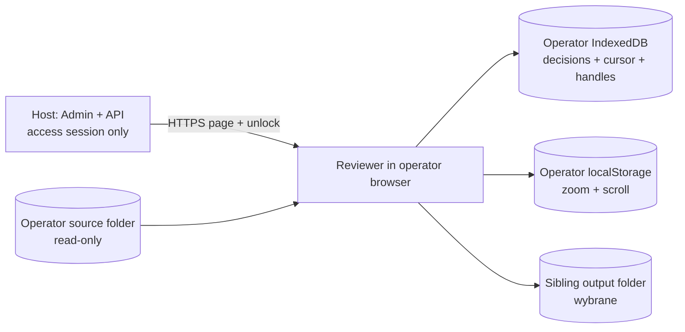
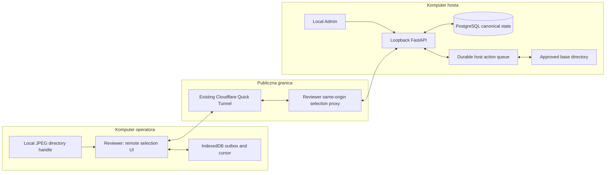
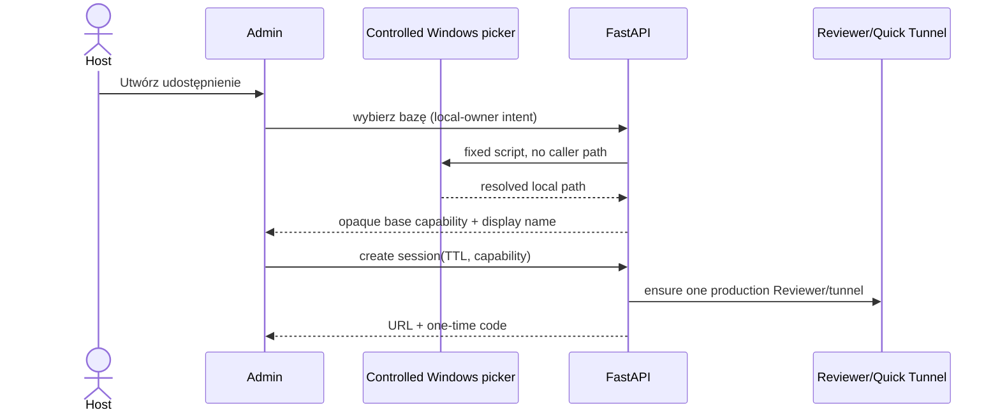
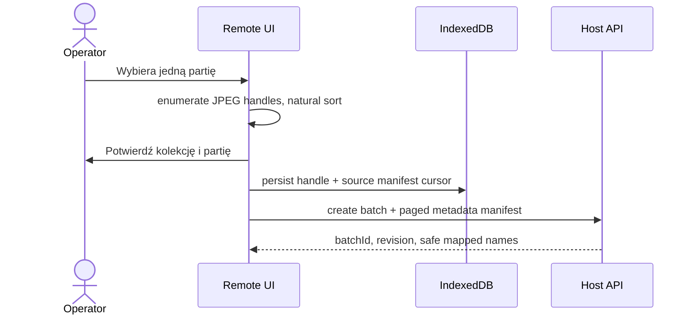
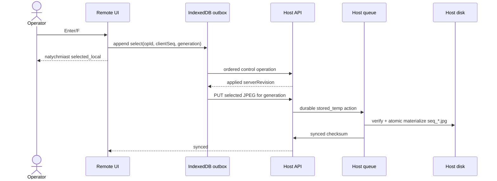
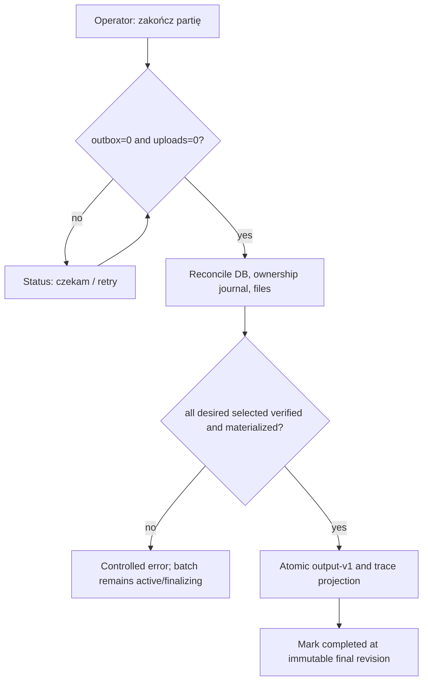
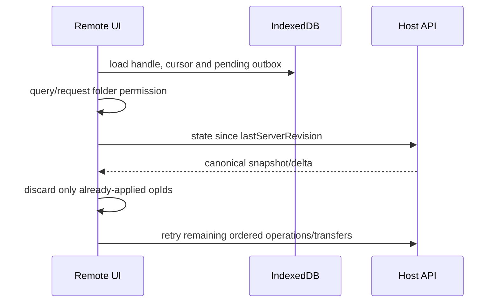

# Zdalna ręczna selekcja zdjęć

## 0. Obowiązująca architektura operator-local

Od v0.7.51 obowiązuje decyzja D-227. Quick Tunnel, link, kod i purpose-scoped
cookie tworzą wyłącznie bramkę dostępu do Reviewera. Dane robocze nie
przekraczają granicy urządzenia operatora:



- Operator wybiera źródło i osobno jego katalog nadrzędny. Drugie wskazanie jest
  konieczne, ponieważ File System Access API nie udostępnia rodzica uchwytu.
- Oba pickery są widoczne od początku i mogą być użyte w dowolnej kolejności.
  Uchwyt katalogu nadrzędnego może istnieć w lokalnej sesji przed indeksem
  źródła; po indeksowaniu Reviewer tworzy lub waliduje właściwy folder wyniku.
- Reviewer tworzy `<sourceDirectoryName> wybrane`, zapisuje oryginalne bajty
  jako `seq_start-end.jpg` i lokalny `manual-image-selection-output-v1.json`.
- Folder wynikowy przechodzi fail-closed preflight: jest pusty albo zawiera
  kompletny manifest i wyłącznie odpowiadające mu `seq_*`. Manifest wiąże
  postęp z checksumą metadanych źródła, a nie z czasowym linkiem dostępu.
- Poprawny istniejący manifest odtwarza kursor, następny zakres, kierunek i
  decyzje również pod nową access session. Identyfikatory zdjęć są ponownie
  mapowane na świeży IndexedDB po ordinalu i względnej ścieżce.
- Checksum-bound ownership blokuje nadpisanie lub usunięcie obcego pliku.
- Kursor, zakres i decyzje są transakcyjne w IndexedDB operatora; zoom oraz obie
  osie scrolla są per session+batch w localStorage operatora.
- Interakcje są szeregowane. Zmiana licznika następuje dopiero po zapisie JPEG-a
  oraz trwałej decyzji, więc sieć i control-plane nie mogą rozsynchroniczować
  wyborów.
- Host przechowuje wyłącznie dane bramki dostępu i audyt. Nie rejestruje partii,
  manifestu źródła, decyzji ani transferu JPEG-ów dla nowego workspace'u.
- Powrót po restarcie może wymagać ponownej zgody `read`/`readwrite`, ale nie
  zmienia zachowanego lokalnie postępu.
- IndexedDB utrwala także uchwyt katalogu nadrzędnego wyniku. Brak potomnego
  `<source> wybrane` jest jednoznacznym sygnałem rozpoczęcia od nowa: Reviewer
  atomowo resetuje batch do pierwszego zdjęcia i pierwszego zakresu, odłącza
  source/output handles i przechodzi do stanu ponownego podpięcia. Zachowany
  indeks oraz checksum manifestu służą do fail-closed sprawdzenia ponownie
  wybranego źródła. Operator wskazuje następnie katalog nadrzędny wyniku, a
  pusty manifest powstaje dopiero przy jawnym uruchomieniu. Ten sam recovery
  uruchamia `NotFoundError` z odczytu JPEG-a, zapisu, manifestu lub cofania.
  Jawny restart usuwa istniejący katalog rekurencyjnie wyłącznie po fail-closed
  walidacji manifestu, źródła i checksum zarządzanych JPEG-ów; obcych danych
  nigdy nie usuwa. Własny modal resetu blokuje skróty i nawigację workspace'u
  do czasu anulowania albo ukończenia operacji.
- Trwały zapis wymaga przeglądarki z File System Access API. Brak API jest
  kontrolowanym ograniczeniem, nie fallbackiem wysyłającym dane do hosta.

Sekcje 1–24 poniżej opisują historyczną architekturę transferu do hosta z
v0.7.27–v0.7.50. Zachowujemy je jako zapis decyzji i mechanizmów odtwarzalnych,
ale w razie sprzeczności pierwszeństwo ma niniejsza sekcja oraz D-227.

## 1. Kontekst

Dokument opisuje proponowane rozszerzenie lokalnej `Ręcznej selekcji zdjęć` o
czasowy link dla operatora pracującego na innym komputerze. Jest wynikiem
TASK-0272 i nie stanowi jeszcze zaakceptowanej decyzji ani implementacji.

Obecny fallback został przyjęty w D-194, ślad uczenia w D-195, a niezależność
od gry w D-210. Zdalny Reviewer ma już osobną powierzchnię na
`127.0.0.1:3001`, same-origin proxy, trwałe sesje, kod dostępu i współdzielony
Quick Tunnel zgodnie z D-095 i D-206. Nowa funkcja może współdzielić lifecycle
procesu i tunelu, ale nie może odziedziczyć scope'u `gameId + importJobId`,
ponieważ ręczna selekcja nie należy do gry ani import joba.

## 2. Cel

Host wybiera lokalny katalog bazowy, tworzy ograniczoną sesję i przekazuje
link oraz osobny kod. Zdalny operator wybiera na swoim komputerze kolekcję i
partię, ogląda JPEG-i bez uprzedniego uploadu całego źródła, przypisuje je do
zakresów `start–start+8`, a w tle wysyłane są tylko finalnie wybrane pliki.
Potwierdzony stan, pliki i zgodny manifest wynikowy są trwałe na hoście.

Przykładowe mapowanie:

```text
host wybiera: C:\dokumenty
operator potwierdza: kolekcja 777, partia 1-19809
wynik: C:\dokumenty\777\1-19809
```

## 3. Obecny przepływ lokalny

| Status | Dowód | Potwierdzone zachowanie |
| --- | --- | --- |
| `CONFIRMED` | `ManualImageSelectionWorkspace` w `apps/admin/src/features/manual-image-selection/manual-image-selection-workspace.tsx` | Workspace jest klientowym komponentem React i nie wywołuje API ani workera. |
| `CONFIRMED` | `pickDirectory`, linie 372–403 | Źródło i wynik wybiera `showDirectoryPicker`; wymagane są osobne uchwyty read i read-write. |
| `CONFIRMED` | `listManualImages` w `manual-image-selection.ts` | JPEG-i są listowane rekurencyjnie i sortowane naturalnie bez dekodowania podczas indeksowania. |
| `CONFIRMED` | efekt cache w workspace, linie 172–259 | Obraz jest czytany lokalnie, renderowany z Object URL, a cache obejmuje najwyżej bieżący indeks ±3; stare URL-e są zwalniane. |
| `CONFIRMED` | `acceptCurrent`, `skipCurrent`, `undoLast` | Enter/F kopiuje oryginalne bajty jako `seq_start-end.jpg`, zwiększa zakres o 9 i przechodzi o jedno zdjęcie; Tab przesuwa zakres bez zmiany zdjęcia; A/Ctrl+Z cofa ostatnią decyzję. |
| `CONFIRMED` | `writeManualOutput`, `removeManagedManualOutput` | Checksum blokuje nadpisanie albo usunięcie obcego pliku. |
| `CONFIRMED` | `ManualImageSelectionStore` | Jedna niezależna sesja i append-only trace są w IndexedDB v2; uchwyty katalogów są częścią rekordu. |
| `CONFIRMED` | workspace, linie 302–316 | `localStorage` zawiera wyłącznie diagnostyczny kursor; nie jest źródłem trwałości. |
| `CONFIRMED` | `writeManualOutputManifest` | Po decyzji powstaje `manual-image-selection-output-v1.json`; nie ma osobnego JSON-u tworzonego na starcie. |
| `CONFIRMED` | `writeManualTraceManifest` | Pełny trace jest materializowany dopiero po jawnej akcji `Eksportuj ślad uczenia`. |
| `CONFIRMED` | `requestPermission` i `resumeSession` | Po wznowieniu przeglądarka może ponownie poprosić o uprawnienie albo użytkownik relinkuje niedostępny uchwyt bez utraty decyzji. |

Obecna operacja lokalna zapisuje zdjęcie, stan IndexedDB i manifest kolejno,
a UI czeka na jej zakończenie. Nie istnieje sieciowy outbox, upload w tle,
serwerowa rewizja, finalizacja partii, ogólne odznaczenie dowolnego wcześniejszego
pliku ani trwały status hosta.

## 4. Oczekiwany przepływ zdalny

1. Host w lokalnym Adminie wybiera bazę przez kontrolowany natywny picker,
   podaje nazwę sesji i TTL, a API wiąże rozwiązany katalog wyłącznie po stronie
   hosta.
2. API zapewnia jeden produkcyjny Reviewer i jeden Quick Tunnel, tworzy
   purpose-scoped sesję i jednorazowo pokazuje link oraz osobny kod.
3. Zdalny operator odblokowuje sesję. Link nie zawiera bearer tokenu ani ścieżki
   hosta.
4. Operator wybiera jedną partię lokalnych zdjęć, a następnie potwierdza logiczną
   nazwę kolekcji i partii. Przeglądarka wysyła wyłącznie bezpieczne nazwy
   komponentów i paged manifest metadanych, nie pełną ścieżkę lokalną.
5. Wspólny silnik zachowuje naturalną kolejność, bufor podglądu, skróty,
   zakresy i trace. Pliki źródłowe są czytane bezpośrednio z lokalnego uchwytu.
6. Decyzja jest natychmiast widoczna lokalnie i trafia do trwałego IndexedDB
   outboxu. Po potwierdzeniu operacji przez hosta wybrany JPEG trafia do osobnej
   kolejki transferu.
7. Host strumieniuje upload do pliku tymczasowego, sprawdza rozmiar, format i
   checksumę, a dopiero potem materializuje własny `seq_*` oraz manifest.
8. Finalizacja jest barierą: kończy partię tylko przy pustym outboxie, braku
   aktywnych transferów i pełnej zgodności kanonicznych decyzji, plików i JSON-u.
9. Po refreshu host zwraca stan kanoniczny, a klient uzgadnia z nim zachowany
   outbox. Potwierdzone operacje nie są powtarzane, a niepotwierdzone nie giną.

## 5. Terminologia

- **host** — komputer właściciela z API, PostgreSQL, Reviewerem i katalogiem
  wynikowym;
- **operator zdalny** — osoba otwierająca link i czytająca własne lokalne
  JPEG-i;
- **sesja udostępniania** — purpose-scoped dostęp związany z jedną bazą hosta;
- **kolekcja** — pojedynczy bezpieczny komponent, np. `777`;
- **partia** — pojedynczy bezpieczny komponent, np. `1-19809`;
- **stan kanoniczny** — potwierdzony stan PostgreSQL uzgodniony z należącymi do
  sesji plikami hosta;
- **outbox** — trwałe, jeszcze niepotwierdzone operacje klienta;
- **generacja wyboru** — monotoniczna wersja żądanego stanu jednego zdjęcia;
- **materializacja** — atomowe udostępnienie zweryfikowanego pliku pod finalną
  nazwą `seq_*`.

Mapowanie istniejących nazw: lokalny `ManualSelectionSessionRecord` odpowiada
części klientowej przyszłej partii, `ManualSelectionDecision` operacji
logicznej, a `ManualSelectionOutputManifestV1` finalnej projekcji wynikowej.

## 6. Wymagania

- Oryginały operatora pozostają tylko do odczytu i nie są masowo wysyłane.
- Zdalne UI zachowuje lokalną kolejność, zakresy, skróty, zoom, fullscreen,
  kursor, trace i bounded preview.
- Host przechowuje trwałe sesje, partie, source manifest, decyzje, transfery,
  rewizje, błędy, retry i wynik finalizacji.
- Interakcja nie czeka na upload; stany lokalny/pending/sending/confirmed oraz
  queued/uploading/verified/synced są jawne.
- Operacje i uploady są idempotentne, uporządkowane oraz odporne na refresh,
  restart i utratę odpowiedzi.
- Zdalny scope nie udostępnia Admina, gier, importów, jobów, innych sesji ani
  arbitralnego systemu plików.
- Lokalny fallback działa bez API i pozostaje bez zmian semantycznych.

## 7. Poza zakresem

- Automatyczna selekcja, OCR, modele, import plansz i uczenie symboli.
- Publiczny Admin, bezpośredni publiczny FastAPI, port forwarding i BLOB-y w
  głównych tabelach.
- Wiele jednoczesnych osób modyfikujących tę samą partię w MVP.
- Chmura danych, Redis/Celery, osobny mikroserwis i osobny tunel na link.
- Gwarancja działania pełnego File System Access API w Firefox/Safari.
- Chunkowany resumable upload przed pomiarem rozkładu rozmiarów i strat
  rzeczywistych plików.

## 8. Ograniczenia przeglądarki

`showDirectoryPicker` wymaga HTTPS i bezpośredniej aktywacji użytkownika, ma
ograniczoną dostępność i zwraca uchwyt tylko do wybranego drzewa. Uchwyt można
zapisać w IndexedDB, ale po powrocie jego permission może być `prompt`; kod musi
wykonać `queryPermission`/`requestPermission` i obsłużyć odmowę. Nie wolno
zakładać dostępu do pełnej ścieżki `C:\...`.

`<input webkitdirectory>` dostarcza `File` i względne `webkitRelativePath`, ale
jest mechanizmem niestandardowym i po przeładowaniu nie daje trwałego uchwytu.
Może być fallbackiem sesyjnym po ponownym wskazaniu tego samego folderu i
walidacji manifestu, lecz nie spełnia samodzielnie wymogu bezobsługowego
wznowienia.

Background Sync i Background Fetch mają ograniczoną dostępność i ograniczenia
czasu życia. Nie są podstawą trwałości transferu wielu GB. MVP utrzymuje
metadane/outbox w IndexedDB i wysyła, gdy karta jest otwarta. Zamknięcie karty
zatrzymuje aktywne fetch, ale po powrocie kolejka jest odtwarzana z uchwytu.
Blobów o łącznym rozmiarze GB nie kopiujemy do IndexedDB/OPFS; przeglądarkowa
pamięć masowa jest quota-bound i może zostać usunięta, jeżeli origin nie uzyska
persistencji.

Wniosek: pełne MVP wspiera desktopowy Chrome/Edge. Inne przeglądarki dostają
jawny test capability i wariant ponownego wyboru folderu, bez fałszywej
obietnicy trwałych permissions.

Źródła platformowe sprawdzone 2026-08-23:

- [MDN `Window.showDirectoryPicker()`](https://developer.mozilla.org/en-US/docs/Web/API/Window/showDirectoryPicker)
  — secure context, user activation i limited availability;
- [WICG File System Access](https://wicg.github.io/file-system-access/) — handle
  z IndexedDB może wrócić ze stanem `prompt`;
- [Chrome for Developers — File System Access](https://developer.chrome.com/docs/capabilities/web-apis/file-system-access)
  — uchwyty są serializowalne do IndexedDB, ale permission trzeba każdorazowo
  sprawdzać;
- [MDN Storage quotas](https://developer.mozilla.org/en-US/docs/Web/API/Storage_API/Storage_quotas_and_eviction_criteria),
  [StorageManager.persist](https://developer.mozilla.org/docs/Web/API/StorageManager/persist),
  [Background Sync](https://developer.mozilla.org/en-US/docs/Web/API/Background_Synchronization_API)
  i [Background Fetch](https://developer.mozilla.org/en-US/docs/Web/API/Background_Fetch_API)
  — quota/persist oraz brak podstawy do gwarantowania długotrwałego transferu
  po zamknięciu karty.

## 9. Porównanie architektur

### Wariant A — Reviewer i API hosta przez istniejący same-origin Quick Tunnel

| Kryterium | Ocena |
| --- | --- |
| Zgodność z obecnym modułem | wysoka; UI i czysty silnik mogą być współdzielone |
| Dostęp do lokalnych zdjęć użytkownika | bezpośrednio w zdalnej przeglądarce |
| Płynność interfejsu | wysoka przy bounded preview i osobnej kolejce uploadu |
| Wznowienie po odświeżeniu | pełne w Chrome/Edge po odzyskaniu handle/permission |
| Transfer 8–15 tys. zdjęć | możliwy, wymaga trwałego outboxu, limitów i benchmarku |
| Bezpieczeństwo | wysoki potencjał dzięki same-origin proxy i ścisłemu scope'owi |
| Złożoność wdrożenia | średnio-wysoka |
| Złożoność utrzymania | najniższa z realnych wariantów |
| Wymagany dodatkowy software | istniejący `cloudflared`; nic u operatora |
| Wykorzystanie istniejącego tunelu | pełne, jeden proces i jeden tunnel |
| Ryzyko | Quick Tunnel bez SLA, limit 200 in-flight i brak SSE |
| Rekomendacja | **tak, MVP** |

### Wariant B — hostowany frontend i tunel tylko do API hosta

| Kryterium | Ocena |
| --- | --- |
| Zgodność z obecnym modułem | średnia |
| Dostęp do lokalnych zdjęć użytkownika | taki sam jak A |
| Płynność interfejsu | podobna do A |
| Wznowienie po odświeżeniu | zależy od stabilnego originu hostowanego frontendu |
| Transfer 8–15 tys. zdjęć | technicznie możliwy |
| Bezpieczeństwo | trudniejsze CORS, CSRF, wersjonowanie i publiczna konfiguracja API |
| Złożoność wdrożenia | wysoka |
| Złożoność utrzymania | wysoka; dwa deploymenty muszą być kompatybilne |
| Wymagany dodatkowy software | hosting i jego lifecycle |
| Wykorzystanie istniejącego tunelu | częściowe |
| Ryzyko | rozbieżne wersje FE/API oraz szersza powierzchnia cross-origin |
| Rekomendacja | nie dla lokalnego produktu |

### Wariant C — lokalny helper/desktop po stronie operatora

| Kryterium | Ocena |
| --- | --- |
| Zgodność z obecnym modułem | niska/średnia |
| Dostęp do lokalnych zdjęć użytkownika | najlepszy i niezależny od browser API |
| Płynność interfejsu | potencjalnie najwyższa |
| Wznowienie po odświeżeniu | natywne i trwałe |
| Transfer 8–15 tys. zdjęć | najlepsza kontrola transferu i background |
| Bezpieczeństwo | nowy instalowany agent i kanał aktualizacji zwiększają ryzyko |
| Złożoność wdrożenia | najwyższa |
| Złożoność utrzymania | najwyższa |
| Wymagany dodatkowy software | instalacja na komputerze operatora |
| Wykorzystanie istniejącego tunelu | możliwe, ale nie usuwa potrzeby backendu hosta |
| Ryzyko | dystrybucja, podpisywanie, aktualizacje i zaufanie do helpera |
| Rekomendacja | fallback dopiero po niezaliczeniu browserowego benchmarku |

## 10. Rekomendowana architektura

Rekomendowany jest wariant A: nowa trasa w istniejącym produkcyjnym
`apps/reviewer`, ten sam proces i Quick Tunnel, osobny purpose-scoped access
service oraz ścisła allowlista proxy. FastAPI i PostgreSQL nadal bindują tylko
loopback. Quick Tunnel jest dopuszczony do pilota i pracy prywatnej, ale jego
brak SLA, losowy URL po restarcie, limit 200 in-flight i brak SSE pozostają
jawne. Dla późniejszej codziennej pracy wymagającej stabilnego adresu można
zamienić ingress na named Tunnel bez zmiany protokołu aplikacji.

Komponenty:

- wspólny package z czystym silnikiem zakresów, nawigacji, decyzji i adapterami;
- niezmieniony lokalny adapter File System Access w Adminie;
- remote source adapter i IndexedDB outbox w Reviewerze;
- osobna domena/API `remote_manual_selection`, bez `gameId/importJobId`;
- trwałe PostgreSQL dla stanu i append-only operacji; obrazy tylko na dysku;
- kontrolowany picker Windows do związania bazy hosta;
- same-origin proxy `/selection-api`, osobne cookie i CSP;
- trzy oddzielne kolejki: control, binary transfer i host materialization;
- polling statusu w MVP; SSE odpada dla Quick Tunnel, WebSocket nie jest
  potrzebny.

Nie wolno jedynie dodać uploadu do obecnego `/review-api`: proxy ma limit
128 KiB, cookie i autoryzacja są związane z game/import, a middleware dopuszcza
mutacje Reviewera tylko dla istniejącej allowlisty plansz.

## 11. Diagramy

### 11.1. Komponenty



### 11.2. Utworzenie linku



### 11.3. Wybór partii



### 11.4. Zaznaczenie i upload



### 11.5. Odznaczenie/cofnięcie

```mermaid
sequenceDiagram
  participant UI as Remote UI
  participant O as Outbox
  participant API as Host API
  participant D as Host disk
  UI->>O: deselect/undo(new generation)
  O->>API: high-priority control operation
  API->>API: desiredSelected=false; invalidate older upload
  alt upload queued/in progress
    API-->>UI: cancelled or stale generation ignored
  else file materialized
    API->>D: checksum guard + move own file to quarantine
  end
  API-->>UI: revision confirmed
```

### 11.6. Finalizacja



### 11.7. Wznowienie



## 12. Mapowanie katalogów

Zdalny request nigdy nie zawiera docelowej ścieżki. Host przechowuje resolved
base path i udostępnia wyłącznie alias/nazwę sesji. Operator przesyła dokładnie
dwa pojedyncze komponenty: `collectionName` i `batchName`.

Reguły:

1. Unicode jest normalizowany do NFC; porównanie kolizji na Windows jest
   case-insensitive.
2. Odrzucane są puste komponenty, `.`, `..`, ścieżki absolutne, drive/UNC,
   `/`, `\\`, znaki kontrolne, `< > : " / \\ | ? *`, końcowa kropka/spacja i
   zarezerwowane nazwy Windows (`CON`, `PRN`, `AUX`, `NUL`, `COM1` itd., także
   z rozszerzeniem).
3. Limity długości komponentu i finalnej ścieżki wynikają z rzeczywistej
   konfiguracji Windows i są sprawdzane przed utworzeniem; UI pokazuje
   kontrolowany błąd, nie skraca nazwy po cichu.
4. Każdy istniejący komponent base/collection/batch jest sprawdzany pod kątem
   reparse point/symlink/junction. Final path uzyskany z uchwytu Windows musi
   pozostawać wewnątrz final path bazy.
5. Folder partii otrzymuje wewnętrzny marker własności z `sessionId`,
   `collectionId`, `batchId` i checksumą. Istniejący folder można wznowić tylko,
   gdy marker i DB wskazują tę samą partię; obcy albo nieoznaczony folder blokuje
   start.
6. Unikalny klucz `(baseBindingId, normalizedCollection, normalizedBatch)`
   zapobiega kolizji aktywnych sesji. Nie powstaje automatyczny sufiks ani
   nadpisanie.
7. Pliki wewnętrzne i kwarantanna leżą pod
   `<batch>\.game-predictor\remote-selection-v1\`; finalny katalog pokazuje
   `seq_*.jpg` i kompatybilny manifest.

Przykład po walidacji:

```text
C:\dokumenty                 # host-only base
└── 777                      # normalized collection component
    └── 1-19809              # normalized batch component
        ├── seq_1-9.jpg
        ├── seq_10-18.jpg
        ├── manual-image-selection-output-v1.json
        └── .game-predictor\remote-selection-v1\...
```

## 13. Model danych i maszyny stanów

### 13.1. Encje

- `remote_manual_selection_sessions`: scope, host-only base path/binding,
  code/token hash, TTL, revoke, revision, active writer lease i audit.
- `remote_manual_selection_collections`: walidowana nazwa i normalized key.
- `remote_manual_selection_batches`: source manifest checksum, first layout,
  direction, cursor, status, revision, final checksum i liczniki.
- `remote_manual_selection_files`: klientowy UUID, względna ścieżka źródłowa,
  indeks, rozmiar, mtime, zakres, desired state/generation, checksum hosta i
  stan materializacji; bez BLOB-u i bez pełnej ścieżki operatora.
- `remote_manual_selection_operations`: append-only `operationId`, client
  instance/sequence, expected/applied revision, typ, generation, outcome.
- `remote_manual_selection_transfers`: attempt, generation, deklarowane i
  odebrane bajty, checksum, status, retry; ścieżki tylko host-internal.
- `remote_manual_selection_host_actions`: trwałe verify/materialize/remove/
  reconcile z lease i backoffem.
- `remote_manual_selection_audit_events`: created/unlocked/revoked, mapping,
  finalize, security reject i administracyjne mutacje; bez sekretów i ścieżki
  bazy w publicznej projekcji.

Zmiany schematu powstają wyłącznie przez Alembic. OpenAPI jest źródłem typów
Admina/Reviewera.

### 13.2. Sesja

```text
DRAFT -> ACTIVE -> COMPLETED
          |  |
          |  +-> EXPIRED
          +----> REVOKED
```

Restart nie zmienia stanu. Nowy Quick Tunnel daje nowy URL do tej samej
`ACTIVE` sesji. Revoke/expiry blokuje nowe operacje i uploady, ale zachowuje
potwierdzony audyt oraz pliki.

### 13.3. Kolekcja i partia

```text
collection: ACTIVE -> COMPLETED
batch: DRAFT -> INDEXING -> ACTIVE -> FINALIZING -> COMPLETED
                                |          |
                                +-> FAILED <-+
                                +-> ABANDONED
```

`FAILED` jest odzyskiwalnym stanem konkretnej akcji; nie oznacza utraty
potwierdzonych decyzji. `COMPLETED` jest niezmienny bez jawnego reopen hosta.

### 13.4. Zdjęcie

```text
DISCOVERED/UNSELECTED
  -> SELECTED_LOCAL -> SELECTION_QUEUED -> UPLOAD_QUEUED -> UPLOADING
  -> STORED_TEMPORARILY -> VERIFIED -> MATERIALIZED/SYNCED

każdy stan selected -> DESELECT_PENDING -> UNSELECTED/REMOVED
błąd transferu -> FAILED -> RETRYING -> poprzedni bezpieczny stan
```

Stan klientowy `SELECTED_LOCAL` nigdy nie jest prezentowany jako host-confirmed.
`SYNCED` wymaga zgodnej generacji, checksumy, finalnego pliku i rewizji DB.

### 13.5. Operacja i transfer

```text
operation: QUEUED -> SENDING -> APPLIED
                       |          |
                       +-> RETRY  +-> SUPERSEDED (tylko przez nowszą generację)
                       +-> CONFLICT/REJECTED

transfer: QUEUED -> UPLOADING -> STORED_TEMP -> VERIFIED -> MATERIALIZED
                |       |             |
                +-> CANCELLED          +-> FAILED -> RETRYING
```

## 14. Model synchronizacji

Rekomendowany jest wariant B z kontrolowanym wykrywaniem konfliktów:
**host jest źródłem prawdy, a IndexedDB zachowuje trwały outbox**. Server-wins
nie może oznaczać wyrzucenia jeszcze niewysłanych decyzji po refreshu.

- Każdy klient ma trwały `clientInstanceId`, a każda karta dodatkowy nietrwały
  `tabInstanceId`; jedna sesja ma jeden aktywny writer lease. Druga karta/osoba
  jest read-only i może wykonać jawny takeover po wygaśnięciu lease. Skopiowany
  przez duplikację karty `sessionStorage` nie utożsamia dwóch kart.
- Operacja dostaje losowy `operationId`, monotoniczny `clientSequence`,
  `expectedServerRevision` i per-file `selectionGeneration`.
- Exact retry tego samego `operationId` zwraca zapisany wynik. Luka w
  `clientSequence` czeka/reaguje konfliktem; duplikat nie zwiększa rewizji.
- Host zwiększa `serverRevision` wyłącznie po atomowym zastosowaniu zmiany.
- Refresh pobiera snapshot/delta od ostatniej rewizji, usuwa z outboxu tylko
  potwierdzone `operationId`, a pozostałe replayuje w kolejności.
- Delta zawiera kanoniczny globalny `lastClientSequence`. Kontrolowany replay
  zużytego numeru pozwala jednokrotnie przenumerować cały niepotwierdzony outbox
  od zegara hosta bez zmiany `operationId`, treści decyzji ani ich kolejności.
- Konflikt precondition nie jest rozwiązywany last-write-wins według czasu
  urządzenia. Klient pobiera stan, pokazuje rozbieżność i replayuje wyłącznie
  operacje, których zakres/generacja nadal mają sens.
- Upload zawsze wskazuje fileId i generation. Spóźniony upload starszej
  generacji może zostać zachowany jako temp do GC, ale nigdy nie jest
  materializowany.
- Outbox przechowuje metadane i uchwyt źródła, nie wielogigabajtowe Bloby. Po
  utracie permission operator relinkuje folder; manifest/rozmiar/mtime i
  ostatecznie checksum muszą pasować.
- `beforeunload` tylko ostrzega. Nie jest elementem poprawności.

## 15. Model kolejek

### 15.1. Operacje sterujące

Trwały IndexedDB outbox, jedna uporządkowana wysyłka per batch i małe
idempotentne requesty. Deselect/undo oraz revoke/finalize mają priorytet przed
nowym selectem. Nie batchujemy operacji zmieniających wzajemne preconditions;
można batchować wyłącznie ciąg już uporządkowanych opów z zachowaniem osobnych
ID i wyników.

### 15.2. Transfery

Osobny scheduler uruchamia po potwierdzeniu selectu upload jednego pliku na
request. Bounded concurrency startuje konserwatywnie i jest strojona dopiero
benchmarkiem; nie może zbliżać się do limitu 200 in-flight Quick Tunnel. Retry
ma exponential backoff z jitterem, a 401/403/409/413 nie są ślepo ponawiane.

Przy średnio 352 KB retry całego pliku jest prostsze niż chunking i traci mało
danych. Klient najpierw pyta o status fileId/generation, więc utracona odpowiedź
nie powoduje ponownego transferu już zweryfikowanego pliku. Chunkowany protocol
jest zadaniem warunkowym po benchmarku p95/max rozmiaru i awaryjności.

### 15.3. Przetwarzanie hosta

Odebranie streamu tworzy durable `STORED_TEMP` action. Lekki executor oparty na
PostgreSQL lease wykonuje verify/materialize/remove/reconcile; nie używa
Redis/Celery. Może działać jako ograniczony handler istniejącego procesu workera
albo kontrolowana pętla aplikacyjna — feasibility task musi wybrać jedną ścieżkę
na podstawie lifecycle'u repozytorium. Status i finalizacja nigdy nie stoją za
binarnymi requestami; finalizacja jest barierą nad trzema kolejkami.

## 16. Kontrakty JSON i API

### 16.1. Zgodność istniejącego JSON-u

`manual-image-selection-output-v1.json` pozostaje finalną projekcją o tych
samych polach: `schemaVersion`, techniczne `gameId`, `sessionKey`,
`sourceDirectoryName`, `direction`, `firstLayout`, `updatedAt` i `items` z
`outputName/imagePath/imageChecksum/rangeStart/rangeEnd`. Dla zdalnej partii
`gameId` pozostaje kompatybilnym technicznym workspace ID, `sessionKey` jest
stabilnym remote session/batch key, a `sourceDirectoryName` logiczną nazwą
partii. Istniejący import nadal filtruje JPEG-i i konsumuje `seq_*`.

`manual-image-selection-trace-v1.json` pozostaje eksportowalną projekcją trace.
Serwerowy stan synchronizacji nie jest wciskany do v1. Nowy host-internal
`remote-manual-image-selection-session-v1.json` przechowuje IDs, rewizje,
generacje, ownership i transfery, ale nie jest źródłem dla obecnego importu.

`CONFLICT`: opis użytkownika zakłada JSON na początku i osobny eksport zdjęć.
Aktualny kod tworzy tylko rekord IndexedDB na starcie, kopiuje zdjęcie od razu
przy Enter i zapisuje output-v1 dopiero po decyzji; jedyna jawna akcja eksportu
materializuje trace. Tryb zdalny zachowuje finalny format, ale musi dodać
wyraźną finalizację jako barierę.

### 16.2. Proponowane endpointy

Lokalny Admin, chroniony `local-owner` intent i exact target:

```text
POST /api/v1/admin/remote-manual-selections/base-directory-selection
POST /api/v1/admin/remote-manual-selections/sessions
GET  /api/v1/admin/remote-manual-selections/sessions
GET  /api/v1/admin/remote-manual-selections/sessions/{sessionId}
POST /api/v1/admin/remote-manual-selections/sessions/{sessionId}/revoke
POST /api/v1/admin/remote-manual-selections/sessions/{sessionId}/reopen-batch
```

Publiczna, session-scoped powierzchnia przez `/selection-api`:

```text
POST /api/v1/remote-manual-selections/sessions/{sessionId}/unlock
GET  /api/v1/remote-manual-selections/context
POST /api/v1/remote-manual-selections/collections
POST /api/v1/remote-manual-selections/collections/{collectionId}/batches
POST /api/v1/remote-manual-selections/batches/{batchId}/source-items
GET  /api/v1/remote-manual-selections/batches/{batchId}/state?sinceRevision=N
POST /api/v1/remote-manual-selections/batches/{batchId}/operations
GET  /api/v1/remote-manual-selections/batches/{batchId}/files/{fileId}/transfer
PUT  /api/v1/remote-manual-selections/batches/{batchId}/files/{fileId}/content
POST /api/v1/remote-manual-selections/batches/{batchId}/finalize
```

Wszystkie mutacje przekazują idempotency key; binarny route jest strumieniowy
i ma własny limit, zamiast globalnego podnoszenia 128 KiB Reviewera. Odpowiedzi
nigdy nie zawierają base path ani temp path. OpenAPI generuje klienta.

## 17. Bezpieczeństwo

| Zagrożenie | Zabezpieczenie |
| --- | --- |
| przejęcie/zgadywanie linku | UUID nie jest bearerem; osobny kod, PBKDF2, 5 prób, TTL 5 min–24 h, revoke |
| token w URL/logu | token tylko rotowany HttpOnly cookie `Secure`, `SameSite=Strict`, osobna ścieżka `/selection-api`; redakcja logów |
| scope substitution | token wiąże dokładnie sessionId; collection/batch/file są zawsze sprawdzane przez relację do sesji |
| CSRF/CORS | same-origin Reviewer, brak publicznego CORS, Strict cookie, walidacja Origin i stały nagłówek intencji proxy |
| publiczny Admin/API | ścisła allowlista `selection-api`; FastAPI/Admin/PostgreSQL pozostają loopback |
| path traversal/reparse | dwa walidowane komponenty, final-path containment, reparse-point rejection i marker ownership |
| nadpisanie/usunięcie obcego pliku | checksum + ownership marker; konflikt zamiast replace/remove |
| złośliwy upload | rozszerzenie, magic/decode JPEG, limity per-file/session, content length, streaming i temp file |
| DoS/request flood | rate limit per session/IP, bounded upload concurrency, quota i backpressure; stabilne 413/429 |
| brak miejsca/uprawnień | preflight disk budget, kontrolowany failed/retry, brak finalizacji i sprzątanie partów |
| replay/out-of-order | operation UUID, clientSequence, serverRevision, generation i zapisany outcome |
| dwie karty/osoby | jeden writer lease, heartbeat, druga karta read-only i jawny takeover |
| ujawnienie danych | brak source images w host response; brak pełnych ścieżek obu komputerów; CSP `self/blob/data` |

Quick Tunnel pozostaje narzędziem testowym bez SLA. Oficjalna dokumentacja
potwierdza 200 równoległych requestów i brak SSE. Nie wolno deklarować go jako
niezawodnego hostingu produkcyjnego; named Tunnel jest późniejszą opcją.
Źródło: [Cloudflare Quick Tunnels](https://developers.cloudflare.com/cloudflare-one/networks/connectors/cloudflare-tunnel/do-more-with-tunnels/trycloudflare/).

## 18. Obsługa błędów i odzyskiwanie

| # | Przypadek | Zachowanie i źródło prawdy | Komunikat/retry i ochrona danych |
| --- | --- | --- | --- |
| 1 | Refresh bez pending | Pobierz host snapshot i wróć do kursora. | „Sesja wznowiona”; brak retry. |
| 2 | Refresh z pending | Host snapshot + replay niepotwierdzonego IndexedDB outboxu. | „Wznawiam N operacji”; opId usuwa duplikaty. |
| 3 | Zamknięcie podczas uploadu | Fetch przerywa się; transfer pozostaje queued/partial, finalny plik nie istnieje. | Po powrocie status i retry całego pliku lub późniejszy chunk-resume. |
| 4 | Internet operatora znika | UI nadal zapisuje decyzje do outboxu i czyta lokalne JPEG-i. | Offline badge; automatyczny bounded retry po powrocie. |
| 5 | Internet hosta znika | Tunel niedostępny, host DB/dysk pozostają kanoniczne. | Operator pracuje lokalnie do limitu outboxu; retry później. |
| 6 | Restart aplikacji hosta | PostgreSQL i journal odtwarzają sesję, transfery i host actions. | „Host uruchamia się ponownie”; reconcile partów, bez drugiego pliku. |
| 7 | Nowy adres tunelu | Stary URL nie działa, stan sesji pozostaje. | Host kopiuje odświeżony URL do tego samego sessionId. |
| 8 | Wygaśnięcie sesji | Nowe mutacje 401/403; potwierdzone dane pozostają. | Host przedłuża przez nową sesję/reopen, bez utraty partii. |
| 9 | Host zatrzymuje sharing | Revoke natychmiast blokuje cookie i lease. | „Udostępnienie zatrzymane”; brak retry bez nowej autoryzacji. |
| 10 | Utrata folder permission | Outbox pozostaje, plików nie da się czytać. | Poproś o permission/relink i porównaj manifest przed retry. |
| 11 | Plik zmieniony | Rozmiar/mtime/checksum nie pasują do source item/generacji. | Konflikt `SOURCE_CHANGED`; ponowny wybór wymaga nowej decyzji. |
| 12 | Plik usunięty | Operacja pozostaje pending/failed, nigdy synced. | Wskaż brak pliku; deselect albo relink, finalizacja zablokowana. |
| 13 | Podwójny upload | Status/opId/generation zwraca istniejący verified rezultat. | Idempotentny sukces, zero drugiego pliku. |
| 14 | Operacje poza kolejnością | Host odrzuca lukę clientSequence albo czeka na brakujący op. | Klient pobiera revision i replayuje w kolejności. |
| 15 | Dwa requesty jednego zdjęcia | Per-file generation i transaction lock serializują stan. | Starszy request `SUPERSEDED`, nie nadpisuje nowego. |
| 16 | Dwie karty | Jedna ma writer lease, druga read-only. | „Sesja aktywna w innej karcie”; takeover po expiry. |
| 17 | Dwie osoby, jeden link | Jak wyżej; jedna aktywna osoba na sesję MVP. | Host tworzy drugi scoped link dla niezależnej pracy. |
| 18 | Docelowy katalog istnieje | Resume tylko przy zgodnym markerze/DB, inaczej blokada. | Host wybiera inną nazwę lub jawnie wiąże zgodny katalog. |
| 19 | Brak miejsca | Preflight i write zwracają controlled error; temp nie jest finalny. | Zwolnij miejsce i retry; decyzje pozostają. |
| 20 | Brak uprawnień hosta | Sesja nie startuje lub host action failed. | Host naprawia ACL/wybiera bazę; remote nie poznaje ścieżki. |
| 21 | Plik zapisany, DB nie | Ownership journal wykrywa own verified file i reconcile kończy DB. | „Odzyskiwanie zapisu”; brak ponownego materializowania. |
| 22 | DB zaktualizowana, plik nie | Stan nie może być `SYNCED`; durable host action ponawia zapis. | Finalizacja zablokowana do filesystem verification. |
| 23 | Deselect po zapisie | Nowa generacja; checksum-guarded move do kwarantanny i manifest update. | UI pending do potwierdzenia; obcy plik daje konflikt. |
| 24 | Select/deselect/select szybko | Generacje 1/2/3; tylko generacja 3 może zostać materializowana. | Stare uploady cancel/stale; brak „wskrzeszenia”. |
| 25 | Przerwana finalizacja | Batch pozostaje `FINALIZING`; krokowa idempotentna bariera jest ponawiana. | „Finalizacja przerwana — wznawiam”; completed dopiero po checksumie. |
| 26 | Powrót po dłuższej przerwie | Re-auth/nowy URL, host snapshot i outbox reconciliation. | Już zapisanych plików nie wysyła się ponownie. |

## 19. Wydajność

Obecny lokalny moduł ma dobry punkt wyjścia: indeks nie otwiera JPEG-ów,
Object URL cache obejmuje siedem pozycji, a decode jest leniwy. Remote adapter
ma zachować ten sam budżet i przenieść indeksowanie/paged source manifest poza
pilną ścieżkę interakcji. W pamięci nie mogą znajdować się wszystkie Bloby ani
cała kolejka request bodies; aktywne są tylko bounded preview i bounded uploady.

Stan referencyjny istniejącego browser stagingu nie jest gotowym rozwiązaniem:
Admin wysyła wszystkie pliki z concurrency 4 i trzema próbami, a FastAPI
przyjmuje całe `bytes` requestu, zapisuje `.part`, dekoduje JPEG i prowadzi
trwały journal. Można wykorzystać jego walidację, journal/recovery i
idempotencję indeksu jako wzorzec, ale zdalny moduł musi wysyłać tylko wybrane
pliki, streamować body, utrzymywać generacje wyboru i przechowywać klientowy
outbox poza pamięcią React.

Teoretyczny minimalny czas samego payloadu, bez TLS, request overhead, retry i
zmienności łącza:

| Efektywny upload operatora | 2,8 GB / 8 tys. | 5,3 GB / 15 tys. |
| ---: | ---: | ---: |
| 5 Mb/s | ok. 74,7 min | ok. 141,3 min |
| 10 Mb/s | ok. 37,3 min | ok. 70,7 min |
| 20 Mb/s | ok. 18,7 min | ok. 35,3 min |
| 50 Mb/s | ok. 7,5 min | ok. 14,1 min |
| 100 Mb/s | ok. 3,7 min | ok. 7,1 min |

To są estymacje, nie SLA. Rzeczywisty czas musi być zmierzony na zdalnym
łączu, ponieważ tysiące requestów, Quick Tunnel i hostowy dysk dodają narzut.

Metryki klienta i hosta: czas reakcji select p50/p95, indexed/seen/selected/
deselected, pending control, queued/active/synced upload, retry per reason,
bytes sent/remaining, throughput p50/p95, memory/CPU, DB/host queue lag, disk
free/used, reconciliation count, missing/duplicate files i resume time.

Backpressure ogranicza aktywne uploady i memory, ale nie blokuje decyzji. UI
ostrzega, gdy liczba lub bajty pending rosną szybciej niż transfer i gdy
zamknięcie karty wymaga późniejszego powrotu. Dokładne progi i concurrency są
wynikiem TASK benchmarkowego, nie założeniem architektonicznym.

## 20. Benchmark i walidacja

### Etap 1 — funkcjonalny

Kilkanście sztucznych JPEG-ów: select, deselect, undo, szybkie generacje,
refresh, relink, finalizacja, output-v1 i trace-v1. Wymagane zero duplikatów i
pełna zgodność DB–filesystem–JSON.

### Etap 2 — 100–500 zdjęć

Normalna praca z transferem w tle, odcięcie Internetu operatora i hosta,
retry, refresh obu aplikacji, restart API, revoke i nowy URL tunelu.

### Etap 3 — około 1 000 zdjęć

Pomiar pamięci/CPU, p50/p95 reakcji, liczby requestów, queue lag, efektywnej
concurrency, źródłowego indeksowania i czasu resume. Ten etap wybiera domyślne
limity bez arbitralnego strojenia.

### Etap 4 — około 8 000 finalnych zdjęć

Wielogodzinna sesja na dwóch komputerach, kontrolowany restart, sieciowe fault
injection i końcowy content-addressed raport zgodności. Nie zaczyna się przed
zaliczeniem etapów 1–3.

### Etap 5 — do 15 000 unikalnych zdjęć lub operacji

Po rozstrzygnięciu OPEN-1 osobno testuje się dużo unikalnych plików oraz dużo
select/deselect/reselect. Pomiar największych i p95 rozmiarów rozstrzyga, czy
file-level resume wystarcza, czy należy uruchomić warunkowy task chunkingu.

Każdy raport zawiera: source/operation/final file counts, bytes, duration,
throughput avg/p95, retry/errors, memory/CPU, duplicates, missing, JSON/file
parity i resume time. Bezwzględne bramki:

- zero cichej utraty potwierdzonych lub zachowanych w outboxie decyzji;
- zero zapisu poza bazą i zero nadpisania/usunięcia obcego pliku;
- zero duplikatów z retry i zero materializacji starej generacji;
- finalna lista, JPEG-i i output-v1 są zgodne checksumowo;
- kontrolowane wznowienie nie wysyła ponownie verified plików;
- interakcja nie czeka na upload; mierzalne cele latency ustala baseline etapu 1;
- finalizacja nie przechodzi przy którejkolwiek niepustej wymaganej kolejce.

## 21. Plan wdrożenia

Implementacja jest rozbita w sekcji 27. Kolejność pionów:

1. capability spike i niezmienna regresja lokalnego fallbacku;
2. wspólny core i wersjonowane kontrakty;
3. trwały model hosta, bezpieczna baza katalogu i scope access;
4. operacje/outbox, następnie osobno upload/materialization/deselect;
5. UI zdalne i hosta, finalizacja/JSON i recovery/status;
6. security gate, rosnące benchmarki i dopiero zdalny rollout.

Każdy checkpoint może zatrzymać pracę bez pozostawienia częściowo publicznej
funkcji. Feature flag i brak publicznej allowlisty utrzymują kod nieaktywny do
końcowego odbioru.

## 22. Kryteria odbiorcze

- Lokalny moduł zachowuje dotychczasowe testy, manifesty i działanie offline.
- Desktop Chrome/Edge przechodzi capability test i wznowienie handle/outbox.
- Link ma osobny TTL, scope, kod, token/cookie, revoke i audit; nie otwiera
  żadnego endpointu istniejącego Admina/Reviewera poza własną allowlistą.
- Host tworzy wyłącznie `<base>/<collection>/<batch>` po pełnej walidacji i
  final-path checku; ścieżka bazy nie występuje w publicznej odpowiedzi/logu.
- Exact retries, out-of-order, dwie karty i trzy generacje jednego zdjęcia
  przechodzą deterministyczne testy konkurencji PostgreSQL.
- Crash w każdej granicy plik/DB/manifest jest odzyskiwalny przez reconcile.
- Wszystkie 26 scenariuszy błędów mają test lub jawny manualny krok odbioru.
- Etapy 1–3 benchmarku przechodzą przed realną partią; etapy 4–5 generują
  podpisany/checksumowany raport zamiast ręcznej deklaracji sukcesu.

## 23. Rollout

1. Pure/unit i symulowany filesystem bez endpointu publicznego.
2. Dwa okna tego samego komputera i test drugiej karty/read-only lease.
3. Dwie przeglądarki na hoście, potem dwa komputery w LAN.
4. Quick Tunnel z małym katalogiem i zewnętrzną siecią.
5. Mała partia kilkunastu, potem 100–500 i 1 000 zdjęć.
6. Kontrolowany dzień 8 000 wybranych z aktywnym monitoringiem i wolnym
   miejscem ponad deklarowany budżet.
7. Dopiero po raporcie przypadek 15 000; osobno unikalne pliki i operacje.

## 24. Rollback

- Feature flag usuwa route z Reviewera i publicznej allowlisty bez dotykania
  lokalnego workspace'u.
- Revoke wszystkich remote sessions i compare-and-stop tunelu nie usuwa
  potwierdzonych wyników.
- Nowe tabele są addytywne; downgrade migracji jest dozwolony dopiero po
  eksporcie/audycie i jawnej decyzji, nigdy automatycznie.
- Partia przerwana pozostaje w DB i host-internal journal; operator może
  dokończyć lokalnie po bezpiecznym eksporcie `seq_*` i output-v1.
- Named Tunnel/chunking, jeżeli później dodane, są adapterami; protokół file-level
  i Quick Tunnel mogą pozostać fallbackiem.

## 25. Największe ryzyka

1. `KRYTYCZNE`: path traversal/reparse i wyścig plik–DB mogą zapisać poza bazą
   albo dać fałszywy sukces. Wymagają osobnego checkpointu Sol.
2. `WYSOKIE`: utrata lokalnych operacji po eviction/permission loss. Outbox nie
   przechowuje JPEG-ów, więc relink i source manifest muszą być rygorystyczne.
3. `WYSOKIE`: semantyka deselect podczas aktywnego uploadu. Generacja jest
   warunkiem materializacji, nie tylko polem diagnostycznym.
4. `WYSOKIE`: Quick Tunnel bez SLA i zmienny URL. Sesja przeżywa restart, ale
   stary link nie; named Tunnel może stać się wymaganiem operacyjnym.
5. `ŚREDNIE`: 8–15 tys. requestów i hostowy dysk mogą ograniczyć throughput.
   Benchmark rozstrzyga concurrency/chunking.
6. `ŚREDNIE`: refaktor wspólnego UI może zregresować używany codziennie fallback.
   Każdy task zachowuje lokalny adapter i osobne testy.

## 26. Pytania otwarte

- `OPEN-1`: czy 15 000 oznacza unikalne finalne JPEG-i, czy wszystkie operacje.
- `OPEN-2`: maksymalna liczba źródeł w jednej partii i rozkład p50/p95/max
  rozmiaru JPEG-a.
- `OPEN-3`: czy po pilocie link ma mieć stabilny hostname; jeśli tak, Quick
  Tunnel trzeba zastąpić named Tunnel.
- `OPEN-4`: czy operatorzy muszą korzystać z Firefox/Safari bez ponownego
  wskazywania folderu. Jeżeli tak, browser-only MVP nie spełni wymagania.
- `OPEN-5`: długość retencji kwarantanny po deselect i przerwanych temp uploadach.
- `OPEN-6`: czy jedna sesja ma obejmować wiele kolejnych partii, czy host ma
  tworzyć osobny link per kolekcję/partię. Rekomendacja MVP: wiele partii pod
  jednym base-scoped linkiem, jeden aktywny writer.

## 27. Plan tasków implementacyjnych

Taski poniżej nie są rozpoczęte. Każdy task kończy się osobnym diffem i
checkpointem wskazanym w jego DoD.

### TASK 1: Browser capability i filesystem feasibility spike

**Status:** `DONE — v0.7.25, GO_WITH_CONSTRAINTS`

**Cel:** Wykonać nieprodukcyjny spike potwierdzający wybór, indeksowanie,
persist/relink i wznowienie jednej partii na wspieranych przeglądarkach.

**Zakres:** Capability matrix dla `showDirectoryPicker`, IndexedDB handle,
permission po reload/close, fallback `webkitdirectory`, source manifest bez
bajtów i test 1/500/1000 sztucznych plików. Spike działa wyłącznie lokalnie i
nie ma endpointu ani tunelu.

**Poza zakresem:** Shared core, API, upload, DB, publiczny link i realne dane.

**Zależności:** Brak.

**Prawdopodobne pliki i moduły:** nowy izolowany fixture/test pod
`apps/reviewer/test` albo `scripts/`; dokument capability w `ai_docs/quality`.

**Kontrakty i dane:** Wersjonowany read-only `RemoteSourceCapabilityReportV1`;
bez produkcyjnego JSON-u.

**Invarianty:** Brak pełnych ścieżek, brak zapisu do źródła, brak uploadu, brak
zmiany lokalnego modułu.

**Plan implementacji:** 1) zbudować testową stronę/fixture, 2) sprawdzić
serializację handle i permission, 3) zmierzyć indeksowanie, 4) udokumentować
Chrome/Edge i fallback, 5) wydać decyzję GO/NO-GO dla browser-only MVP.

**Testy jednostkowe:** Parser względnych nazw i deterministyczny source
manifest.

**Testy integracyjne:** IndexedDB roundtrip uchwytu i relink z tym samym/innym
manifestem.

**Testy E2E:** Manualny Chrome/Edge: reload, zamknięcie wszystkich kart,
regrant i odmowa permission.

**Testy wydajnościowe:** Czas i pamięć indeksowania 1/500/1000 syntetycznych
JPEG-ów bez decode wszystkich plików.

**Testy bezpieczeństwa:** Brak ekspozycji absolute path i brak write
permission.

**Komendy weryfikacyjne:** `npm test --workspace @game-predictor/reviewer`;
`npm run typecheck --workspace @game-predictor/reviewer`;
`npm run lint --workspace @game-predictor/reviewer`.

**Definition of Done:** Content-addressed raport jednoznacznie potwierdza albo
odrzuca MVP i zapisuje ograniczenia/relink; żaden publiczny route nie powstał.

**Rollback:** Usunięcie izolowanego fixture i raportu; zero runtime state.

**Ryzyko:** `ŚREDNIE`

**Checkpoint przed kontynuacją:** `TAK`

**Model do implementacji:** `gpt-5.6-sol`

**Reasoning do implementacji:** `HIGH`

**Uzasadnienie wyboru modelu:** Wynik wpływa na całą architekturę i wymaga
rozróżnienia możliwości od gwarancji browser API.

**Model do niezależnego review:** `gpt-5.6-sol`, `HIGH`

**Przewidywane zużycie kontekstu:** `ŚREDNIE`

### TASK 2: Wspólny silnik selekcji i adapter lokalny

**Status:** `DONE — v0.7.26`

**Cel:** Oddzielić czystą domenę/nawigację od File System Access bez zmiany
używanego lokalnego zachowania.

**Zakres:** Wyprowadzić typy stanu, zakresy, decyzje, natural order, preview
window policy i porty source/output/session do wspólnego package; podłączyć
dotychczasowy Admin przez lokalne adaptery.

**Poza zakresem:** Remote UI, outbox, API, format v2 i zmiana skrótów/UX.

**Zależności:** TASK 1 GO.

**Prawdopodobne pliki i moduły:** `packages/manual-image-selection-core/*`,
`apps/admin/src/features/manual-image-selection/*`, testy Admina/package.

**Kontrakty i dane:** Istniejące publiczne typy v1 pozostają kompatybilne;
nowe porty są frontend-internal.

**Invarianty:** Enter/F, Tab, A/Ctrl+Z, strzałki, zoom, scroll, zakres +9,
checksum guard, IndexedDB v2 i dwa manifesty v1 zachowują semantykę.

**Plan implementacji:** 1) dopisać behavior tests baseline, 2) wydzielić pure
core, 3) opisać source/output/session ports, 4) przepiąć lokalny workspace,
5) porównać wynik przed/po.

**Testy jednostkowe:** Pełna maszyna zakresu, undo, natural order, preview
window i port contract.

**Testy integracyjne:** Local FSA adapters z fake handles, foreign file guard i
manifest v1 snapshot.

**Testy E2E:** Istniejący manualny local smoke bez API.

**Testy wydajnościowe:** Brak regresji indeksowania i bounded preview względem
TASK 1.

**Testy bezpieczeństwa:** Source adapter nie ma operacji write; output usuwa
tylko own checksum.

**Komendy weryfikacyjne:** `npm test --workspace @game-predictor/admin`;
`npm run typecheck --workspace @game-predictor/admin`;
`npm run lint --workspace @game-predictor/admin`; `npm run admin:build`.

**Definition of Done:** Lokalny UI ma identyczne wyniki i przechodzi pełne
testy; wspólny core nie importuje React, IndexedDB ani FSA.

**Rollback:** Przywrócić importy lokalnego workspace'u; brak migracji danych.

**Ryzyko:** `WYSOKIE`

**Checkpoint przed kontynuacją:** `TAK`

**Model do implementacji:** `gpt-5.6-terra`

**Reasoning do implementacji:** `HIGH`

**Uzasadnienie wyboru modelu:** Standardowy refaktor kilku modułów, ale dotyka
operacyjnego fallbacku i wymaga rygorystycznej regresji.

**Model do niezależnego review:** `gpt-5.6-sol`, `HIGH`

**Przewidywane zużycie kontekstu:** `WYSOKIE`

### TASK 3: Kontrakty domenowe, rewizje i kompatybilność manifestów

**Status:** `DONE — v0.7.27`

**Cel:** Zamrozić czyste maszyny stanów i wersjonowane kontrakty zdalnego trybu
przed migracją lub endpointem.

**Zakres:** Sesja/kolekcja/partia/plik/operacja/transfer/host action, legalne
transition, revision/generation/idempotency, source manifest, remote manifest i
projekcja output/trace v1.

**Poza zakresem:** ORM, HTTP, filesystem i UI.

**Zależności:** TASK 1; TASK 2 dla wspólnych typów selekcji.

**Prawdopodobne pliki i moduły:** nowy
`services/api/src/game_predictor_api/domain/remote_manual_selections.py`,
`packages/manual-image-selection-core`, testy domeny.

**Kontrakty i dane:** `RemoteManualSelection*V1`, stabilne error codes,
kanoniczna serializacja i checksumy.

**Invarianty:** Starsza generacja nie zmienia desired state; exact retry nie
zmienia revision; output-v1 zachowuje dotychczasowe pola.

**Plan implementacji:** 1) zdefiniować algebraiczne stany, 2) pure transition
functions, 3) canonical JSON/checksum, 4) v1 projection, 5) property/scenario
tests wszystkich niedozwolonych przejść.

**Testy jednostkowe:** Każde legalne/nielegalne przejście, op ordering,
generation, exact retry i v1 snapshots.

**Testy integracyjne:** Brak — task jest czystą domeną.

**Testy E2E:** Brak.

**Testy wydajnościowe:** Kanoniczna projekcja 15 tys. rekordów w bounded czasie
i pamięci, bez ustalania bramki przed pomiarem.

**Testy bezpieczeństwa:** Parser odrzuca obce session/batch/file IDs i
nieznane typy operacji fail-closed.

**Komendy weryfikacyjne:** `\.venv\Scripts\python.exe -m pytest
services/api/tests/test_remote_manual_selection_domain.py -q`;
`\.venv\Scripts\ruff.exe check <zmienione pliki>`;
`\.venv\Scripts\python.exe -m mypy <zmienione moduły>`.

**Definition of Done:** Wszystkie maszyny i kontrakty mają wersję, invarianty i
wykonywalne testy; nie istnieje jeszcze route ani tabela.

**Rollback:** Usunąć nieużywane moduły/typy.

**Ryzyko:** `WYSOKIE`

**Checkpoint przed kontynuacją:** `TAK`

**Model do implementacji:** `gpt-5.6-sol`

**Reasoning do implementacji:** `HIGH`

**Uzasadnienie wyboru modelu:** Rewizje, generacje i kompatybilność JSON
determinują odporność wszystkich późniejszych warstw.

**Model do niezależnego review:** `gpt-5.6-sol`, `EXTRA HIGH`

**Przewidywane zużycie kontekstu:** `WYSOKIE`

### TASK 4: Trwały model PostgreSQL i repozytoria

**Status:** `DONE — v0.7.28`

**Cel:** Utrwalić stan z TASK 3 bez obrazów w bazie i z pełnymi constraintami.

**Zakres:** Addytywna migracja Alembic, modele ORM, repozytoria, transaction/
row locks, uniqueness base mapping i append-only operations/audit.

**Poza zakresem:** Picker, auth, API, upload i materializacja.

**Zależności:** TASK 3.

**Prawdopodobne pliki i moduły:** `services/api/alembic/versions/*`,
`storage/models.py`, nowe `remote_manual_selection_repository.py`, test baseline
i integration PostgreSQL.

**Kontrakty i dane:** Tabele z sekcji 13; absolutny base path jest host-only i
nigdy nie trafia do publicznego mappera.

**Invarianty:** Jeden active mapping partii, monotonic revision/clientSequence,
unikalny opId, brak BLOB, append-only audyt, FK scope.

**Plan implementacji:** 1) migration/constraints/indexes, 2) repository mapping,
3) row/advisory locks, 4) in-memory parity double, 5) upgrade/downgrade baseline.

**Testy jednostkowe:** Mapper roundtrip i constraint error mapping.

**Testy integracyjne:** PostgreSQL concurrency dla opId/sequence/revision i
dwóch sesji tej samej partii.

**Testy E2E:** Brak.

**Testy wydajnościowe:** Query plan/list delta dla 15 tys. plików i operacji.

**Testy bezpieczeństwa:** Publiczny DTO nie zawiera base/temp path, salt/hash
ani lease tokenu.

**Komendy weryfikacyjne:** `npm run db:baseline:verify`;
`\.venv\Scripts\python.exe -m pytest services/api/tests/integration -q`;
Ruff i focused mypy.

**Definition of Done:** Upgrade/downgrade w izolowanej bazie działa, constraints
egzekwują invarianty także przy równoległych transakcjach.

**Rollback:** Alembic downgrade wyłącznie na pustych/testowych danych; po danych
produkcyjnych najpierw eksport/audyt i jawna decyzja.

**Ryzyko:** `WYSOKIE`

**Checkpoint przed kontynuacją:** `TAK`

**Model do implementacji:** `gpt-5.6-sol`

**Reasoning do implementacji:** `HIGH`

**Uzasadnienie wyboru modelu:** Constrainty i współbieżność są trudne do
naprawienia po powstaniu danych.

**Model do niezależnego review:** `gpt-5.6-sol`, `EXTRA HIGH`

**Przewidywane zużycie kontekstu:** `WYSOKIE`

### TASK 5: Host base binding i bezpieczne mapowanie Windows

**Status:** `DONE — v0.7.29`

**Cel:** Pozwolić hostowi wybrać jedyną bazę zapisu i bezpiecznie tworzyć
collection/batch bez sterowania ścieżką przez remote.

**Zakres:** Reuse stałego `select_local_image_folder.ps1`, krótkotrwała opaque
capability, trwały binding w sesji, centralny validator nazw, Windows final-path
containment, reparse/junction guard, ownership marker i kolizje.

**Poza zakresem:** Publiczna sesja, upload, JSON wynikowy i remote UI.

**Zależności:** TASK 4.

**Prawdopodobne pliki i moduły:** `application/image_imports.py` tylko przez
wspólny fixed-picker abstraction, nowy path policy/service, Admin API schema,
PowerShell picker bez zmiany caller-controlled command.

**Kontrakty i dane:** Local-only base capability response ujawnia wyłącznie
display name; create mapping zwraca IDs i logiczne nazwy.

**Invarianty:** Zero client path, zero wyjścia poza base, zero reparse w
docelowym łańcuchu, obcy folder/pliki blokują, brak cichego suffix/overwrite.

**Plan implementacji:** 1) test matrix nazw, 2) final-path/reparse helper,
3) capability consume, 4) atomic folder+marker creation, 5) restart/recovery i
collision tests.

**Testy jednostkowe:** Reserved names, Unicode/case collision, separators,
trailing dot/space, absolute/UNC i length.

**Testy integracyjne:** Rzeczywiste temp dirs, symlink/junction, restart service,
równoległe create i existing own/foreign marker.

**Testy E2E:** Lokalny picker z cancel/success/second-window conflict.

**Testy wydajnościowe:** Nie dotyczy poza bounded path checks.

**Testy bezpieczeństwa:** Pełny traversal/reparse/TOCTOU corpus i public response
redaction.

**Komendy weryfikacyjne:** Celowane pytest API, `npm run powershell:check`, Ruff,
focused mypy i `git diff --check`.

**Definition of Done:** Żaden testowany input nie zapisuje poza resolved base;
restart zachowuje binding, a remote DTO/log nie ujawnia ścieżki.

**Rollback:** Wyłączyć endpoint/binding feature flag; utworzone, puste own
markery można usunąć tylko jawną local-owner operacją.

**Ryzyko:** `KRYTYCZNE`

**Checkpoint przed kontynuacją:** `TAK`

**Model do implementacji:** `gpt-5.6-sol`

**Reasoning do implementacji:** `EXTRA HIGH`

**Uzasadnienie wyboru modelu:** To granica dowolnego zapisu na Windows i
najbardziej niebezpieczny element feature'u.

**Model do niezależnego review:** `gpt-5.6-sol`, `EXTRA HIGH`

**Przewidywane zużycie kontekstu:** `WYSOKIE`

### TASK 6: Purpose-scoped sesja, kod i writer lease

**Status:** `DONE — v0.7.30`

**Cel:** Dodać trwałą, odwoływalną sesję zdalnej selekcji bez rozszerzania
game/import scope Reviewera.

**Zakres:** Wspólne primitives hash/code/token wyodrębnione bez regresji,
osobny session service/repository, TTL, unlock/rotate, HttpOnly token contract,
revoke, audit, one-writer lease/heartbeat/takeover.

**Poza zakresem:** Proxy, folder mapping UI, operacje zdjęć i upload.

**Zależności:** TASK 4; TASK 5 dla base binding przy create.

**Prawdopodobne pliki i moduły:** `application/reviewer_access.py` tylko
bezpieczne wydzielenie crypto, nowe remote access modules, schemas/API tests.

**Kontrakty i dane:** Admin create/list/revoke i public unlock/context; kod
ujawniany tylko w create, bearer nigdy w JSON publicznego proxy.

**Invarianty:** 5 prób, TTL 5 min–24 h, hash-only secrets, immediate revoke,
jedna aktywna writer lease, brak game/import dostępu.

**Plan implementacji:** 1) regresje Reviewera, 2) shared credential primitive,
3) remote service, 4) lease transitions, 5) audit/redaction.

**Testy jednostkowe:** TTL, lockout, token rotate/expiry, revoke, lease expiry i
idempotent heartbeat.

**Testy integracyjne:** PostgreSQL concurrent unlock/takeover i restart API.

**Testy E2E:** Jeszcze bez tunelu; loopback HTTP create/unlock/revoke.

**Testy wydajnościowe:** Bounded auth/heartbeat; PBKDF benchmark bez osłabiania
parametrów.

**Testy bezpieczeństwa:** Brute force, replay, session substitution, secret
redaction i lista bez kodu/tokenów.

**Komendy weryfikacyjne:** Celowane i pełne API pytest, Ruff, focused mypy,
`npm run openapi:check` po wygenerowaniu klienta.

**Definition of Done:** Nowa sesja działa po restarcie, revoke jest natychmiastowy,
a istniejące Reviewer sessions mają identyczne zachowanie/testy.

**Rollback:** Usunąć route z composition root; zachować tabelę/audyt do
kontrolowanej migracji.

**Ryzyko:** `KRYTYCZNE`

**Checkpoint przed kontynuacją:** `TAK`

**Model do implementacji:** `gpt-5.6-sol`

**Reasoning do implementacji:** `EXTRA HIGH`

**Uzasadnienie wyboru modelu:** Nowa publiczna granica, tokeny i concurrency
lease wymagają security-first implementacji.

**Model do niezależnego review:** `gpt-5.6-sol`, `EXTRA HIGH`

**Przewidywane zużycie kontekstu:** `WYSOKIE`

### TASK 7: Osobna powierzchnia Reviewera i reuse ingressu

**Status:** `DONE` (`v0.7.31`)

**Cel:** Udostępnić wyłącznie shell/unlock/context nowego modułu przez jeden
istniejący Reviewer i Quick Tunnel.

**Zakres:** Route `/manual-selection`, osobne `/selection-api`, cookie path,
strict proxy allowlist, CSP, origin/size policy, Admin lifecycle reuse i nowy
URL do tej samej sesji po restarcie tunelu.

**Poza zakresem:** Operacje, binarny upload, właściwy workspace i Admin monitor.

**Zależności:** TASK 6.

**Prawdopodobne pliki i moduły:** `apps/reviewer/src/app`, access gate,
`reviewer-proxy-policy.ts`, Next route, ingress/lifecycle mapping, testy security.

**Kontrakty i dane:** Cookie `gp_remote_selection_token`, scope response bez
base path; domyślny proxy limit pozostaje 128 KiB poza przyszłym binarnym route.

**Invarianty:** Jeden process/tunnel, publiczny host ignoruje local mode, Admin i
stare review routes pozostają odcięte, żadnego CORS do FastAPI.

**Plan implementacji:** 1) route/gate, 2) cookie isolation, 3) allowlist,
4) lifecycle URL, 5) negative route matrix i CSP build.

**Testy jednostkowe:** Proxy allow/deny dla każdej metody/path i cookie path.

**Testy integracyjne:** Loopback Reviewer proxy z fake API; stary Reviewer scope
nie odblokowuje remote selection i odwrotnie.

**Testy E2E:** Lokalny production Reviewer, bez uruchamiania publicznego tunelu
w automatycznym teście.

**Testy wydajnościowe:** Warm route/unlock baseline.

**Testy bezpieczeństwa:** CSRF/origin, CSP, cookie, forbidden Admin/import/job,
cross-session i oversized control request.

**Komendy weryfikacyjne:** `npm test --workspace @game-predictor/reviewer`;
reviewer typecheck/lint/build; celowane API tests; OpenAPI check.

**Definition of Done:** Publiczna powierzchnia ma zamkniętą allowlistę i osobny
scope, a istniejący Reviewer/Quick Tunnel lifecycle nie tworzy drugiego procesu.

**Rollback:** Feature flag usuwa route/allowlist; stare Reviewer linki działają.

**Ryzyko:** `WYSOKIE`

**Checkpoint przed kontynuacją:** `TAK` — wykonany po zamkniętej macierzy
allowlisty, lokalnym production E2E i weryfikacji CSP. TASK 8 może rozpocząć
się dopiero na jawne polecenie użytkownika.

**Model do implementacji:** `gpt-5.6-terra`

**Reasoning do implementacji:** `HIGH`

**Uzasadnienie wyboru modelu:** Integracja Next/FastAPI jest standardowa, ale
publiczna allowlista wymaga rygorystycznego review.

**Model do niezależnego review:** `gpt-5.6-sol`, `EXTRA HIGH`

**Przewidywane zużycie kontekstu:** `WYSOKIE`

### TASK 8: Remote source adapter i trwały IndexedDB outbox

**Status:** `DONE — v0.7.32`

**Cel:** Czytać lokalne JPEG-i operatora i zachowywać kursor, handle, source
manifest oraz niepotwierdzone operacje bez kopiowania obrazów do storage.

**Zakres:** Remote FSA source adapter, paged enumeration, IndexedDB schema,
outbox stores, permission/relink, BroadcastChannel/tab coordination,
`navigator.storage.persist()` jako best effort i capability fallback.

**Poza zakresem:** HTTP zastosowanie operacji, upload, pełny UI i host DB.

**Zależności:** TASK 1, TASK 2, TASK 3 i shell TASK 7.

**Prawdopodobne pliki i moduły:** `apps/reviewer/src/features/manual-selection/*`,
wspólny core i nowe testy fake IndexedDB/FSA.

**Kontrakty i dane:** IndexedDB v1 remote: sessions, batches, sourceItems,
outbox, transfer checkpoints, client instance; jawna migracja każdej wersji.

**Invarianty:** Żaden Blob nie jest trwałe kopiowany; source read-only; local
decision jest odróżniona od server-confirmed; handle loss nie usuwa outboxu.

**Plan implementacji:** 1) schema/migration, 2) source adapter i manifest,
3) durable append/ack outbox, 4) relink validation, 5) second-tab read-only.

**Testy jednostkowe:** IDB migrations, ordering, ack pruning, manifest compare i
tab lock state.

**Testy integracyjne:** Fake handles z permission granted/prompt/denied,
refresh/crash restore i changed/missing source.

**Testy E2E:** Chrome fixture po reload i relink; fallback input wymaga ponownego
wyboru i pokazuje ograniczenie.

**Testy wydajnościowe:** 1k source metadata i 15k outbox records bez
nieograniczonego React state.

**Testy bezpieczeństwa:** Source path redaction, read-only permission i
odrzucenie relinku innego manifestu.

**Komendy weryfikacyjne:** Reviewer test/typecheck/lint/build.

**Definition of Done:** Refresh zachowuje wszystkie pending op IDs i kursor;
UI nie przechowuje Blobów i nie deklaruje sync bez host ack.

**Outcome:** Reviewer ma osobny IndexedDB v1 z sześcioma jawnymi store'ami,
read-only FSA adapter, naturalny checksumowany manifest, ścisły relink,
permission recovery, best-effort persist oraz koordynację kart. Outbox zachowuje
exact `operationId`, monotoniczny `clientSequence` i usuwa rekord wyłącznie po
jawnym ack. Fake IndexedDB/FSA potwierdziły crash restore, 1000 source metadata
i bounded odczyt przy 15 000 operacji. Fixture Chromium potwierdził restore
uchwytu po reload; zewnętrzny Chrome pozostaje ręczną bramką przed rolloutem.
Nie dodano HTTP apply, uploadu ani pełnego workspace'u.

**Rollback:** Migracja IDB zachowuje poprzedni store albo eksportuje pending;
feature flag nie dotyka lokalnego Admin IDB.

**Ryzyko:** `WYSOKIE`

**Checkpoint przed kontynuacją:** `TAK`

**Model do implementacji:** `gpt-5.6-sol`

**Reasoning do implementacji:** `HIGH`

**Uzasadnienie wyboru modelu:** Offline outbox, permission i recovery mają dużo
stanów brzegowych oraz wysokie ryzyko utraty pracy.

**Model do niezależnego review:** `gpt-5.6-sol`, `EXTRA HIGH`

**Przewidywane zużycie kontekstu:** `WYSOKIE`

### TASK 9: Operacje selekcji, rewizje i idempotencja HTTP

**Status:** `DONE — v0.7.33`

**Cel:** Synchronizować małe operacje sterujące w ścisłej kolejności i bez
duplikatów lub cofnięcia nowszego stanu.

**Zakres:** Create collection/batch/source items, POST operations, state delta,
row locks, op outcomes, generation, lease authorization, client replay i
controlled conflicts.

**Poza zakresem:** Binarny upload, materializacja, finalizacja i UI hosta.

**Zależności:** TASK 3, TASK 4, TASK 6, TASK 7 i TASK 8.

**Prawdopodobne pliki i moduły:** nowe API/application/storage/schemas,
OpenAPI client i Reviewer sync adapter.

**Kontrakty i dane:** Endpointy control z sekcji 16; stable errors dla stale
revision, gap, duplicate mismatch, lease lost i scope mismatch.

**Invarianty:** Exact retry ten sam wynik; starszy op/generation nie nadpisuje;
jeden server revision order; source manifest nie może zmienić się po active.

**Plan implementacji:** 1) application service, 2) transactional repository,
3) HTTP/OpenAPI, 4) client drain/reconcile, 5) concurrency fault tests.

**Testy jednostkowe:** Batch op parsing i state delta/replay.

**Testy integracyjne:** PostgreSQL: duplikat, out-of-order, dwa requesty file,
lease expiry/takeover i restart.

**Testy E2E:** Select/Tab/undo przez loopback z refresh pomiędzy request/response.

**Testy wydajnościowe:** 15k operations, paged state delta i bounded response.

**Testy bezpieczeństwa:** Cross-session IDs, forged revision/sequence,
rate-limit control path i no base path.

**Komendy weryfikacyjne:** Celowane/pełne API pytest, PostgreSQL integration,
Ruff/mypy, OpenAPI generate/check, Reviewer tests/typecheck.

**Definition of Done:** Fault injection nie gubi ani nie duplikuje operacji;
outbox usuwa wyłącznie potwierdzone opId i poprawnie obsługuje conflict.

**Rollback:** Wyłączyć mutacje feature flag; append-only ops zachować do audytu.

**Ryzyko:** `KRYTYCZNE`

**Checkpoint przed kontynuacją:** `TAK`

**Model do implementacji:** `gpt-5.6-sol`

**Reasoning do implementacji:** `EXTRA HIGH`

**Uzasadnienie wyboru modelu:** To centralna logika kolejności, idempotencji i
conflict resolution.

**Model do niezależnego review:** `gpt-5.6-sol`, `EXTRA HIGH`

**Przewidywane zużycie kontekstu:** `WYSOKIE`

### TASK 10: Strumieniowy transfer jednego pliku

**Status:** `IMPLEMENTED — CHECKPOINT REQUIRED`

**Cel:** Przesyłać wyłącznie wybrane JPEG-i bez blokowania UI i bez trzymania
requestu w całości w pamięci hosta.

**Zakres:** File status/PUT, Blob streaming client, bounded scheduler,
AbortController, retry/backoff, session/file quotas, temp write, server checksum,
JPEG validation i idempotent verified response po utracie ack.

**Poza zakresem:** Final output materialization, deselect po zapisie, chunking i
finalizacja partii.

**Zależności:** TASK 7–9.

**Prawdopodobne pliki i moduły:** Reviewer proxy binary route z osobnym limitem,
FastAPI `Request.stream`, transfer service/repository i client scheduler.

**Kontrakty i dane:** GET transfer status, PUT octet-stream z fileId/generation,
declared size/mtime oraz request id; host checksum w odpowiedzi.

**Invarianty:** Tylko selected-confirmed generation może uploadować; `.part` nie
jest complete; max active/memory/disk limit; retry nie tworzy drugiej treści.

**Plan implementacji:** 1) test streaming fake, 2) temp/journal state,
3) validation/checksum, 4) status-before-retry, 5) client scheduler/backpressure.

**Testy jednostkowe:** Retry classifier, queue priority, Abort i quota.

**Testy integracyjne:** Przerwany stream, lost response, invalid JPEG, 413/429,
checksum mismatch, restart i duplicate PUT.

**Testy E2E:** Mały loopback katalog podczas ciągłej nawigacji.

**Testy wydajnościowe:** 100–500 plików, concurrency sweep, host/client memory i
request overhead.

**Testy bezpieczeństwa:** MIME/magic/decode, oversized/chunked body, slow upload,
rate limit i cross-file/generation.

**Komendy weryfikacyjne:** API/Reviewer focused i full tests, builds,
Ruff/mypy, OpenAPI check.

**Definition of Done:** Pojedynczy interrupted upload nigdy nie tworzy finalnego
pliku, a verified retry nie wysyła pliku drugi raz; UI pozostaje interaktywne.

**Outcome v0.7.34:** Publiczne status/PUT używają stałego transfer UUID,
`Request.stream()` i host-internal `.part -> .verified`. Source size/mtime oraz
checksum potwierdzonego `SELECT` są sprawdzane przed zapisem, a magic/format i
pełny decode JPEG po zapisie. Limity są konfigurowalne przez środowisko; proxy
ma odrębny binary limit i nie materializuje body. Scheduler ma domyślną
współbieżność 2, pending-byte backpressure, priorytet, AbortController,
wykładniczy backoff z jitterem oraz odtwarzanie `transferId` z IndexedDB.
Materializacja, deselect i finalizacja pozostają wyłącznie w TASK 11+.

**Rollback:** Usunąć binary route z allowlisty i scheduler flag; temp GC nie
dotyka finalnych plików.

**Ryzyko:** `KRYTYCZNE`

**Checkpoint przed kontynuacją:** `TAK`

**Model do implementacji:** `gpt-5.6-sol`

**Reasoning do implementacji:** `EXTRA HIGH`

**Uzasadnienie wyboru modelu:** Streaming, limity, proxy i retry przecinają
przeglądarkę, Next, FastAPI i filesystem.

**Model do niezależnego review:** `gpt-5.6-sol`, `EXTRA HIGH`

**Przewidywane zużycie kontekstu:** `WYSOKIE`

### TASK 11: Host action queue i atomowa materializacja

**Status:** `IMPLEMENTED — CHECKPOINT REQUIRED`

**Cel:** Zamienić verified temp upload na należący do partii `seq_*` oraz stan
DB/manifest odporny na crash w każdej granicy.

**Zakres:** Durable host actions z lease/backoff, generation recheck, exclusive
target ownership, atomic same-volume replace, flush, internal journal,
materialized state i startup/status reconciliation.

**Poza zakresem:** Deselect/remove, finalizacja całej partii i ciężkie workery.

**Zależności:** TASK 5, TASK 9 i TASK 10.

**Prawdopodobne pliki i moduły:** application/storage/filesystem adapter,
worker registration lub bounded API executor wybrany na checkpointcie.

**Kontrakty i dane:** Host action status/attempt/lease; publicznie tylko
queued/verified/synced i checksum.

**Invarianty:** DB nie zgłasza synced bez finalnego checksum; own marker i
checksum wymagane przed replace; stare generation nie materializuje.

**Plan implementacji:** 1) crash-point state table, 2) temp/target ownership,
3) executor lease, 4) reconcile obu półstanów, 5) restart tests.

**Testy jednostkowe:** Legal actions i retry/backoff.

**Testy integracyjne:** Fault injection przed/po temp DB, replace, journal,
manifest i synced commit; two executors SKIP LOCKED.

**Testy E2E:** Restart procesu przy 100 plikach i końcowa checksum parity.

**Testy wydajnościowe:** Host disk throughput i queue lag przy concurrency z
TASK 10.

**Testy bezpieczeństwa:** Foreign target, changed own file, reparse introduced
po create i no delete outside marker.

**Komendy weryfikacyjne:** API/worker tests, PostgreSQL integration, Ruff/mypy,
PowerShell checks jeśli lifecycle się zmienia.

**Definition of Done:** Każdy crash point po retry prowadzi do jednego synced
pliku albo kontrolowanego conflict, nigdy false success/overwrite.

**Rollback:** Stop executor; verified temp i DB pozostają odzyskiwalne, finalne
pliki nie są kasowane.

**Ryzyko:** `KRYTYCZNE`

**Checkpoint przed kontynuacją:** `TAK`

**Model do implementacji:** `gpt-5.6-sol`

**Reasoning do implementacji:** `EXTRA HIGH`

**Uzasadnienie wyboru modelu:** Atomowość dwóch systemów trwałości i recovery
wymagają pełnego modelu failure windows.

**Model do niezależnego review:** `gpt-5.6-sol`, `EXTRA HIGH`

**Przewidywane zużycie kontekstu:** `WYSOKIE`

**Outcome:** TASK-0283 wdrożył osobną trwałą kolejkę materializacji w istniejącym
general workerze. Verified upload idempotentnie enqueue'uje akcję; status i
worker odtwarzają brakujące akcje. Claim używa `SKIP LOCKED`, lease/fencing,
bounded retry/backoff i recheck bieżącej generacji. Host publikuje `seq_*` przez
same-volume working file, fsync, wyłączne utworzenie celu oraz checksumowany
journal, a DB przechodzi do `synced` dopiero przy przypiętym zgodnym pliku.
Foreign/changed target, reparse i stale generation są fail-closed. Reguły R-003
i R-005 zaakceptowano w D-223. Deselect i finalizacja pozostają poza zakresem.

### TASK 12: Deselect, undo, tombstone i szybkie generacje

**Status:** `COMPLETED` — TASK-0284 / v0.7.36

**Cel:** Zachować semantykę cofania i bezpiecznie usuwać finalnie odznaczony own
plik bez możliwości wskrzeszenia przez spóźniony upload.

**Zakres:** Priority control op, cancel queued/in-flight, selection generation,
checksum-guarded quarantine, manifest projection update, reselect i GC policy
bez wykonywania finalnego GC przed decyzją retencji.

**Poza zakresem:** Arbitrary bulk delete, foreign files i completed batch reopen.

**Zależności:** TASK 9–11.

**Prawdopodobne pliki i moduły:** Domain/application/repository, client scheduler,
host filesystem adapter i tests.

**Kontrakty i dane:** `deselect`/`undo` op z target decision/generation;
quarantined/superseded outcomes.

**Invarianty:** Tylko own checksum może zniknąć z final folderu; generation N nie
materializuje po N+1; undo exact-retry jest idempotentny.

**Plan implementacji:** 1) state transitions, 2) scheduler cancellation,
3) quarantine action, 4) rapid 1/2/3 scenario, 5) foreign conflict.

**Testy jednostkowe:** All lifecycle points before/during/after upload.

**Testy integracyjne:** Race upload/deselect/reselect z równoległymi transakcjami
i delayed host action.

**Testy E2E:** Skróty A/Ctrl+Z i UI statuses przy wolnym sztucznym uploadzie.

**Testy wydajnościowe:** 15k operations na mniejszej liczbie plików.

**Testy bezpieczeństwa:** Foreign checksum blocks removal; quarantine path
containment.

**Komendy weryfikacyjne:** API/Reviewer tests, PostgreSQL concurrency, build,
Ruff/mypy/OpenAPI.

**Definition of Done:** Wszystkie punkty deselect z sekcji 18 kończą się zgodnym
desired state i filesystemem, zero stale resurrection.

**Rollback:** Wyłączyć remote deselect i pozostawić sesję paused; kwarantanna
jest odwracalna dla own checksum.

**Ryzyko:** `KRYTYCZNE`

**Checkpoint przed kontynuacją:** `TAK`

**Model do implementacji:** `gpt-5.6-sol`

**Reasoning do implementacji:** `EXTRA HIGH`

**Uzasadnienie wyboru modelu:** Wymaga rozumowania o trzech asynchronicznych
kolejkach i wielu momentach anulowania.

**Model do niezależnego review:** `gpt-5.6-sol`, `EXTRA HIGH`

**Przewidywane zużycie kontekstu:** `WYSOKIE`

**Outcome:** `deselect` i `undo` są generacyjnymi tombstone'ami związanymi z
wcześniejszym zastosowanym `select`. Repozytorium atomowo anuluje starsze
transfery, superseduje materializację i tworzy priorytetową akcję `remove`.
General worker wykonuje ją przed materializacją, z lease/fencing i bounded
retry. Własny, checksumowo zgodny plik jest przenoszony przypiętym uchwytem do
odwracalnej kwarantanny opisanej checksumowanym journalem; brak, crash po rename
i exact retry są odzyskiwalne, a foreign/changed/reparse target jest fail-closed.
Rapid generation zachowuje najnowszy desired state i nie dopuszcza stale
resurrection. Finalny GC kwarantanny oraz pełny remote workspace pozostają poza
zakresem; osobna flaga pozwala zatrzymać nowe odznaczenia bez utraty stanu.

### TASK 13: Zdalny workspace współdzielący lokalny UX

**Status:** `DONE`

**Cel:** Udostępnić operatorowi właściwy ekran z lokalnymi podglądami i jawnym
stanem synchronizacji bez duplikowania silnika.

**Zakres:** Wspólny presentation/core, remote adapters, setup collection/batch,
natural images, keyboard, zoom/fullscreen/scroll, cursor, counters, sync panel,
beforeunload warning i backpressure banner.

**Poza zakresem:** Host Admin monitor, nowe API, zmiana lokalnych skrótów i
automatyczna selekcja.

**Zależności:** TASK 2, TASK 7–12.

**Prawdopodobne pliki i moduły:** shared React components/package,
`apps/admin` local shell, `apps/reviewer` remote shell/styles/tests.

**Kontrakty i dane:** UI mapuje stany domenowe; nie tworzy ręcznych odpowiedzi
API poza wygenerowanym klientem.

**Invarianty:** Preview pozostaje local-only; selected_local nie wygląda jak
synced; lokalny fallback bez API pozostaje dostępny.

**Plan implementacji:** 1) component boundaries, 2) remote setup/capability,
3) state badges/counters, 4) shortcuts/preview, 5) refresh and errors.

**Testy jednostkowe:** Actions/view-model i wszystkie shortcut guards.

**Testy integracyjne:** Fake sync adapter z offline/retry/conflict/permission.

**Testy E2E:** Dwukomputerowy scenariusz dopiero rollout; automatycznie dwa
browser contexts z local fixtures.

**Testy wydajnościowe:** Navigation/interaction p95 podczas aktywnych uploadów,
bounded Object URLs i React nodes.

**Testy bezpieczeństwa:** Brak renderowania host path, escaping nazw, CSP blob
preview i forbidden navigation.

**Komendy weryfikacyjne:** Admin i Reviewer full tests/typecheck/lint/build.

**Definition of Done:** Feature parity skrótów i podglądu jest udokumentowane;
operator zawsze widzi pending/confirmed/synced/error i może pracować podczas
uploadu.

**Rollback:** Remote route flag off; shared local component ma testy regresji.

**Ryzyko:** `WYSOKIE`

**Checkpoint przed kontynuacją:** `TAK`

**Model do implementacji:** `gpt-5.6-terra`

**Reasoning do implementacji:** `HIGH`

**Uzasadnienie wyboru modelu:** Rozległy, ale typowy React integration task z
zaakceptowanymi wcześniej kontraktami.

**Model do niezależnego review:** `gpt-5.6-sol`, `HIGH`

**Przewidywane zużycie kontekstu:** `WYSOKIE`

**Outcome:** Wspólny core rozpoznaje skróty lokalnego i zdalnego workspace'u z
jednymi guardami pól edytowalnych. Reviewer konfiguruje kolekcję/partię,
rejestruje checksumowany naturalny source manifest i otwiera operacyjny ekran z
bounded local-only preview, zoomem, fullscreenem, zachowaniem scrolla i kursora.
Decyzja oraz outbox są zapisywane w jednej transakcji IndexedDB; sync i
jednoplikowy transfer pozostają w tle. Jawny view-model nie utożsamia
`selected_local`, pending, confirmed, synced i error. Refresh odtwarza decyzje,
outbox, kursor i checkpointy, a zaległe potwierdzone transfery są wznawiane
stronicami bez trzymania Blobów lub całego source list w React. Konflikt,
permission, offline, backpressure i beforeunload mają osobne komunikaty. Nie
dodano API, migracji backendu ani automatycznej selekcji; TASK 14 pozostaje za
obowiązkowym checkpointem/review.

### TASK 14: Panel hosta i lifecycle udostępnienia

**Status:** `COMPLETED` (`v0.7.38`)

**Cel:** Pozwolić hostowi wybrać bazę, utworzyć/revoke sesję i monitorować
partie bez ujawniania sekretów po reloadzie.

**Zakres:** Sekcja Admina niezależna od gry, base picker, label/TTL, one-time
code/link, active sessions, new URL po tunnel restart, per-batch counters,
connection/disk/errors i stop konkretnej sesji.

**Poza zakresem:** Remote workspace, globalny stop tunelu przy innych aktywnych
assignments i edycja plików.

**Zależności:** TASK 5–7, TASK 9–13.

**Prawdopodobne pliki i moduły:** `apps/admin/src/features/manual-image-selection`
lub nowy launcher, API client i reviewer lifecycle state/actions.

**Kontrakty i dane:** Admin list/detail/create/revoke/status; lista nigdy nie
zwraca kodu/tokenu/base path.

**Invarianty:** Stop sesji nie przerywa innych Reviewer assignments; kod tylko
w odpowiedzi create; local-owner exact target dla high-impact operations.

**Plan implementacji:** 1) actions/state, 2) picker/create, 3) one-time secret
card, 4) monitor polling, 5) revoke/refresh URL/recovery.

**Testy jednostkowe:** View state, secret disappearance, validation i labels.

**Testy integracyjne:** Fake client create/list/reload/revoke i shared ingress.

**Testy E2E:** Lokalny production Reviewer create/stop bez realnego uploadu.

**Testy wydajnościowe:** Polling wielu partii jest paged/bounded.

**Testy bezpieczeństwa:** Base path/secret redaction, exact target i no global
stop while other online work exists.

**Komendy weryfikacyjne:** Admin tests/typecheck/lint/build, API tests,
OpenAPI check.

**Definition of Done:** Host może odzyskać aktywną sesję po reload/restart i
bezpiecznie ją revoke; lista nie zawiera żadnego sekretu ani ścieżki. Panel
Admina realizuje picker, label/TTL, jednorazowy kod, dynamiczny URL i ograniczony
monitor 100 partii z dyskiem oraz stabilnymi kodami błędów.

**Rollback:** Ukryć sekcję flagą i revoke remote sessions; istniejący launcher
Reviewera bez zmian.

**Ryzyko:** `ŚREDNIE`

**Checkpoint przed kontynuacją:** `NIE`

**Model do implementacji:** `gpt-5.6-terra`

**Reasoning do implementacji:** `HIGH`

**Uzasadnienie wyboru modelu:** Standardowy Admin UI i typowany client po
zamknięciu ryzykownych usług bazowych.

**Model do niezależnego review:** `gpt-5.6-sol`, `HIGH`

**Przewidywane zużycie kontekstu:** `ŚREDNIE`

### TASK 15: Finalizacja oraz zgodność outputu i śladu

**Status:** `COMPLETED` (`v0.7.39`)

**Cel:** Zamykać partię dopiero po trwałym uzgodnieniu operacji i plików oraz
generować wynik zgodny z lokalnymi manifestami v1.

**Zakres:** Bariera finalizacji, walidacja braku aktywnych operacji i uploadów,
projekcja `manual-image-selection-output-v1`, materializacja
`manual-image-selection-trace-v1`, osobny host-internal manifest operacyjny,
kontrolowane ponowne otwarcie wyłącznie przez hosta oraz raport rozbieżności.

**Poza zakresem:** Zmiana schematu istniejących manifestów v1, automatyczny
trening rankera i eksport obrazów do bazy.

**Zależności:** TASK 3, TASK 4, TASK 11, TASK 12, TASK 13, TASK 14.

**Prawdopodobne pliki i moduły:** Core ręcznej selekcji, nowy application
service finalizacji w API, repozytoria sesji/partii, adapter host filesystem,
Admin i testy zgodności fixture'ów.

**Kontrakty i dane:** `RemoteSelectionFinalizePreview`, komenda finalize z
`expectedServerRevision`, wynik `finalizedAt/finalManifestChecksum`, istniejące
manifesty v1 bez zmiany schema oraz wewnętrzny `RemoteSelectionManifestV1`.

**Invarianty:** Finalizacja nie kończy partii z niesynchronizowanym plikiem;
output zawiera tylko materializowane, aktualne generacje; trace zachowuje
chronologię; istniejący lokalny importer czyta wynik bez rozgałęzienia.

**Plan implementacji:** 1) czysty builder projekcji, 2) preview blokad,
3) transakcyjna blokada finalizacji, 4) atomowy zapis manifestów, 5) read-only
stan po finalizacji i host-only reopen, 6) testy kompatybilności byte/semantic.

**Testy jednostkowe:** Projekcja accepted/skipped/undo, kolejność zakresów,
checksumy, wykluczenie tombstone i deterministyczny trace.

**Testy integracyjne:** Finalize równolegle z uploadem lub host action; awaria
między zapisem manifestu i commitem; reopen i ponowna finalizacja.

**Testy E2E:** Lokalny importer konsumuje wynik partii zdalnej bez zmiany
kontraktu; refresh po finalizacji pozostaje read-only.

**Testy wydajnościowe:** Budowa manifestu dla 15 000 operacji i odczyt delta po
finalizacji.

**Testy bezpieczeństwa:** Zdalny operator nie może reopen ani podmienić
manifestu; finalizacja innej sesji jest odrzucona.

**Komendy weryfikacyjne:** Celowane testy core/API/Admin/Reviewer; `npm run
openapi:check`; `npm run typecheck`; `npm run lint`; `npm run format:check`.

**Definition of Done:** Zamknięta partia ma kompletne pliki i deterministyczne
manifesty v1 zgodne z lokalnym modułem; żadna aktywna operacja nie znika przez
finalizację.

**Rollback:** Wyłączyć finalize dla zdalnych sesji; zachować dane operacyjne i
pozwolić hostowi kontynuować lub wyeksportować raport diagnostyczny.

**Ryzyko:** `WYSOKIE`

**Checkpoint przed kontynuacją:** `TAK`

**Outcome:** Wdrożono deterministyczny preview, rewizyjną blokadę i
crash-retry journal publikujący niezmienione output/trace v1 oraz wewnętrzny
manifest operacyjny. Reviewer utrwala completed i blokuje dalsze decyzje;
lokalny Admin jako jedyny może wykonać checksum-bound reopen dokładnej partii.
Publiczna allowlista zawiera finalize-preview/finalize, ale nigdy reopen ani
zapis dowolnego manifestu. Migracja nie była potrzebna, ponieważ status,
rewizja, checksum finalizacji i audyt istniały w modelu z TASK 4.

**Model do implementacji:** `gpt-5.6-sol`

**Reasoning do implementacji:** `HIGH`

**Uzasadnienie wyboru modelu:** Finalizacja łączy stan bazy, filesystem i
kompatybilność publicznego artefaktu, więc wymaga rygorystycznych invariantów.

**Model do niezależnego review:** `gpt-5.6-sol`, `EXTRA HIGH`

**Przewidywane zużycie kontekstu:** `WYSOKIE`

### TASK 16: Recovery, status i obserwowalność

**Status:** `COMPLETED` (`v0.7.40`)

**Cel:** Zapewnić wznowienie po restarcie i jednoznaczną diagnostykę bez
ujawniania ścieżek lub danych wrażliwych.

**Zakres:** Startup reconciliation dla bazy, tempów i plików finalnych; delta
status przez polling; liczniki kolejek i bajtów; heartbeat writer lease;
redagowane logi/audyt; raport osieroconych artefaktów i bezpieczny preview GC.

**Poza zakresem:** Automatyczne destrukcyjne czyszczenie, telemetryka chmurowa,
WebSocket/SSE oraz nowy zewnętrzny system monitoringu.

**Zależności:** TASK 4, TASK 9, TASK 10, TASK 11, TASK 12, TASK 15.

**Prawdopodobne pliki i moduły:** API startup/lifespan, repositories, host
action runner, Reviewer polling hooks, Admin status cards, structured logging.

**Kontrakty i dane:** `RemoteSelectionStatusDelta`, `afterRevision`, queue
counts/bytes, recovery findings z kodami, `lastHeartbeatAt`; bez absolutnych
ścieżek hosta w publicznym DTO.

**Invarianty:** Restart nie potwierdza niezapisanych danych; reconciliation jest
idempotentne; status hosta jest kanoniczny; logi nie zawierają tokenów, kodów ani
pełnych ścieżek.

**Plan implementacji:** 1) klasyfikator crash windows, 2) idempotentny reconciler,
3) delta status/polling backoff, 4) metryki i redaction, 5) preview GC,
6) fault-injection restart suite.

**Testy jednostkowe:** Każdy crash window, redaction, delta cursor, backoff i
klasyfikacja orphanów.

**Testy integracyjne:** Restart API/worker w stanach temp/uploaded/materializing;
powtórzony reconciler nie dubluje operacji.

**Testy E2E:** Zamknięcie i ponowne uruchomienie usług podczas partii, ponowne
wejście zdalne i wznowienie bez utraty decyzji.

**Testy wydajnościowe:** Polling/delta dla 15 000 operacji i limit rozmiaru
odpowiedzi; czas startup reconciliation.

**Testy bezpieczeństwa:** Publiczny status nie ujawnia base path, checksumów
obcych sesji ani danych audytowych hosta.

**Komendy weryfikacyjne:** Celowane testy API/worker/Admin/Reviewer; fault
injection suite; `npm run typecheck`; `npm run lint`; `npm run format:check`.

**Definition of Done:** Każdy opisany crash window ma deterministyczny recovery,
UI rozróżnia pending/uploading/materializing/synced/conflict, a logi są
zredagowane.

**Rollback:** Wyłączyć reconciler/status delta feature flagiem i zachować pełny
journal do ręcznej diagnozy; nie usuwać artefaktów automatycznie.

**Ryzyko:** `WYSOKIE`

**Checkpoint przed kontynuacją:** `TAK`

**Model do implementacji:** `gpt-5.6-sol`

**Reasoning do implementacji:** `HIGH`

**Uzasadnienie wyboru modelu:** Recovery wymaga spójnego rozumowania o wielu
trwałych stanach i powtarzalnych przejściach.

**Model do niezależnego review:** `gpt-5.6-sol`, `EXTRA HIGH`

**Przewidywane zużycie kontekstu:** `WYSOKIE`

### TASK 17: Bramka bezpieczeństwa zdalnej selekcji

**Status:** `COMPLETED` (`v0.7.41`, `TASK-0289`)

**Cel:** Udowodnić przed rolloutem, że nowy publiczny scope nie rozszerza
dostępu do Admina, gier, importów ani dowolnych ścieżek hosta.

**Zakres:** Aktualizacja threat modelu, kompletna macierz route/method deny,
rate limit i quota operacji/bajtów, testy tokenów/cookies/origin, corpus ścieżek
Windows i reparse point, audit/redaction oraz formalny raport bramki.

**Poza zakresem:** Publiczny test przez prawdziwy Quick Tunnel, pentest strony
trzeciej i zmiana globalnej polityki autoryzacji istniejącego Reviewera.

**Zależności:** TASK 5, TASK 6, TASK 7, TASK 9, TASK 10, TASK 11, TASK 12,
TASK 15, TASK 16.

**Prawdopodobne pliki i moduły:** `REMOTE_REVIEWER_THREAT_MODEL.md`, proxy
policy, API security middleware/dependencies, rate limiter, path validator,
security test suites i raport acceptance.

**Kontrakty i dane:** Stabilne kody 401/403/409/413/429, quota counters,
security audit events bez sekretów; żadnych nowych szerokich bearer scopes.

**Invarianty:** Default deny; kod dostępu nie jest bearer tokenem; jedna sesja
nie widzi innej; publiczny użytkownik nigdy nie podaje ani nie odczytuje
absolutnej ścieżki; nie można nadpisać obcego pliku.

**Plan implementacji:** 1) threat enumeration, 2) negative HTTP matrix,
3) path corpus i symlink/junction harness, 4) rate/quota abuse tests,
5) token/cookie/CSRF tests, 6) redaction audit, 7) podpisany raport bramki.

**Testy jednostkowe:** Normalizacja i traversal, expiry/revoke, quota, token
hashing oraz filtrowanie logów.

**Testy integracyjne:** Próby cross-scope/cross-session, replay, stale lease,
oversize body, zmiana junction po walidacji i foreign-file conflict.

**Testy E2E:** Lokalny Reviewer production build, dwa izolowane konteksty
przeglądarki i negatywne próby dojścia do Admin/API poza allowlistą.

**Testy wydajnościowe:** Koszt rate limitera, PBKDF unlock i walidacji ścieżki
pod zakładanym równoległym obciążeniem.

**Testy bezpieczeństwa:** Wszystkie scenariusze z threat modelu, w tym XSS/CSP,
CSRF, brute force, session fixation, token leakage, traversal, TOCTOU i DoS.

**Komendy weryfikacyjne:** Security suites API/Reviewer, testy proxy policy,
testy path corpus; lint/typecheck/build/OpenAPI/format check.

**Definition of Done:** Wszystkie krytyczne zagrożenia mają zabezpieczenie i
test negatywny, raport nie ma otwartego findingu critical/high, a publiczna
allowlista jest zamknięta.

**Rollback:** Nie włączać feature flagi zdalnego modułu; revoke wszystkich jego
sesji pozostawiając lokalny fallback.

**Ryzyko:** `KRYTYCZNE`

**Checkpoint przed kontynuacją:** `TAK`

**Model do implementacji:** `gpt-5.6-sol`

**Reasoning do implementacji:** `EXTRA HIGH`

**Uzasadnienie wyboru modelu:** To formalna granica dopuszczenia publicznego
dostępu do procesu zapisującego na filesystem hosta.

**Model do niezależnego review:** `gpt-5.6-sol`, `EXTRA HIGH`

**Przewidywane zużycie kontekstu:** `WYSOKIE`

### TASK 18: Benchmark skali, E2E i kontrolowany rollout

**Status:** `IN PROGRESS` (`TASK-0290`)

**Cel:** Zmierzyć niezawodność i płynność etapami oraz dopuścić codzienną pracę
wyłącznie po spełnieniu mierzalnych progów.

**Zakres:** Harness i content-addressed raporty dla etapów 1–5, fault injection,
metryki UX/API/transfer/host queue, pilotaż feature flag, runbook operatora,
checkpointy 10/500/1000/8000/15000 operacji.

**Poza zakresem:** Automatyczne uruchomienie testów 8–15 tys. bez zgody
użytkownika, test przez publiczny tunel podczas implementacji i zmiana
algorytmu wyboru zdjęć.

**Zależności:** TASK 13, TASK 14, TASK 15, TASK 16, TASK 17.

**Prawdopodobne pliki i moduły:** Test harness E2E, benchmark scripts,
`artifacts/`, runbook lokalny, CURRENT_STATE, checklist rollout/rollback.

**Kontrakty i dane:** Wersjonowany raport z konfiguracją komputera, rozkładem
rozmiarów, przepustowością, retry, p50/p95/p99, liczbą konfliktów i checksumą
manifestu; bez kopiowania JPEG-ów do repozytorium.

**Invarianty:** Każdy etap przechodzi przed następnym; wynik porównuje hosta z
manifestem i plikami; przerwanie nie traci zaakceptowanej decyzji; lokalny
fallback pozostaje dostępny.

**Plan implementacji:** 1) mały deterministyczny fixture, 2) 100–500,
3) około 1000, 4) za zgodą około 8000, 5) za zgodą do 15000, 6) chaos/restart,
7) raport i decyzja rollout/rollback.

**Testy jednostkowe:** Parser/aggregator raportu i kryteria pass/fail.

**Testy integracyjne:** Kontrolowane opóźnienia, błędy 429/5xx, restart API i
worker action runner oraz ponowienie bez duplikatu.

**Testy E2E:** Dwa komputery lub dwa izolowane profile, wybór/cofnięcie/refresh/
finalize i zgodność output/trace.

**Testy wydajnościowe:** Pełne pięć etapów; masowe etapy dopiero po jawnej
zgodzie, z limitem czasu i monitorowaniem zasobów.

**Testy bezpieczeństwa:** Ponowienie negatywnego smoke po każdym środowisku i
potwierdzenie, że raporty nie zawierają sekretów/ścieżek.

**Komendy weryfikacyjne:** Dedykowane skrypty benchmark/E2E z jawnymi timeoutami;
pełne testy dotkniętych workspace'ów; lint/typecheck/build/OpenAPI/format check.

**Definition of Done:** Etapy mają audytowalne wyniki, zero utraconych lub
zduplikowanych finalnych plików, akceptowalny lag UI i zaakceptowany runbook;
rollout nie postępuje przy niespełnionej bramce.

**Outcome v0.7.43 (częściowy etap 2):** lokalna podbramka 100 JPEG-ów korzysta
z produkcyjnego control plane, streamingu, materializacji, finalizacji i
rzeczywistego tymczasowego filesystemu. Udana zweryfikowana próba transferu
anuluje starsze nieudane próby tego samego pliku i generacji, zachowując ich
wpisy audytowe; finalizacja nadal blokuje nieodzyskany bieżący `failed`.
Raport pozostaje `blocked` do czasu osobnej próby dwóch profili/UI, LAN,
offline host/operator, restartu API, revoke i zmiany URL tunelu.

**Rollback:** Wyłączyć flagę, revoke sesje i wrócić do lokalnej selekcji;
zachować raporty i stan do diagnozy.

**Ryzyko:** `WYSOKIE`

**Checkpoint przed kontynuacją:** `TAK`

**Model do implementacji:** `gpt-5.6-terra`

**Reasoning do implementacji:** `HIGH`

**Uzasadnienie wyboru modelu:** Harness jest standardową integracją, lecz
wymaga dyscypliny pomiarowej i kontroli wielu warstw.

**Model do niezależnego review:** `gpt-5.6-sol`, `HIGH`

**Przewidywane zużycie kontekstu:** `WYSOKIE`

### TASK 19: Warunkowy upload chunkowany i resumable

**Status:** `PLANNED — CONDITIONAL`

**Cel:** Dodać wznowienie od offsetu tylko wtedy, gdy benchmark wykaże, że
plikowe retry nie spełnia bramki niezawodności lub kosztu transferu.

**Zakres:** Decyzja go/no-go na danych TASK 18; przy go: wersjonowany protokół
init/chunk/status/complete, trwały offset i checksumy chunków, limit rozmiaru,
cleanup tempów i migracja outboxu bez zmiany semantyki operacji.

**Poza zakresem:** Batch wielu plików w jednym żądaniu, równoległe chunki jednego
pliku, deduplikacja między sesjami i uruchomienie bez dowodu benchmarkowego.

**Zależności:** TASK 10, TASK 16, TASK 18.

**Prawdopodobne pliki i moduły:** Binary proxy route, API upload application
service/repository, IndexedDB outbox transport, OpenAPI oraz benchmarki sieciowe.

**Kontrakty i dane:** `UploadProtocolV2`, `uploadId`, `committedOffset`, chunk
checksum, final checksum i expiry; v1 file upload pozostaje wspieranym fallbackiem.

**Invarianty:** Operacja/generacja pozostają źródłem idempotencji; komplet nie
jest materializowany przed pełną checksumą/decode; offset nie może przeskoczyć;
retry chunku nie dopisuje danych drugi raz.

**Plan implementacji:** 1) formalny wynik go/no-go, 2) protokół i threat review,
3) trwały upload state, 4) proxy streaming, 5) outbox resume, 6) chaos tests,
7) porównanie z baseline v1.

**Testy jednostkowe:** Offset/checksum/idempotent chunk, expiry i finalizacja.

**Testy integracyjne:** Zerwane połączenie na różnych offsetach, restart API,
duplikat i chunk poza kolejnością, stale generation.

**Testy E2E:** Refresh/zamknięcie i wznowienie dużego pliku bez retransmisji
zaakceptowanej części.

**Testy wydajnościowe:** A/B v1 vs v2 przy wymuszonej utracie pakietów i p95/max
rozmiarze realnych JPEG-ów.

**Testy bezpieczeństwa:** Quota amplification, sparse/oversized chunks,
cross-session uploadId, hash collision handling i temp exhaustion.

**Komendy weryfikacyjne:** Celowane testy API/Reviewer/Admin, network fault
harness, OpenAPI/lint/typecheck/build/format check.

**Definition of Done:** Albo raport TASK 18 zamyka task jako `NOT NEEDED`, albo
v2 mierzalnie poprawia bramkę, zachowując wszystkie invarianty v1 i fallback.

**Rollback:** Wyłączyć v2 capability i wrócić do jednoplikowego transferu;
ważne tempy v2 pozostawić do kontrolowanego recovery/GC.

**Ryzyko:** `WYSOKIE`

**Checkpoint przed kontynuacją:** `TAK`

**Model do implementacji:** `gpt-5.6-sol`

**Reasoning do implementacji:** `HIGH`

**Uzasadnienie wyboru modelu:** Protokół resumable łączy idempotencję, stan
trwały, proxy streaming i złośliwe przypadki brzegowe.

**Model do niezależnego review:** `gpt-5.6-sol`, `EXTRA HIGH`

**Przewidywane zużycie kontekstu:** `WYSOKIE`

## 28. Odpowiedzi na obowiązkowe pytania architektoniczne

1. **Czy mapowanie katalogów działa w zwykłej przeglądarce?** Częściowo.
   Chromium może przekazać uchwyt wybranego katalogu po geście użytkownika, ale
   aplikacja nie może odkryć dowolnej ścieżki ani zagwarantować trwałego prawa po
   restarcie. Dlatego operator wybiera partię, a host mapuje tylko logiczne
   nazwy pod wcześniej związanym katalogiem bazowym.
2. **Ograniczenia?** Secure context, wymagany gest, różne wsparcie przeglądarek,
   możliwa ponowna prośba o uprawnienie, brak pracy po zamknięciu strony bez
   wsparcia trwałego outboxu i brak możliwości wysłania samej lokalnej ścieżki.
3. **Cała struktura czy partie?** Rekomendowane jest wskazywanie jednej partii
   naraz i jawne potwierdzenie logicznych nazw kolekcji/partii. To ogranicza
   uprawnienia, rozmiar indeksu i koszt pomyłki.
4. **Gdzie frontend?** W istniejącym lokalnym `apps/reviewer`, publikowanym
   same-origin przez ten sam kontrolowany ingress co Reviewer.
5. **Jak wystawić link?** Jednym współdzielonym procesem Reviewer i jednym Quick
   Tunnel, z osobnym route, cookie, scope i zamkniętą allowlistą proxy.
6. **Czy reuse tunelu/sesji jest możliwy?** Lifecycle tunelu tak; istniejący
   scope sesji `game + import` nie. Potrzebny jest osobny purpose i encja sesji.
7. **Czy link przetrwa restart?** Tożsamość sesji i kod mogą; publiczny hostname
   Quick Tunnel może się zmienić, więc Admin musi pokazać aktualny URL po
   ponownym uruchomieniu ingressu.
8. **Jak oglądać bez masowego uploadu?** Przez lokalne `File`/blob URL w
   przeglądarce zdalnej; host otrzymuje dopiero zaakceptowany JPEG.
9. **Kiedy start uploadu?** Po trwałym zapisaniu operacji accept w lokalnym
   outboxie i potwierdzeniu jej przez hosta; sterowanie nie czeka na transfer.
10. **Jak zachować płynność 8–15 tys.?** Wirtualizacja/lazy decode, mały cache
    blob URL, indeks metadanych bez blobów, delta polling, osobne kolejki,
    ograniczona współbieżność i backpressure.
11. **Plik, batch czy resumable?** MVP: jeden JPEG na streamowane żądanie i
    retry całego pliku. Chunked resumable wyłącznie po negatywnym benchmarku.
12. **Jak rozdzielić wybór i transfer?** Operacja kontrolna tworzy kanoniczną
    intencję/generację; osobny upload realizuje zawartość; host action osobno
    materializuje plik.
13. **Lokalna kolejka?** W wersjonowanym IndexedDB outboxie, bez danych blob;
    odwołania do uchwytów wymagają ponownej walidacji uprawnień.
14. **Trwały stan hosta?** PostgreSQL dla domeny/journalu, filesystem dla tempów
    i JPEG-ów, manifesty JSON jako artefakty kompatybilności.
15. **Uzgadnianie po refreshu?** Klient wysyła ostatnią rewizję, pobiera snapshot
    lub delta z hosta, a potem replayuje idempotentny outbox w kolejności.
16. **Ochrona niesynchronizowanych operacji?** Zapis do IndexedDB przed
    requestem, jawny stan pending/conflict i zakaz traktowania `beforeunload`
    jako mechanizmu poprawności.
17. **Cofanie/usuwanie po uploadzie?** Deselect zwiększa generację i tworzy
    tombstone; host usuwa/przenosi tylko własny plik o zgodnej checksumie,
    a stary upload nie może go wskrzesić.
18. **Duplikaty/out-of-order?** `operationId`, monotoniczny `clientSequence`,
    `serverRevision`, `selectionGeneration` i idempotentna odpowiedź na replay.
19. **Bezpieczeństwo katalogu hosta?** Host-only base binding, dwa walidowane
    segmenty logiczne, final-handle containment, blokada reparse/junction,
    marker własności, checksum i brak overwrite obcego pliku.
20. **Zgodność JSON/eksportu?** Zdalny stan jest projekcją do niezmienionych
    `manual-image-selection-output-v1` i `trace-v1`; manifest operacyjny jest
    osobnym wewnętrznym artefaktem.
21. **Największe ryzyka?** Uprawnienia przeglądarki, utrata/replay kolejki,
    filesystem traversal/TOCTOU, crash między DB i plikiem, publiczny scope,
    przepustowość i niejednoznaczne odznaczenie po transferze.
22. **Rekomendowany MVP?** Desktop Chrome/Edge, jedna partia, jeden writer,
    existing Reviewer/Quick Tunnel, IndexedDB outbox, host canonical state,
    file-level streaming retry, polling i lokalny fallback.
23. **Co odłożyć?** Chunked resumable, wielu jednoczesnych writerów, pełne
    wsparcie Firefox/Safari, automatyczny GC i deduplikację między sesjami.

## 29. Tabela tasków

| Task | Nazwa | Zależności | Ryzyko | Model / reasoning |
| --- | --- | --- | --- | --- |
| 1 | Browser capability spike | — | średnie | Sol / high |
| 2 | Wspólny core i adapter lokalny | 1 | wysokie | Terra / high |
| 3 | Kontrakty, rewizje, manifesty | 2 | wysokie | Sol / high |
| 4 | PostgreSQL i repozytoria | 3 | wysokie | Sol / high |
| 5 | Bezpieczne mapowanie Windows | 3 | krytyczne | Sol / extra high |
| 6 | Sesja, kod i writer lease | 3, 4 | krytyczne | Sol / extra high |
| 7 | Reviewer route i ingress | 6 | wysokie | Terra / high |
| 8 | Remote adapter i outbox | 1, 2, 3, 7 | wysokie | Sol / high |
| 9 | Operacje i idempotencja HTTP | 3, 4, 6, 8 | krytyczne | Sol / extra high |
| 10 | Strumieniowy transfer pliku | 5–9 | krytyczne | Sol / extra high |
| 11 | Host action i materializacja | 3–5, 9, 10 | krytyczne | Sol / extra high |
| 12 | Deselect, undo, tombstone | 9–11 | krytyczne | Sol / extra high |
| 13 | Zdalny workspace | 1, 2, 8–12 | wysokie | Terra / high |
| 14 | Panel hosta | 4–7, 9, 11 | średnie | Terra / high |
| 15 | Finalizacja i zgodność v1 | 3, 4, 11–14 | wysokie | Sol / high |
| 16 | Recovery i obserwowalność | 4, 9–12, 15 | wysokie | Sol / high |
| 17 | Bramka bezpieczeństwa | 5–12, 15, 16 | krytyczne | Sol / extra high |
| 18 | Benchmark, E2E i rollout | 13–17 | wysokie | Terra / high |
| 19 | Warunkowy resumable | 10, 16, 18 | wysokie | Sol / high |

Niezależnie po TASK 3 mogą rozpocząć się przygotowania TASK 4 i TASK 5. Po
TASK 6 równolegle można prowadzić TASK 7 oraz ograniczoną część TASK 8, ale ich
integracja czeka na oba wyniki. TASK 9–12, 15–18 stanowią krytyczny łańcuch
spójności. Osobne checkpointy są obowiązkowe po TASK 1, 2, 5, 6, 7, 9–12,
15–18 oraz przed ewentualnym TASK 19.

## 30. Proponowany podział na commity

Każdy commit używa kolejnego wolnego numeru `v0.7.N`; numerów nie należy
rezerwować z góry, jeśli równolegle zmieni się historia brancha.

1. TASK 1 — wyłącznie spike, fixture i raport decyzji.
2. TASK 2 — extraction wspólnego core oraz test parity lokalnego adaptera.
3. TASK 3 — kontrakty domenowe i kompatybilność manifestów.
4. TASK 4 — jedna migracja/repozytoria wraz z testem upgrade/downgrade.
5. TASK 5 — host binding i hardened path resolver.
6. TASK 6 — sesje, kod, revoke i writer lease.
7. TASK 7 — Reviewer route/proxy/ingress isolation.
8. TASK 8 — adapter zdalnego źródła i IndexedDB outbox.
9. TASK 9 — control API, rewizje i idempotencja.
10. TASK 10 — binary streaming route i file-level retry.
11. TASK 11 — host action runner, atomowy zapis i reconciliation hooks.
12. TASK 12 — generation/tombstone/deselect.
13. TASK 13 — zdalny workspace.
14. TASK 14 — panel hosta.
15. TASK 15 — finalizacja i zgodność output/trace v1.
16. TASK 16 — recovery/status/observability.
17. TASK 17 — security hardening i raport bramki.
18. TASK 18 — harness, runbook i etapowe raporty rollout.
19. TASK 19 — osobny commit tylko po decyzji go; w przeciwnym razie dokumentuje
    `NOT NEEDED` bez kodu protokołu v2.

## 31. Plan MVP

MVP obejmuje TASK 1–18 z zastrzeżeniem, że produkcyjny rollout następuje dopiero
po bramkach TASK 17 i etapach TASK 18. TASK 19 nie jest częścią MVP. Pierwszy
pilot ma jednego hosta, jednego zdalnego writera, jedną aktywną partię, Chrome
lub Edge desktop, polling i jednoplikowy transfer. Lokalny moduł pozostaje
pełnoprawnym fallbackiem i ma identyczne skróty, zakresy oraz manifest v1.

## 32. Propozycje lepszego podejścia

### PROPOZYCJA P-001: Jawne mapowanie jednej partii zamiast rekonstrukcji całego drzewa

**Status:** `DO AKCEPTACJI`

**Problem:** Przeglądarka nie daje serwerowi bezpiecznej, trwałej informacji o
lokalnej ścieżce ani prawa do dowolnego drzewa.

**Obecne założenie:** Zdalny użytkownik wskazuje całą strukturę, którą aplikacja
odtwarza automatycznie na hoście.

**Proponowane rozwiązanie:** Wskazywać jedną partię naraz i jawnie potwierdzać
dwa logiczne segmenty: kolekcję i partię; host mapuje je pod własnym base path.

**Dowody:** File System Access działa wyłącznie po wyborze użytkownika i nie
udostępnia serwerowi przenośnej absolutnej ścieżki.

**Korzyści:** Mniejszy scope, prostsze wznowienie, przewidywalne kolizje i brak
rekonstrukcji platformowych ścieżek.

**Ryzyka i koszt:** Jedno dodatkowe potwierdzenie przy rozpoczęciu partii oraz
brak jednego kliknięcia dla całego drzewa.

**Wpływ na UX:** Operator wybiera folder partii, widzi proponowane nazwy i
potwierdza miejsce docelowe przed pierwszą decyzją.

**Wpływ na plan:** Ustala zakres TASK 1, 5, 8 i 13.

**Rekomendacja:** `AKCEPTUJ PROPOZYCJĘ P-001`.

### PROPOZYCJA P-002: Reuse jednego Reviewera i ingressu z osobnym scope

**Status:** `DO AKCEPTACJI`

**Problem:** Drugi proces/tunel powiela mutexy, logi i błędy portów, natomiast
reuse obecnej sesji review rozszerzyłby jej uprawnienia.

**Obecne założenie:** Można uruchomić osobny link albo wykorzystać obecny
Reviewer bez rozdzielenia autoryzacji.

**Proponowane rozwiązanie:** Jeden process i Quick Tunnel, lecz oddzielne route,
cookie, purpose, encja sesji i proxy allowlista dla ręcznej selekcji.

**Dowody:** Repozytorium posiada już współdzielony lifecycle ingressu i ścisłą
allowlistę Reviewera, której obecny scope jest związany z grą/importem.

**Korzyści:** Brak drugiego cloudflared, mniej konfliktów port/log, jeden runbook
i izolacja najmniejszych uprawnień.

**Ryzyka i koszt:** Większa odpowiedzialność jednego publicznego procesu i
konieczność bardzo rygorystycznej macierzy deny.

**Wpływ na UX:** Host zarządza linkami w jednym miejscu; restart może zmienić
URL, ale nie stan sesji.

**Wpływ na plan:** Ustala TASK 6, 7, 14 i 17.

**Rekomendacja:** `AKCEPTUJ PROPOZYCJĘ P-002`.

### PROPOZYCJA P-003: File-level retry przed protokołem chunkowanym

**Status:** `DO AKCEPTACJI`

**Problem:** Resumable upload zwiększa liczbę stanów, attack surface i koszt
recovery, choć typowy JPEG w obecnym zbiorze jest relatywnie mały.

**Obecne założenie:** Transfer 8–15 tys. zdjęć może od początku wymagać chunków.

**Proponowane rozwiązanie:** W MVP streamować jeden plik na żądanie i wznawiać
go w całości; dodać v2 chunked tylko po benchmarku p95/max i błędów sieci.

**Dowody:** Aktualny przykładowy staging ma średnio około 352 KiB na JPEG, więc
koszt retry jednego typowego pliku jest mały wobec złożoności chunków.

**Korzyści:** Prostsza idempotencja, cleanup, proxy i szybszy bezpieczny MVP.

**Ryzyka i koszt:** Największe pliki albo słabe łącze mogą powodować kosztowne
powtórki; dlatego TASK 19 pozostaje zaplanowany warunkowo.

**Wpływ na UX:** Brak różnicy przy normalnym łączu; jawny retry pojedynczego
pliku przy błędzie.

**Wpływ na plan:** TASK 10 implementuje v1, TASK 18 podejmuje decyzję, TASK 19
realizuje v2 wyłącznie przy `go`.

**Rekomendacja:** `AKCEPTUJ PROPOZYCJĘ P-003`.

## 33. Propozycje nowych reguł

Reguły są propozycjami do osobnej akceptacji. Na tym etapie nie zmieniają
`AGENTS.md`.

### REGUŁA R-001: Trwały outbox przed zdalną mutacją pliku

**Status:** `ZAAKCEPTOWANA — D-221`

**Problem:** Request wysłany bez wcześniejszego trwałego zapisu może zniknąć po
refreshu, zamknięciu karty lub utracie sieci.

**Proponowana reguła:** Każda zdalna operacja wpływająca na finalny JPEG musi
trafić do wersjonowanego IndexedDB outboxu przed wysłaniem. `beforeunload` nie
jest mechanizmem poprawności.

**Zakres obowiązywania:** Zdalna ręczna selekcja i przyszłe browserowe workflow
przenoszące pliki na hosta.

**Uzasadnienie:** Daje jawny replay, konflikt i dowód tego, co nie zostało
potwierdzone.

**Koszt / wyjątki:** Operacje czysto nawigacyjne i telemetryczne nie wymagają
outboxu; potrzebna jest migracja IndexedDB i obsługa quota.

**Sposób weryfikacji:** Test refresh/close/offline potwierdza replay bez utraty i
bez duplikatu.

**Wpływ na dokumentację:** Po akceptacji dopisać do zasad trwałości i wymagań
manualnej selekcji.

**Rekomendacja:** `AKCEPTUJ REGUŁĘ R-001`.

### REGUŁA R-002: Zapis host filesystem wymaga containment i własności

**Status:** `ZAAKCEPTOWANA — D-218`

**Problem:** Walidacja tekstowej ścieżki nie chroni przed junction/reparse,
TOCTOU ani nadpisaniem obcego pliku.

**Proponowana reguła:** Zdalny zapis może używać wyłącznie host-bound base path,
zweryfikowanego finalnego uchwytu, atomowego replace oraz markera własności i
checksummy tej samej sesji.

**Zakres obowiązywania:** Wszystkie publicznie inicjowane operacje zapisu,
zamiany, usunięcia i recovery plików na Windows.

**Uzasadnienie:** Ogranicza skutki błędu nazw, race i celowego traversal.

**Koszt / wyjątki:** Więcej operacji IO i platformowych testów; lokalne, jawne
narzędzia operatorskie mogą mieć osobną politykę, ale nie publiczny route.

**Sposób weryfikacji:** Corpus nazw, junction swap, foreign file i crash-window
tests.

**Wpływ na dokumentację:** Po akceptacji dopisać do security i standardu
adapterów filesystem.

**Rekomendacja:** zrealizowana w TASK 5; rozszerzenia materializacji muszą
zachować D-218.

### REGUŁA R-003: Operacje, transfer i materializacja są osobnymi kolejkami

**Status:** `ACCEPTED — D-223`

**Problem:** Jedna kolejka blokuje nawigację dużym transferem i zaciera granicę
między intencją, bajtami oraz skutkiem na hoście.

**Proponowana reguła:** Browser control outbox, file transfer queue i host action
queue mają osobne stany, limity, retry oraz metryki; łączy je stabilna tożsamość
operacji i generacja.

**Zakres obowiązywania:** Zdalna ręczna selekcja oraz przyszłe przepływy o tej
samej charakterystyce.

**Uzasadnienie:** Zapewnia responsywność i rozróżnia bezpieczny retry każdego
etapu.

**Koszt / wyjątki:** Więcej stanów domenowych; mały lokalny fallback może nadal
wykonywać zapis synchroniczny przez ten sam core.

**Sposób weryfikacji:** Fault injection każdego etapu i pomiar, że upload nie
blokuje kolejnej decyzji.

**Wpływ na dokumentację:** Po akceptacji dopisać jako wzorzec architektoniczny
dla browser-to-host transferów.

**Rekomendacja:** zaakceptowana i wdrożona dla pionu TASK 8–11.

### REGUŁA R-004: Masowa skala wymaga etapowej bramki

**Status:** `DO AKCEPTACJI`

**Problem:** Test od razu na 8–15 tys. plików utrudnia przypisanie błędu i może
zużyć czas lub dane użytkownika.

**Proponowana reguła:** Każdy nowy workflow masowego transferu przechodzi kolejno
fixture, 100–500, około 1000, około 8000 i do 15000 operacji; dwa ostatnie etapy
wymagają jawnej zgody właściciela.

**Zakres obowiązywania:** Benchmarki z realnymi plikami użytkownika i publicznym
ingressem.

**Uzasadnienie:** Daje szybki rollback i mierzalne kryteria zamiast długiego
niekontrolowanego runu.

**Koszt / wyjątki:** Dłuższy formalny rollout; etapy można pominąć tylko jawną
decyzją udokumentowaną z ryzykiem.

**Sposób weryfikacji:** Content-addressed raport każdego etapu i checklista go/no-go.

**Wpływ na dokumentację:** Po akceptacji rozszerzyć Definition of Done dla
przepływów masowych.

**Rekomendacja:** `AKCEPTUJ REGUŁĘ R-004`.

### REGUŁA R-005: Zgodność bazy i filesystemu wymaga fault injection

**Status:** `ACCEPTED — D-223`

**Problem:** Happy-path test nie wykrywa crashu pomiędzy tempem, rename,
manifestem i commitem bazy.

**Proponowana reguła:** Funkcja zapisująca plik i stan domenowy nie może zostać
uznana za ukończoną bez testów restartu w każdym trwałym crash window oraz
idempotentnego reconciliation.

**Zakres obowiązywania:** Host action queue, finalizacja, deselect i cleanup.

**Uzasadnienie:** To jedyny sposób udowodnienia braku utraty i podwójnej
materializacji poza pojedynczą transakcją ACID.

**Koszt / wyjątki:** Dodatkowy harness i wolniejsze testy integracyjne; nie
dotyczy czystych projekcji bez IO.

**Sposób weryfikacji:** Parametryzowany restart/fault suite z porównaniem DB,
manifestu, tempów i finalnych checksum.

**Wpływ na dokumentację:** Po akceptacji dopisać do Definition of Done dla
filesystem-backed workflows.

**Rekomendacja:** zaakceptowana; obowiązuje filesystem-backed host actions,
finalizację, deselect i cleanup.

## 34. Dziennik decyzji i changelog

### Dziennik decyzji

- `PROPOSED` — P-001: jedna jawnie mapowana partia zamiast rekonstrukcji całego
  drzewa.
- `PROPOSED` — P-002: jeden Reviewer/Quick Tunnel z osobnym scope selekcji.
- `PROPOSED` — P-003: file-level retry w MVP, chunked wyłącznie po pomiarze.
- Nie zmieniono żadnej istniejącej decyzji `ACCEPTED`; po akceptacji propozycje
  wymagają wpisu w `DECISION_LOG.md` przed implementacją zależnych tasków.

### Changelog

- `2026-08-23` — utworzono analizę obecnego modułu, porównanie trzech
  architektur, rekomendację, threat/failure model, 19-taskowy breakdown,
  propozycje P-001–P-003 i R-001–R-005. Brak zmian produkcyjnych.

### Mapa 33 wymaganych elementów dokumentacji

| # | Element | Lokalizacja |
| --- | --- | --- |
| 1–4 | kontekst, cel, przepływ lokalny i zdalny | sekcje 1–4 |
| 5–8 | terminologia, wymagania, out of scope, browser | sekcje 5–8 |
| 9–10 | warianty i rekomendacja | sekcje 9–10 |
| 11–15 | diagramy komponentów/przepływu i trzy state machines | sekcje 11 i 13 |
| 16–18 | synchronizacja, source of truth, kolejki | sekcje 14–15 |
| 19–20 | mapowanie katalogów i kontrakty | sekcje 12 i 16 |
| 21–24 | security, błędy, wydajność, benchmark | sekcje 17–20 |
| 25–28 | wdrożenie, odbiór, rollout, rollback | sekcje 21–24 |
| 29–30 | ryzyka i pytania | sekcje 25–26 |
| 31 | proponowane reguły | sekcja 33 |
| 32–33 | dziennik decyzji i changelog | sekcja 34 |
