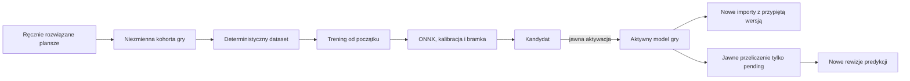

# Architektura iteracyjnego ulepszania modelu symboli

## Granica odpowiedzialności

Ten pion obejmuje model rozpoznawania symboli. Nie zmienia wersji geometrii,
croppera ani OCR numerów sekwencji. Właścicielem reguł produktowych jest
`requirements/SUPERVISED_MODEL_IMPROVEMENT.md`; ten dokument opisuje sposób ich
realizacji.

Kalibracja geometrii w wersji 0.5 pozostaje osobnym pionem z własną kohortą,
bramką, rejestrem aktywacji i snapshotem importu. Jej kontrakt opisuje
architecture/ITERATIVE_IMAGE_IMPORT.md; model symboli nie może ukrycie
aktywować ani zmieniać profilu siatki.

## Przepływ



## Planowane encje PostgreSQL

Zmiany schematu są wykonywane wyłącznie migracją Alembic. Szczegółowe pola
należą do `DATA_MODEL.md`.

### `verified_training_cohorts`

Niezmienny manifest pełnych, ręcznie zweryfikowanych plansz jednej gry.
Zawiera co najmniej `game_id`, numer iteracji, checksumę manifestu, liczności,
identyfikatory źródeł oraz czas i aktora zamrożenia.

### `symbol_model_iterations`

Opisuje niezmienną wersję kandydata: kohortę, fingerprint konfiguracji,
status, wersje kodu i bibliotek, ścieżki artefaktów, checksumy, metryki,
kalibrację i powód odrzucenia lub błędu.

### `game_symbol_model_activations`

Historia jawnych aktywacji i rollbacków per gra. Jeden rekord wskazuje wersję,
aktora i przyczynę. Bieżący aktywny model jest jednoznaczną projekcją ostatniego
skutecznego zdarzenia.

### `symbol_prediction_revisions`

Append-only wynik inferencji dla konkretnego cropu i wersji modelu. Zawiera
ranking klas, confidence, checksumę cropu oraz pochodzenie joba. Decyzja review
nie jest przechowywana w tej tabeli.

## Ochrona decyzji człowieka

Warstwa aplikacyjna kwalifikuje do przeliczenia wyłącznie elementy `pending`.
Sam zapis stosuje warunek porównujący oczekiwany status, rewizję review i
checksumę cropu. Jeżeli użytkownik rozwiązał element po pobraniu partii, zapis
nie dochodzi do skutku i raportuje `skipped_human_resolved`.

Operacja nie wykonuje `UPDATE` ani `DELETE` na tabelach zdarzeń rozstrzygnięć,
zatwierdzonych geometriach i stagingu. Test integracyjny porównuje ich checksumy
przed oraz po treningu, aktywacji i masowej inferencji.

## Budowa skumulowanego datasetu

Builder czyta wyłącznie pełne rozstrzygnięcia `accepted` i `corrected` z
zaakceptowaną geometrią oraz kompletem komórek. Zamrożony manifest wiąże:

- identyfikator i rewizję planszy,
- `cropSampleId` oraz checksumę każdego cropu,
- kod symbolu ustalony przez człowieka,
- zdjęcie źródłowe i import,
- wersję geometrii oraz pipeline'u.

Grupą podziału jest co najmniej zdjęcie źródłowe. Builder generuje stabilny
train/validation/test i osobny stały zestaw regresyjny. Ta sama grupa nie może
wystąpić w kilku częściach. Kolejna iteracja trenuje od początku na całej
skumulowanej kohorcie, co ogranicza dryf i pozwala dokładnie odtworzyć wynik.

Implementacja `verified-symbol-training-dataset-v1` przypisuje całą rodzinę
źródła przez stabilny hash checksumy oryginału. Domyślny podział wynosi
65% train, 15% validation, 10% test i 10% regression. Seed, wersja polityki
splitu oraz wersja transformacji wchodzą do manifestu. Dzięki przypisaniu
niezależnemu od liczby rekordów nowe iteracje nie przenoszą starszych źródeł
między splitami. Regression jest rozłączny z train, a niskie pokrycie klasy
jest jawnym advisory zamiast ukrytego przetasowania danych.

## Artefakty

Artefakty są content-addressed, nie są zapisywane jako duże BLOB-y w tabelach:

```text
data/
  training/<game-code>/<cohort-sha256>/
    assets/<prefix>/<crop-sha256>.png
    manifests/<dataset-manifest-sha256>.json
  models/<game-code>/<iteration-id>/<manifest-sha256>/
  exports/model-quality/<game-code>/<iteration-id>/
```

Manifest modelu zawiera co najmniej checksumę kohorty, konfiguracji, checkpointu
i ONNX, wersję kodu, kalibrację, progi, katalog symboli oraz pełne metryki.

## Trwały job

Jedna iteracja ma kontrolowane etapy:

```text
cohort_freeze -> dataset_build -> training -> onnx_export
              -> calibration -> evaluation -> candidate_ready
```

Każdy etap zapisuje checkpoint. Retry potwierdza fingerprint wejścia i nie
tworzy drugiej wersji z tym samym kluczem idempotencji. Początkowo blokada per
gra dopuszcza najwyżej jeden ciężki trening albo masową ponowną inferencję.

TASK-0146 realizuje pierwsze dwa etapy workera: `dataset_build` i `training`.
Używa wybranej wcześniej architektury `spatial-symbol-cnn-v1`, trenuje od zera
na pełnej kohorcie i zapisuje po każdej epoce niezmienny checkpoint modelu,
optimizera, najlepszego stanu i historii metryk. Fingerprint wiąże checksumę
kohorty, konfigurację i wersję runtime. Heartbeat jest odnawiany również w
długiej epoce i podczas materializacji datasetu. Anulowanie zachowuje ostatni
poprawny checkpoint, a retry odrzuca dryf wejścia. Status `trained` nie oznacza
aktywacji; eksport ONNX i bramka pozostają w TASK-0147.

TASK-0147 rozszerza ten sam trwały job o `onnx_export`, `calibration`,
`evaluation` i zapis manifestu. Status `trained` jest checkpointem po treningu,
`evaluating` oznacza działającą bramkę, a dopiero `candidate_ready` lub
kontrolowane `rejected` kończy iterację. Błąd techniczny ustawia `failed`.

## Bramka kandydata

Kandydat musi przejść:

- integralność artefaktów i zgodność katalogu symboli,
- parytet PyTorch–ONNX na ustalonej tolerancji,
- kalibrację confidence na validation,
- metryki ogólne i per klasa na rozłącznym test/regression,
- brak niedopuszczalnej regresji względem aktywnego modelu,
- smoke test CPU w środowisku workera.

Dokładne progi są wersjonowaną konfiguracją bramki. Przejście bramki nadaje
status `candidate_ready`, ale nie aktywuje modelu.

ONNX, checkpoint, katalog klas, kalibracja i raport są content-addressed i
powiązane wspólnym manifestem SHA-256. Validation służy wyłącznie do dopasowania
temperatury, natomiast test i regression pozostają rozłączne od treningu.
Pierwszy kandydat jawnie raportuje `baseline_unavailable`; od kolejnej aktywnej
wersji kandydat i baza muszą być mierzone na dokładnie tych samych próbkach.
Regresja recall pojedynczego symbolu blokuje kandydata nawet przy wzroście
metryki globalnej.

## Aktywacja, rollback i przypięcie importu

Aktywacja jest osobną, audytowalną komendą i dopisuje zdarzenie pod blokadą
rekordu gry. Nie istnieje drugi, mutowalny wskaźnik: aktywny model jest projekcją
zdarzenia o najwyższym monotonicznym `activation_number`. Poprzednie wersje
pozostają niezmienne, więc rollback jest kolejnym zdarzeniem aktywacji.

Jeżeli gra nie ma jeszcze zdarzenia, resolver zwraca jawny, checksum-bound
snapshot kontrolowanego modelu bootstrapowego. Po pierwszej aktywacji resolver
sprawdza manifest, ONNX, katalog klas i kalibrację przed utworzeniem joba; brak
lub drift artefaktu zatrzymuje nowy import bez cichego fallbacku.

Tworzenie image import joba schema v2 zapisuje dokładny snapshot modelu:
identyfikator iteracji, manifest SHA-256, ONNX SHA-256, wersję, katalog klas,
kalibrację, parametry wejścia i fingerprint inferencji. Efektywny fingerprint
pipeline'u obejmuje fingerprint bazowego pipeline'u oraz modelu, więc cache
predykcji nie może zostać użyty między różnymi modelami. Worker zawsze używa
tego snapshotu do końca joba. Historyczny schema v1 zachowuje kontrolowany
bootstrap; aktywacja w trakcie importu wpływa dopiero na następny import.

## Przeliczenie oczekujących

Jawna komenda tworzy job z listą elementów kwalifikujących się w momencie
startu. Worker ponownie sprawdza warunki przy każdym zapisie. Wyniki są nowymi
rekordami `symbol_prediction_revisions`, a projekcja bieżącej sugestii wybiera
najnowszą zgodną rewizję dla elementu nadal `pending`.

Raport końcowy rozdziela:

- przeliczone,
- pominięte jako rozwiązane przez człowieka,
- pominięte z powodu zmiany cropu lub geometrii,
- nieudane technicznie.

## Planowany kontrakt API

Kontrakty OpenAPI będą właścicielsko opisane w `API_CONTRACT.md`. Planowane
grupy operacji:

- odczyt stanu jakości aktywnej gry,
- preview i zamrożenie kohorty,
- utworzenie oraz odczyt iteracji modelu,
- jawna aktywacja, odrzucenie i rollback,
- preview oraz uruchomienie przeliczenia oczekujących.

Frontend korzysta z generowanego klienta; nie utrzymuje ręcznych kopii typów.

## Obserwowalność i odtwarzalność

Każda iteracja i inferencja zapisuje czas etapów, liczności, wersje, checksumy,
aktora oraz stabilne kody błędów. Diagnostyka nie zawiera obrazów ani ścieżek
absolutnych. Aktywna wersja i wersja przypięta do importu są widoczne w Adminie.
