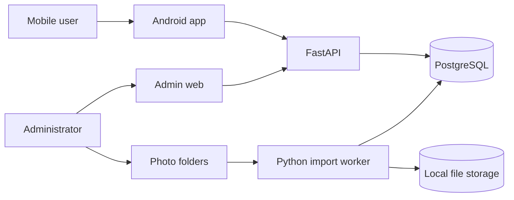
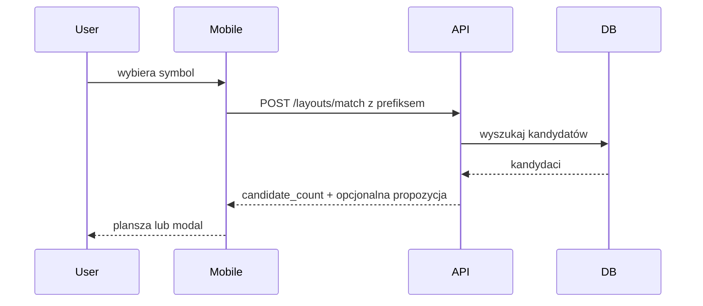
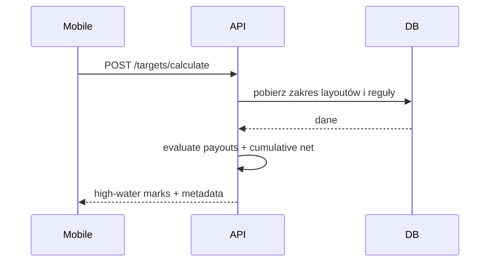

# Architektura systemu

## Kontekst



## Odpowiedzialności

### Mobile app

- prezentacja gier i symboli,
- lokalny stan planszy,
- undo/reset,
- wysyłanie prefiksu i pełnego layoutu,
- prezentacja wyniku i targetu,
- brak bezpośredniego dostępu do bazy.

### Admin web

- CRUD konfiguracji,
- edycja wzorców i wypłat,
- uruchamianie i obserwacja importów,
- manual review,
- publikacja danych.

### API

- walidacja wejścia,
- kontrola transakcji,
- layout matching,
- payout evaluation,
- target forecast,
- operacje administracyjne,
- generowanie OpenAPI.

### Worker

- operacje długotrwałe,
- skanowanie folderów,
- OpenCV/OCR/klasyfikacja,
- zapisy staging,
- raportowanie postępu,
- brak logiki UI.

### PostgreSQL

- kanoniczne konfiguracje,
- wersje danych,
- sekwencje layoutów,
- reguły i wyniki importu,
- integralność i indeksy.

### File storage

- oryginalne zdjęcia,
- pliki robocze,
- wycinki,
- dane treningowe,
- eksporty.

## Przepływ dopasowania



## Przepływ targetu



## Przepływ importu

1. Admin tworzy import job.
2. Worker pobiera job i skanuje folder.
3. Każde zdjęcie przechodzi pipeline.
4. Niepewne elementy trafiają do review.
5. Admin zatwierdza poprawki.
6. Worker wykonuje walidację.
7. Zatwierdzony staging jest publikowany jako wersja datasetu.

## Granice modułów backendu

```text
services/api/app/
  api/
  application/
  domain/
    matching/
    payouts/
    forecasting/
  storage/
  models/
  schemas/
```

Algorytmy w `domain/` nie importują FastAPI ani komponentów UI. Preferowane wejścia to proste struktury i typy domenowe.

## Model wdrożenia MVP

- PostgreSQL w Docker Compose na komputerze Windows.
- FastAPI uruchomione lokalnie na hoście.
- Admin pod lokalnym adresem webowym.
- Telefon Android łączy się z API przez adres IP komputera w tej samej sieci.
- CORS i firewall są skonfigurowane wyłącznie dla środowiska developerskiego.

Ten model jest propozycją do czasu zamknięcia Q-001.

## Przyszły offline mode

Jeżeli mobile ma działać offline:

1. admin publikuje wersję datasetu,
2. backend tworzy zoptymalizowany snapshot,
3. mobile pobiera snapshot,
4. wyszukiwanie i forecast mogą działać lokalnie,
5. aktualizacja jest wersjonowana i atomowa.

Nie należy implementować tego w MVP bez potwierdzonego wymagania.

## Integralność

- `sequence_number` unikalny w ramach gry i wersji datasetu,
- sygnatura layoutu nie jest unikalna,
- wszystkie symbole layoutu muszą należeć do gry,
- publikowana wersja danych jest immutable,
- import staging nie jest widoczny dla mobile,
- wynik targetu wskazuje wersję danych i reguł.
