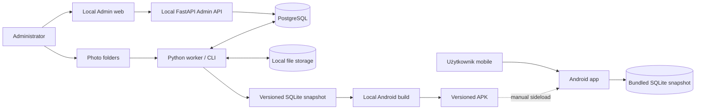
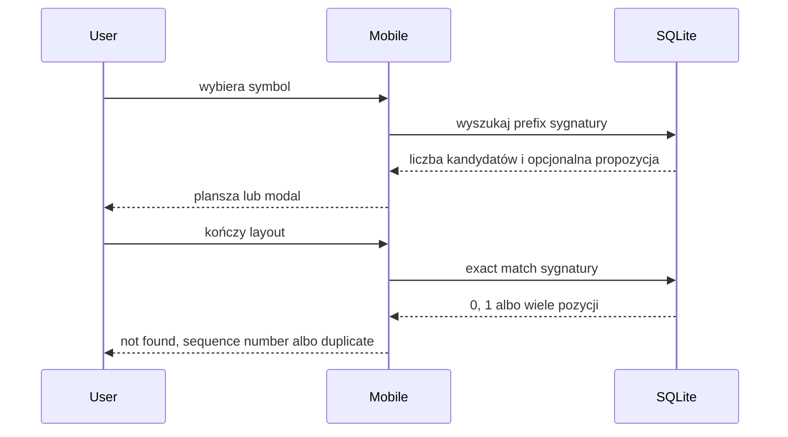
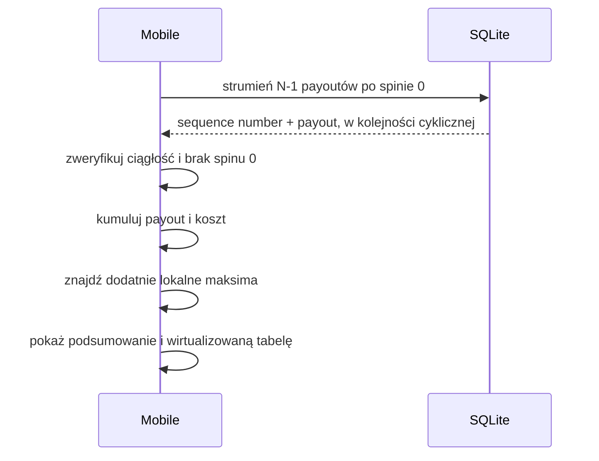
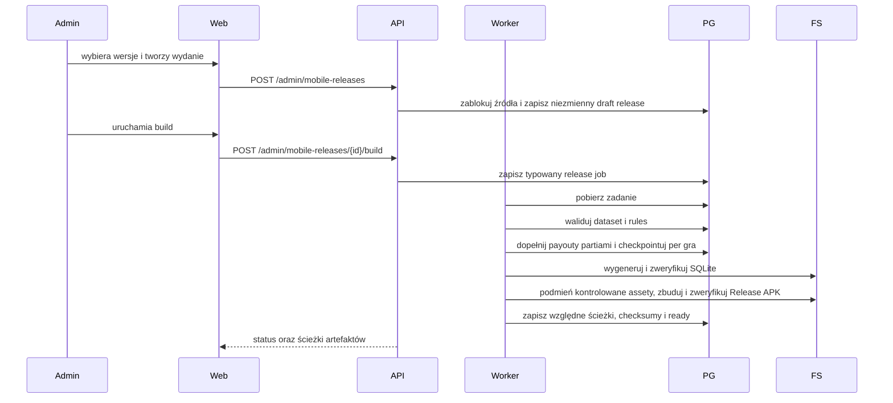

# Architektura systemu

## Kontekst



Najważniejsza granica: Android nie komunikuje się z Admin API ani PostgreSQL. Jedynym źródłem danych runtime jest snapshot dołączony do konkretnego APK.

## Odpowiedzialności

### Mobile app

- odczyt konfiguracji i symboli z lokalnego SQLite,
- stan planszy, undo i reset,
- lokalny exact/prefix matching,
- wykrycie duplikatu bez arbitralnego wyboru pozycji,
- skan gotowych payoutów dla pełnego cyklu,
- wykrycie dodatnich lokalnych maksimów,
- prezentacja wyniku i wirtualizowanej tabeli,
- diagnostyka wersji i integralności snapshotu.

### Admin web

- CRUD konfiguracji,
- edytor paylines i payoutów,
- generowanie/import i podgląd layoutów,
- uruchamianie i obserwacja jobs,
- manual review,
- publikacja wersji datasetów i reguł,
- zlecenie przygotowania snapshotu i APK.

### Admin API

- walidacja kontraktów,
- transakcje PostgreSQL,
- operacje administracyjne,
- kontrolowane zlecanie typowanych jobs,
- raportowanie postępu i artefaktów,
- generowanie OpenAPI dla klienta admin.

Admin API nie wykonuje długiego importu, pełnego precomputingu ani Android build wewnątrz requestu.
Wyjątkiem jest jawnie ograniczony mock M2: dokładnie 1000 małych layoutów
tworzonych synchronicznie i atomowo. Limit nie może zostać zwiększony do skali
produkcyjnej; większe generowanie przechodzi przez worker/job.

### Worker / CLI

- operacje długotrwałe i wznawialne,
- skanowanie folderów,
- OpenCV/OCR/klasyfikacja,
- zapis stagingu,
- walidacja ciągłości i integralności,
- obliczanie payoutów,
- generowanie SQLite,
- kontrolowane uruchamianie lokalnego workflow Android build,
- raportowanie postępu i błędów.

Admin API wyłącznie zapisuje typowany job w stanie `created`. Wspólny status
cyklu życia jest niezależny od `stage` konkretnego workflow. Żądanie anulowania
działającego joba zapisuje timestamp; dopiero worker może potwierdzić
`cancelled` po domknięciu bezpiecznej partii. Atomowy lease i ograniczenie
jednego ciężkiego wykonania należą do granicy workera.

Worker przejmuje najstarszy `created` przez `FOR UPDATE SKIP LOCKED`, a
unikalny slot w PostgreSQL dopuszcza tylko jeden rekord `processing`.
Handler działa poza transakcją i odnawia domyślny 60-sekundowy lease przez
heartbeat albo atomowy zapis checkpointu z postępem. Losowy token odcina stare
procesy od zapisu po wygaśnięciu lease. Następny claim najpierw odzyskuje
osierocony rekord: wraca on do `created` z zachowanym checkpointem albo do
`cancelled`, jeżeli wcześniej zażądano anulowania.

### PostgreSQL

- kanoniczne konfiguracje,
- wersje danych i reguł,
- sekwencje layoutów,
- staging, review i historia jobs,
- payouty powiązane z wersjami,
- manifesty wydań.

### File storage

- oryginalne zdjęcia,
- pliki robocze i wycinki,
- dane treningowe i modele,
- eksporty,
- strukturalne audyty payoutów JSONL,
- wygenerowane snapshoty i APK.

### Batch payout precomputation

Handler `payout-v2` odczytuje wyłącznie opublikowany dataset i opublikowane
reguły tej samej gry o zgodnych wymiarach. Źródło jest mapowane do czystych
kontraktów engine, a layouty są pobierane rosnąco po `sequence_number` w
partiach po 1000, bez ładowania pełnego datasetu do pamięci.

Dla każdej partii worker:

1. sprawdza ciągłość sekwencji i ocenia layouty czystym engine,
2. atomowo podmienia deterministyczny plik audytu JSONL,
3. wykonuje idempotentny upsert `layout_payouts`,
4. dopiero potem zapisuje checkpoint z ostatnim numerem i licznikami.

Awaria przed checkpointem może więc powtórzyć ostatnią partię, ale nie tworzy
drugiego wyniku ani innej ścieżki audytu. Katalog artefaktów jest lokalny i
konfigurowalny argumentem CLI; mobile nigdy go nie odczytuje.

Przed generowaniem snapshotu wielokrotnie używalna bramka gotowości sprawdza
dokładną kombinację dataset/rules/algorithm. Liczniki są obliczane agregatami
SQL bez materializowania pełnego datasetu w workerze, a próbka braków jest
ograniczona do 100 rosnących `sequence_number`. Bramka blokuje staging,
archiwalne źródło, niezgodną grę lub wymiary, niepełny zestaw i brak przypisania
audytu. Wyniki innych wersji pozostają w bazie, lecz nie wpływają na raport.

Osobny strumieniowy weryfikator JSONL porównuje nagłówek i każdy rekord z
oczekiwanym wynikiem partii. Potwierdza kolejność, payout, sumę matches,
komórki, jokery i ich interpretacje bez ładowania całego pliku do pamięci.

### Production SQLite generation

Generator schema v2 przyjmuje jawne wybory
`(dataset_version_id, rules_version_id, algorithm_version)` oraz deterministyczne
metadata wydania. Każdy wybór przechodzi bramkę kompletności M3.2. Źródła są
porządkowane po stabilnym kodzie gry, a mobilne identyfikatory techniczne są
przydzielane dopiero po tym sortowaniu.

Katalog gier i symboli jest mały i powstaje przed zapisem. Layouty z dokładnie
wybraną wersją payoutu są odczytywane z PostgreSQL keysetowo i zapisywane do
tymczasowego SQLite partiami po 1000. W tym samym przebiegu powstaje logiczny
SHA-256 kanonicznych rekordów. Dopiero kompletny plik z finalnym
`content_checksum` staje się widoczny pod ścieżką docelową; generator odrzuca
istniejący cel.

Generator snapshotu nie jest osobnym child-jobem release. Handler
`android_build` z TASK-0037 wywołuje go jako jeden z resumowalnych etapów
nadrzędnego workflow.

Publisher TASK-0035 buduje SQLite i kanoniczny manifest w prywatnym katalogu
stagingowym. Niezależny walidator otwiera bazę read-only, potwierdza fizyczny
SHA-256, schema/application id, dokładny zestaw tabel i indeks signature,
metadata, FK oraz `quick_check`. Następnie odczytuje layouty po 1000, kontroluje
ciągłość, symbole, codec sygnatury i payout oraz rekonstruuje logiczny SHA-256.

Dopiero zweryfikowany staging jest atomowo przenoszony do
`snapshots/<releaseVersion>/<logicalContentSha256>/`. Katalog końcowy zawiera
wyłącznie `snapshot.db` i `manifest.json`. Retry nie zmienia istniejących
plików; pełna walidacja identycznego manifestu pozwala użyć ich ponownie, a
każda rozbieżność kończy się stabilną kolizją.

## Przepływ dopasowania offline



## Przepływ Target offline



Port forecastu przyjmuje uporządkowany strumień `N - 1` par
`(sequence_number, payout)` wraz z metadanymi wydania. Adapter SQLite odpowiada
za cykliczny odczyt partiami, a czysty engine ponownie weryfikuje oczekiwany
numer każdej pozycji i wykonuje jeden przebieg.

Payout reguł nie jest liczony w runtime mobile. Został obliczony przy przygotowaniu wydania.

## Przepływ publikacji wydania



Publikacja jest niezmienna. Zmiana danych tworzy nowe wydanie i nie modyfikuje już zainstalowanego APK.

Dokładnie jeden job `android_build` posiada cały przebieg. Checkpoint schema v1
zapisuje ukończone gry i aktywny checkpoint payoutu, dlatego po wygaśnięciu
lease albo retry nie powstają child-joby i nie są nadpisywane gotowe artefakty.
Kontrolowany adapter przyjmuje wyłącznie utrwalony release, stały wariant
`Release` i architekturę `arm64-v8a`; klient nie przekazuje komendy. Na czas
builda produkcyjny manifest schema v1 i `snapshot.db` zastępują stały asset
Metro, a pliki bazowe są bezwarunkowo odtwarzane. Weryfikacja potwierdza podpis,
brak `INTERNET`, standalone bundle oraz SQLite o dokładnym checksumie release.

Panel wybiera wyłącznie aktywne gry oraz opublikowane, zgodne wymiarami pary
dataset/reguły. Po utworzeniu draftu nie edytuje jego składu. Podczas builda
odświeża szczegół release i dokładnie jeden przypięty job, a retry wznawia ten
sam rekord. Gotowy APK jest pobierany przez kontrolowany endpoint po ponownej
weryfikacji SHA-256 względem wspólnego katalogu artefaktów; przeglądarka nie
przekazuje ścieżki ani komendy systemowej.

Utworzenie release i uruchomienie builda są osobnymi operacjami. TASK-0036
utrwala globalnie unikalną wersję oraz 1–15 dokładnych wyborów dataset/rules.
Serwer ustala obsługiwany algorytm i schema, blokuje źródła, wymaga statusu
`published`, wspólnej aktywnej gry oraz zgodnych wymiarów i zapisuje wszystkie
rekordy w jednej transakcji. Dopiero TASK-0037 tworzy job i zmienia lifecycle.

## Przepływ ręcznego importu layoutów

1. Operator umieszcza CSV/JSONL pod skonfigurowanym lokalnym `import_root`.
2. Panel przekazuje Admin API wyłącznie względny `sourcePath` i wersję
   kontraktu.
3. Warstwa application rozwiązuje ścieżkę pod rootem, sprawdza limit i preview,
   a następnie liczy SHA-256 bounded partiami.
4. API tworzy istniejący job `import` z poświadczonym formatem, rozmiarem,
   checksumą i kanoniczną ścieżką względną.
5. `input_key` blokuje drugi import tej samej treści/kontraktu dla tej samej gry.
6. Worker `worker-v3` ponownie sprawdza checksum i usuwa ewentualny nietrwały
   ogon znajdujący się za checkpointem.
7. CSV/JSONL jest czytany po jednej ograniczonej linii i partiami po 1000
   niepustych rekordów; poprawny rekord albo bezpieczny błąd trafia do
   `layout_import_rows`.
8. Po idempotentnym upsercie partii worker zapisuje offset bajtowy, numer linii,
   liczniki i łańcuch checksumy prefiksu w checkpoint schema v1.
9. Pełny SHA-256 jest ponownie potwierdzany przed końcowym checkpointem; każda
   rozbieżność usuwa surowy staging i zeruje kursor do bezpiecznego replay.
10. API tworzy osobny job `validate` dla zakończonego importu i wybranej
    opublikowanej wersji reguł tej samej gry.
11. Worker `worker-v4` pobiera surowe wiersze bounded partiami po fizycznym
    `line_number`, sprawdza `rows * columns` i aktywny alfabet oraz koduje
    stałoszeroką sygnaturę.
12. Znormalizowana partia jest idempotentnie zapisywana przed checkpointem.
    Błędy parsera i błędy domenowe pozostają osobnymi rekordami, więc jeden
    wadliwy wiersz nie zatrzymuje pozostałych.
13. Po zakończeniu walidacji Admin API liczy dokładne agregaty integralności
    bez ładowania całego stagingu do pamięci: zgodność liczby wierszy, ciąg od
    `1`, luki, duplikaty numerów, duplikaty sygnatur i kody błędów.
14. Panel może pobierać bounded, deterministyczne próbki oraz stronicować
    znormalizowane wiersze po fizycznym `line_number`; raport nadal nie tworzy
    datasetu.
15. Jawne odrzucenie zakończonej walidacji usuwa wszystkie znormalizowane
    stagingi jej importu przed surowymi wierszami, pozostawiając joby jako audyt;
    aktywna walidacja albo istniejący dataset blokuje operację.
16. Publikacja blokuje job importu, jego walidacje, opublikowane reguły i grę,
    ponownie liczy ten sam raport, a następnie w jednej transakcji tworzy
    serwerowo numerowaną wersję datasetu i kopiuje poprawne rekordy setowym
    `INSERT ... SELECT`. Dataset staje się `published` dopiero po sprawdzeniu
    liczby skopiowanych layoutów.

HTTP nie przesyła dużego pliku i nie wykonuje pełnego importu w requestcie.
Inspekcja czyta najwyżej bounded preview oraz jeden przebieg SHA-256; staging i
pełna walidacja pozostają w workerze. Surowy staging nie tworzy jeszcze
`dataset_version` ani `layouts` i nie jest widoczny dla wydania mobilnego.
To samo dotyczy znormalizowanego stagingu: TASK-0047 raportuje luki i duplikaty,
a TASK-0049 dopiero transakcyjnie tworzy dataset.
Retry publikacji identyfikuje wynik przez unikalny
`dataset_versions.source_job_id = validation_job_id` i zwraca tę samą wersję.
Odrzucenie i publikacja blokują najpierw ten sam job importu, dzięki czemu nie
mogą równolegle usunąć oraz skopiować stagingu.

## Przepływ importu zdjęć

1. Admin tworzy import job.
2. Worker skanuje folder i zapisuje checksumy.
3. Każde zdjęcie przechodzi wersjonowany pipeline.
4. Niepewne elementy trafiają do review.
5. Admin zatwierdza poprawki.
6. Worker wykonuje walidację ciągłości.
7. Zatwierdzony staging tworzy nową wersję datasetu.

TASK-0068 scala wersje etapów w kanoniczny
`image-pipeline-manifest-v1`. Manifest nie jest konfigurowalnym skrótem typu
„latest”: zawiera komplet adapterów, modele i ich SHA-256, preprocessing,
kalibrację, confidence policy oraz stałą kolejność ośmiu etapów.
`pipelineFingerprint` jest wyprowadzany z sortowanego kanonicznego JSON bez
envelope, timestampów i danych hosta. Envelope przechowuje fingerprint obok
manifestu i jest odrzucany, gdy oba elementy nie są zgodne.

Tożsamość wykonania pojedynczego pliku ma kontrakt
`image-file-execution-v1`:

```text
SHA-256("image-file-execution-v1\0" + sourceSha256 + "\0" + pipelineFingerprint)
```

Ten sam plik i identyczny pipeline mają jeden klucz idempotencji. Zmiana
adaptera, modelu, checksumy, kalibracji albo polityki tworzy nowy klucz i nowy
namespace wyniku. Persistence, lease i transakcje zostają w TASK-0069, ale
muszą utrwalać ten klucz bez zmiany jego semantyki.

Checkpoint per plik używa kontraktu `image-pipeline-file-checkpoint-v1`.
`completedStages` jest unikalnym uporządkowanym prefiksem manifestu, a
`nextStage` jest dokładnie następnym elementem. Przejście jest idempotentne albo
kończy jeden kolejny etap. Ponieważ aktualne OCR i symbol ONNX są
`manual_review_only`, checkpoint po `symbol_inference` musi mieć
`waiting_for_review`; nie wolno przejść bezpośrednio do walidacji.

TASK-0069 utrwala wykonanie w dwóch warstwach. Globalne
`image_file_executions` ma PK równy `fileExecutionKey`; asocjacja
`image_import_job_files` dodaje job, deterministyczny `order_index` i
diagnostyczną ścieżkę. Dwa joby mogą więc wykorzystać ten sam kompletny wynik,
ale zmiana pipeline'u tworzy nowy rekord bez nadpisania historii.

`ImageBatchHandler` przyjmuje port wykonania jednego etapu. Po każdym etapie
najpierw, w krótkiej transakcji z blokadą, zapisuje file checkpoint i ponownie
sprawdza fencing token aktywnego joba. Dopiero potem zapisuje checkpoint i
liczniki joba. Awaria pomiędzy tymi operacjami pozostawia postęp pliku i
powtarza najwyżej idempotentny checkpoint joba. Anulowanie jest zauważane przez
wspólny runtime przy tym drugim zapisie, więc nie rozpoczyna następnego etapu.

Handler najpierw kończy wszystkie pliki `processing`, następnie raz na przebieg
rewaliduje oczekujące review i dopiero wtedy zwalnia slot przez
`waiting_for_review`. Nierozwiązana plansza nie blokuje zatem diagnostyki
pozostałych źródeł. Orkiestrator nie publikuje datasetu i nie jest jeszcze
rejestrowany w CLI; rzeczywiste adaptery i seeding z discovery podłącza
TASK-0070.

Discovery używa kontraktu `image-discovery-v1`. Read-only scanner zapisuje poza
katalogiem źródłowym deterministyczny manifest ścieżek względnych POSIX,
SHA-256, rozmiarów, mtime, wymiarów oraz stabilnych problemów. Identyczne bajty
pod wieloma nazwami tworzą jedną tożsamość treści z listą ścieżek. Znany
manifest pozwala wybrać wyłącznie nowe checksumy bez zmiany pełnego manifestu
źródła. Manifest nie zawiera ścieżki absolutnej ani binarnej treści zdjęcia.

Normalizacja używa kontraktu `image-normalization-v1` i Pillow
`ImageOps.exif_transpose`. Po ponownej kontroli manifestu i SHA-256 zapisuje
czyste RGB PNG jako
`image-normalization-v1/<prefix>/<source-sha256>/normalized.png` oraz
`diagnostic.json`. Artefakty są względne wobec osobnego working root,
content-addressed i niezmienne; retry porównuje bajty, a kolizji nie nadpisuje.

Geometria używa portu `PageBoardDetector` oraz kontraktu
`page-board-detector-v1`. Klasyczna implementacja OpenCV/NumPy przyjmuje
znormalizowany RGB, wykrywa czerwone ramki w HSV i zwraca stronę oraz dokładnie
dziewięć plansz w kolejności row-major. Każda plansza zawiera indeks, quad,
bounding box, ocenę czerwonej ramki i jawny znacznik korekty względem siatki.
Confidence obrazu składa się z dowodu ramki, zgodności rozmiaru, wyrównania
wierszy/kolumn i stabilności korekty. Niespełniona geometria zwraca
`needs_review` ze stabilnymi powodami zamiast częściowego wyniku.

Overlaye detektora są niezmiennymi artefaktami roboczymi pod
`page-board-detector-v1/<prefix>/<source-sha256>/overlay.png`. Warstwa domenowa
detektora nie zna CLI ani systemu plików; runner odpowiada za weryfikację
raportu normalizacji, bezpieczne ścieżki, checksumy i idempotentny zapis.

Prostowanie i podział komórek używa osobnego portu `BoardCellCropper`.
`board-cell-crops-v1` jest niezmiennym, odrzuconym wejściem historycznym:
globalny inset zmienił krok siatki i przeciął symbole. Nowe etykiety mogą
powstawać wyłącznie z `board-cell-crops-v2`. Runner ponownie weryfikuje raport normalizacji,
jego checksumę zapisaną przez TASK-0054, tożsamość źródła i checksumę
znormalizowanego PNG. Dopiero kompletny wynik dziewięciu plansz trafia do
indywidualnych transformacji perspektywy 500 × 300 i siatki 3 × 5.

Artefakty v2 mają układ
`board-cell-crops-v2/<prefix>/<source-sha256>/board-<index>/`: `board.png`,
`grid-overlay.png` oraz `cells/r<row>-c<column>.png`. Raport przechowuje
macierz transformacji i SHA-256 każdego pliku. Port nie zna systemu plików,
natomiast runner gwarantuje bezpieczne ścieżki, content-addressed zapis,
idempotencję i brak częściowych artefaktów przy wyniku `needs_review`.

## Granice kodu

```text
services/api/app/
  api/
  application/
  domain/
  storage/
  models/
  schemas/

services/worker/
  jobs/
  image/
    geometry/
    ocr/
    classification/
  publication/
  build/

apps/mobile/src/
  features/
  domain/
    matching/
    forecasting/
  data/
    sqlite/
  ui/
```

Moduły `domain/` nie importują FastAPI, React, Expo ani ORM. Porty oddzielają:

- matching od formatu sygnatury i SQLite,
- forecast od sposobu pobierania payoutów,
- OCR i klasyfikację od konkretnych bibliotek,
- przygotowanie wydania od konkretnej komendy Android build.

`SequenceNumberRecognizer` jest wersjonowanym portem recognition-only. Runner
`sequence-number-ocr-v1` samodzielnie weryfikuje checksumy manifestu,
normalizacji, detekcji i lokalnego modelu, tworzy content-addressed `raw.png`
oraz `foreground.png`, a następnie zapisuje raw text, normalized number i
confidence. Pierwszy adapter D-055 uruchamia oficjalny model
`en_PP-OCRv5_mobile_rec` bezpośrednio przez PaddlePaddle CPU; brak modelu ma
stabilny błąd i nie może uruchomić pobierania. Walidacja ciągłości jest osobną
czystą funkcją: dodaje powody review, lecz nie poprawia odpowiedzi OCR.

Benchmark `m5-image-benchmark-v2` jest osobnym, read-only agregatorem raportów
etapowych. Weryfikuje ich łańcuch checksum, liczy tylko wskazane artefakty,
przechowuje surowe próbki czasu i odtwarza z nich deterministyczne podsumowanie.
Mierzy geometrię na 43 przejrzanych obrazach i 387 pozycjach oraz OCR osobno
na podziale held-out według zdjęcia źródłowego. Kontrola alternatywy zmienia
tylko wersjonowaną politykę wejścia OCR i nie zmienia stagingu ani baseline
adaptera.

Po D-057 pipeline obrazu ma trzy jawne poziomy dojrzałości:

- `retain`: kontrakty plików, checksum, idempotentnych artefaktów, portów,
  detektor `page-board-detector-v2` jest stabilną granicą, natomiast cropper
  komórek przechodzi korektę v2,
- `supported`: strona zawiera od 1 do 9 pozycji row-major; krótsza strona jest
  dozwolona tylko jako jawnie opisana ostatnia strona sekwencji, a recovery
  wymaga oczekiwanej liczby pozycji i dowodu czerwonej ramki,
- `manual_review_only`: obecny adapter OCR może tworzyć propozycję i
  diagnostykę, lecz jego wynik nie może sam zatwierdzić ani opublikować
  `sequence_number`.

Golden narożników detektora został zainicjalizowany jego własnym wynikiem i
zaakceptowany po wizualnym przeglądzie overlayów. Nie jest niezależnym ręcznym
pomiarem i nie wystarcza do rectyfikacji piętnastu komórek. Zgodnie z D-060
osobny `cell-grid-golden-v1` zawiera ręcznie zaakceptowany `sourceQuad`
rzeczywistej ramy planszy na oryginalnym zdjęciu. Homografia quadu tworzy
kanoniczne 500 × 300, gdzie linie 100 × 100 są osiowe; na zdjęciu te same linie
są ukośną siatką perspektywiczną. M6 może korzystać wyłącznie z cropów, które
przejdą tę bramkę; właściciel nie wycina ich ręcznie.

Domyślny cropper v2 dzieli 500 × 300 na logiczne sloty 100 × 100, po czym
stosuje wersjonowany inset wewnątrz każdego slotu. `GridCalibrationProfile`
ma zakres `(source_group, board_position)` i przechowuje niezmienne anchory
zaakceptowanych quadów jako korekty narożników w lokalnej bazie quadu detektora.
Korekta jest interpolowana liniowo po domenowym `sequence_number`, a poza
zakresem anchorów klamrowana do najbliższego z nich bez ekstrapolacji. Profil
nie nadpisuje wcześniejszych artefaktów; skalibrowany cropper materializuje
osobny namespace `board-cell-crops-v2-calibrated-v1` z identyfikatorem profilu,
wersją i pochodzeniem anchorów w każdym rekordzie planszy.

Po D-063 również profile exact source-image z D-062 są historyczne jako
produkcjne źródło finalnych granic komórek: jedna korekta ramy nie może być
przenoszona między pozycjami tej samej strony. Produkcyjny cropper rozpoczyna
od quadu detektora każdej planszy osobno, lokalizuje 15 środków symboli i
dopasowuje odporną korektę afiniczną. Każdy rekord zachowuje wersję refinera,
coverage, inliery, residual i źródło geometrii. Niespełnienie któregokolwiek
guardu zatrzymuje całą stronę jako `needs_review`; odrzucona plansza trafia do
exact-observation review bez poluzowania progów globalnych. Dopiero kompletna
regeneracja i przegląd pełnych stron mogą ustawić `trainingAllowed = true`.

Po odrzuceniu osiowego v9 D-064 zastępuje transform afiniczny nowym kandydatem
projektowym, bez modyfikowania historycznych artefaktów. Quad detektora jest
rozszerzany w kanonicznych współrzędnych tej samej płaszczyzny, więc nie traci
nachylenia. `symbol-lattice-homography-ransac-v1` następnie dopasowuje jedną
homografię ideal-to-observed do wszystkich wiarygodnych środków znanej siatki
5 × 3. RANSAC odrzuca lokalne błędy, a cztery wirtualne narożniki są projekcją
kanonicznych granic wyznaczoną ze wszystkich inlierów. Guardy wymagają pełnego
pokrycia wierszy i kolumn, liczby punktów, residualu, wypukłości, pola,
marginesu i prawdopodobnych odstępów. Krok estymacji nie tworzy cropów.
Osobny kolejny etap prostuje planszę przez zaakceptowaną homografię, stosuje
stały padding w kanonicznej komórce i przechodzi małą bramkę regresji przed
uruchomieniem pełnego korpusu.

Pierwsza implementacja tego etapu,
`board-cell-crops-v12-projective-lattice-fixed-padding-preflight-v1`,
stosuje inset `10 px`, support mask i projekcję czterech narożników każdego
cropu. Zapobiega to użyciu pikseli spoza rozszerzonej ramki, ale ograniczona
bramka odrzuciła rozwiązanie. Przyczyną nie jest warp ani padding: wejściowy
lokalizator nadal szuka jednego środka wewnątrz każdego przybliżonego slotu i
może wybrać fragment ramy lub już przeciętego symbolu. Spójnie błędna kolumna
może przejść przez RANSAC. Następny wariant musi najpierw utworzyć globalny
zbiór kandydatów symboli na całej planszy, a następnie jawnie przypisać go do
5 × 3 przed użyciem niezmienionych guardów homografii i fixed padding.

Wariant v13 realizuje tę granicę jako
`global-bright-component-lattice-assignment-v1`. Kompaktowe komponenty są
wykrywane na całej płaszczyźnie analizy, wspólnie wyznaczają pięć kolumn i trzy
rzędy, a każdy komponent może wspierać najwyżej jeden slot. Refinement lokalny
następuje dopiero wokół przypisanej bazy; slot bez globalnego komponentu nie
może zostać wiarygodnym punktem tylko na podstawie fragmentu ramy.
`symbol-lattice-homography-ransac-v2-global-assignment-v1` nadal wymaga tej
samej liczby kandydatów i inlierów, pełnego coverage oraz P95 residualu.

Rozszerzona plansza 500 × 300 jest wyłącznie płaszczyzną analizy, a nie
fizycznym źródłem pikseli. Dlatego
`board-cell-crops-v13-global-lattice-source-aware-fixed-padding-preflight-v1`
składa homografię `ideal -> analysis -> normalized source` i prostuje komórki
bezpośrednio z oryginalnego znormalizowanego zdjęcia. Wirtualna siatka może
wyjść w ograniczonym zakresie poza płaszczyznę analizy, ale każdy narożnik
padded cropu musi pozostać wewnątrz realnego źródła, a osobna maska musi dać
support fraction `1.0`. To usuwa sztuczne ograniczenie błędnego quadu
pośredniego bez dopuszczania border replication, czarnych pikseli ani
poluzowania progów RANSAC.

Ograniczona regresja v13 odzyskała `29`, wszystkie zgłoszone `4`, `6`, `7`,
`26`, `30` oraz 12 z 14 kontroli. Kontrole `3` i `11` pozostają bezpiecznie
odrzucone z powodu braku kompletnego globalnego przypisania. Z tego powodu v13
jest nadal kandydatem preflight, nie produkcyjnym źródłem datasetu; pełny
korpus i trening pozostają zatrzymane.

Wariant v14 dodaje pojedynczy, kontrolowany retry na szerszej płaszczyźnie
analizy wyprowadzonej z `boundingBox` detektora. Retry wolno uruchomić wyłącznie
po braku komponentów, nieudanym przypisaniu osi albo zbyt małej liczbie
przypisań globalnego locatora. Prostokąt z paddingiem `6%` w poziomie i `4%`
w pionie nie jest geometrią komórek: służy tylko do ponownego zebrania punktów,
po czym obowiązują te same globalne przypisanie, RANSAC, pełne coverage,
residual, kompozycja do źródła i support fraction `1.0`. Inne błędy pozostają
fail-closed.

Ograniczona regresja v14 przechodzi technicznie `20/20`. Tylko kontrole `3`
i `11` użyły retry; pozostałe 18 kart jest bajtowo zgodne z v13. V14 pozostaje
kandydatem preflight do czasu jawnej akceptacji galerii przez właściciela.
Pełny korpus i trening nadal są zatrzymane.

Po akceptacji galerii pełny runner zachowuje wynik każdej planszy i komórki
w osobnym, niezmiennym artefakcie oraz grupuje review po obrazie źródłowym.
Pierwszy przebieg v14 przetworzył wszystkie 387 plansz, ale tylko 373 przeszły
guardy. Czternaście wyników fail-closed nie jest pomijanych ani zastępowanych
geometrią v7; blokują one publikację całego namespace'u i trening. Dalsza
korekta może rozszerzać wyłącznie jawne ścieżki analizy tych przypadków.

Zgodnie z D-067 te 14 przypadków może skonsumować osobny, zaakceptowany zbiór
ręcznych override'ów. Klucz override'u to checksum obrazu źródłowego oraz
`position_index`. Ścieżka ręczna omija lokalizator symboli tylko dla tej jednej
obserwacji, ale nadal wykonuje source-aware fixed padding, kontrolę wszystkich
narożników, support fraction `1.0` i pełny page-level gate.

Implementacja v16 zachowuje 373 zaakceptowane artefakty v14 bajtowo: każdy
plik jest ponownie odczytywany i sprawdzany względem zapisanej checksumy przed
materializacją nowego namespace'u. Tylko 14 ręcznych quadów przechodzi ponowną
rectyfikację i fixed padding. Dzięki temu merge nie uruchamia ponownie RANSAC
dla poprawnych plansz i nie wprowadza niedeterministycznej regresji między
dwoma przebiegami pełnego preflightu.

Zgodnie z D-058 bootstrap M6 nie łączy cropów z fikcyjnymi rekordami layoutów.
Historyczne zachowanie v2 po D-061 pozostaje audytowalne, ale produkcyjny
`symbol-crop-inventory-v3` ponownie sprawdza manifest korpusu, reviewed
sequences, dokładny raport v16, osobną akceptację właściciela oraz rzeczywiste
pliki plansz RGB 500 × 300 i komórek RGB 90 × 90, checksumy i pozycje
row-major, a następnie nadaje stabilne
`observationId` niezależne od bajtów cropu oraz wersjonowane `cropSampleId`
zależne od croppera, proweniencji geometrii i checksumy. Osobny kontrakt decyzji wiąże obserwację i
dokładną wersję cropu z symbolem dopiero po
jawnej decyzji człowieka. Eksporter `labeled-symbol-dataset-v1` materializuje
jeden content-addressed asset na checksumę, zachowując osobne wystąpienia i
pochodzenie. Brak decyzji nie jest błędem danych, lecz stanem `pending`;
konflikt dwóch zatwierdzonych klas dla identycznych bajtów jest błędem
blokującym. Eksporter jawnie odrzuca inwentarz v1 i przenosi do manifestu
checksumy całego zaakceptowanego łańcucha oraz identyfikatory obserwacji,
cropu, planszy i geometrii. Stare decyzje v2 nie przechodzą automatycznie do
v3; pozostają powiązane z historycznym `cropSampleId`.

TASK-0097 dodatkowo grupuje obserwacje według stabilnego `boardId`, ponownie
weryfikuje kanoniczny obraz planszy RGB 500 × 300 i udostępnia wyłącznie
loopbackowy endpoint planszy. Zapis zestawu decyzji komórek jest atomowy,
idempotentny i nie może obejmować cropu z innej planszy. Częściowe decyzje
pozostają poprawnym, wznawialnym stanem `reviewed-cell-labels-v1`.

Bootstrap review pokazuje pełną planszę 5 × 3. Pierwsza iteracja etykiet tworzy
wersjonowany batch treningowy; model nie jest aktualizowany online. Kolejne
TASK-0061–TASK-0063 tworzą model, ONNX i skalibrowaną politykę active learning,
która priorytetyzuje niepewne przypadki, ale nie uruchamia auto-accept przed
przejściem held-out.

Baseline TASK-0061 jest małym, lokalnym CNN bez pretrained weights. Otrzymuje
deterministycznie znormalizowane RGB 64 × 64, uczy się batchowo wyłącznie na
train i wybiera checkpoint według validation macro-recall. Test jest oceniany
dopiero po zamrożeniu checkpointu. Raport wiąże dataset, source-aware split,
konfigurację, class mapping, wersje PyTorch/torchvision oraz logiczny checksum
`state_dict`. Model ma status `bootstrap` i nie może auto-akceptować etykiet.

TASK-0099 wykorzystuje zamrożony checkpoint wyłącznie jako pomoc w ręcznym
review. Indeks najbliższych przykładów zawiera tylko zaakceptowane próbki
partycji train z zatwierdzoną geometrią. Dla każdej komórki wyklucza self-match
i wszystkie referencje z tego samego obrazu źródłowego, po czym zwraca najwyżej
jedną referencję na klasę i deterministyczne top-3. Próg cosinusowy `0,9975`
jest bramką wyświetlenia, nie confidence policy ani auto-accept. Brak
wystarczającego podobieństwa daje `no_suggestion`. Historyczna etykieta
powiązana przez `observationId` jest osobnym dowodem poprzedniej geometrii.
Żadna sugestia nie zmienia `reviewed-cell-labels-v1`; dopiero kliknięcie albo
skrót użytkownika tworzy zwykłą decyzję review.

TASK-0062 ustanawia produkcyjną granicę inferencji jako
`bootstrap-symbol-cnn-onnx-v1`: aktualny eksporter `torch.export` materializuje
ONNX opset 18 z dynamicznym wyłącznie batchem oraz stałymi wymiarami
`N × 3 × 64 × 64 -> N × 8 logits`. Artefakt wskazuje dokładny checkpoint
PyTorch, preprocessing i kolejność klas, przechodzi pełny ONNX checker oraz
jest ponownie generowany bajtowo w trybie `--check`. Lokalny adapter weryfikuje
SHA-256 przed utworzeniem sesji, wymusza wyłącznie
`CPUExecutionProvider`, jeden wątek i sekwencyjne wykonanie oraz odrzuca
niepoprawny kształt, typ i wartości niefinitywne. Akceptowany limit parytetu
wynosi `1e-5` osobno dla logits i prawdopodobieństw; zmiana top-1 jest błędem
blokującym. Adapter nie pobiera modelu ani danych z sieci.

TASK-0063 nakłada na logits jedną dodatnią temperaturę
`symbol-temperature-calibration-v1`, dopasowaną deterministycznie przez
ograniczoną optymalizację NLL wyłącznie na validation. Skalowanie nie zmienia
top-1. Raport przechowuje NLL, Brier, ECE, reliability bins, metryki każdej
klasy i pełny pomiar progów; test służy wyłącznie jednorazowej ocenie po
zamrożeniu temperatury. Polityka `symbol-confidence-policy-v1` jest
fail-closed: status bootstrapowy, nieosiągnięty cel liczności albo brak
wymaganego precision/support wyłącza auto-accept. Automatyczny reject jest
zawsze wyłączony, ponieważ niska pewność modelu nie jest dowodem błędnej
geometrii ani nieważnej obserwacji.

`whole-layout-active-learning-v1` uruchamia ten sam checksum-bound adapter ONNX
na pending cropach, weryfikując każdy plik przed inferencją. Do kandydatów
dopuszcza wyłącznie plansze z kompletem 15 pending komórek. Deterministyczny
greedy ranking waży niepewność, różnorodność w przestrzeni predykcji, nowe
źródło i rzadko przewidywane klasy; do pokrycia dostępnych źródeł wybiera
najwyżej jedną planszę na zdjęcie. Wynik jest tylko wersjonowaną kolejką
manual review i nie mutuje źródła etykiet ani modelu.

Granica persistence M6.3 przyjmuje wyłącznie kompletny, checksum-bound raport
active-learning. Warstwa domenowa waliduje katalog symboli, 15 komórek
row-major, źródła, ścieżki i provenance przed jakimkolwiek zapisem.
`review_batches` zachowuje niezmienny raport, a `review_items` jego
deterministycznie uporządkowane snapshoty plansz. Ponowienie importu po tym
samym SHA-256 jest idempotentne; inny payload lub gra z tym samym kluczem są
konfliktem. Read-only Admin API jest osobnym pionem od późniejszego zapisu
decyzji, dzięki czemu samo wyświetlenie sugestii nie może zmienić etykiet,
datasetu ani modelu.

Przeglądarka nie otrzymuje ścieżki systemu Windows ani nie może wskazać
dowolnego pliku. Read-only endpoint assetu jest zawsze związany z
`review_item`: oryginał jest wyszukiwany pod skonfigurowanym lokalnym rootem po
SHA-256, a plansza i crop po zapisanej względnej ścieżce pod osobnym crop
rootem. Wyjście poza root, nieobsługiwany typ obrazu, brak pliku lub więcej niż
jeden oryginał o tej samej checksumie kończą się kontrolowanym błędem. Obraz
nie przechodzi przez JSON ani PostgreSQL.

Write path TASK-0066 jest osobnym atomowym kontraktem. Domena wiąże pełne 15
etykiet z niezmiennymi `sampleId`, wymaga zaakceptowanej geometrii i aktywnego
katalogu symboli. Repozytorium blokuje element, porównuje oczekiwaną rewizję,
dopisuje `review_resolution` i aktualizuje bieżącą projekcję w jednej
transakcji. Klucz idempotencji chroni przed podwójnym kliknięciem, a zmiana
decyzji nigdy nie usuwa poprzedniego zdarzenia.

Eksport feedbacku blokuje batch oraz jego elementy, odrzuca stan z pending i
zamraża current-state checksum. Odrzucone plansze są dowodem audytowym, ale nie
próbkami treningowymi. Każdy inny stan otrzymuje kolejną wersję i osobny
checksum payloadu; pojedyncza decyzja ani eksport nie uruchamia treningu i nie
zmienia działającego modelu.

TASK-0067 składa te granice w bounded pion odbioru, ale nie tworzy nowego
runtime ani magazynu decyzji. Runner ponownie buduje
`symbol-crop-inventory-v3` z zaakceptowanego v16 i porównuje bajty, weryfikuje
dataset, source-aware split, ONNX, kalibrację oraz raport active-learning, a
następnie uruchamia checksum-bound ONNX na 416 oznaczonych próbkach. Dla 24
kompletnych plansz ground truth jest przepuszczany przez ten sam domenowy
kontrakt accept/correct, którego używa Admin API. Cztery częściowe plansze z
historycznego bootstrapu pozostają jawnie wyłączone z whole-board resolution.

Raport `classifier-review-vertical-slice-v1` oddziela deterministyczną treść od
pomiaru ściennego czasu. `--check` ponownie liczy predykcje, metryki i
provenance, zachowuje zamrożoną obserwację czasu i wymaga identycznych bajtów
raportu. Przejście pionu nie oznacza promocji modelu: manifest modelu,
datasetu, splitu, ONNX, kalibracji i raportu odbioru jest promowany albo
wycofywany jako całość. Historyczne artefakty i batche nie są nadpisywane.

Manual review nie może ufać samemu confidence OCR. Dopóki osobny held-out
benchmark nie wyznaczy zaakceptowanych progów, każdy numer wymaga potwierdzenia
człowieka. Continuity pozostaje walidatorem i nie jest źródłem zastępczej
wartości. Nie wolno łączyć tego wyjątku z automatyczną publikacją datasetu.

### Kontrakt lokalnego repozytorium M1

`LocalLayoutRepository` otrzymuje już otwartą instancję SQLite od warstwy
aplikacyjnej. Nie kopiuje assetu, nie aktywuje wydania i nie otwiera bazy przy
każdym spinie.

- katalog gier mapuje identyfikator techniczny SQLite osobno od kodu domenowego,
- exact match zwraca `not_found`, `unique` albo `duplicate` i nigdy nie wybiera
  pierwszego duplikatu,
- prefix match zwraca dokładny licznik kandydatów, ale pełny rekord tylko dla
  jednego kandydata,
- prefix tekstowej sygnatury v1 jest zakresem
  `[prefix, prefix + ":")`,
- strumień Target jest jednym uporządkowanym zapytaniem `UNION ALL` i zawiera
  dokładnie `layout_count - 1` payoutów,
- adapter waliduje rekordy oraz kolejność i mapuje awarię na
  `local_data_error`,
- adapter nie importuje React ani komponentów UI.

## Model wdrożenia

### Mobile

- prywatne, podpisane lub testowe APK,
- ręczny sideload na maksymalnie 3–5 urządzeń,
- brak usług runtime poza systemem Android,
- nowy APK po każdej opublikowanej zmianie danych,
- stały `applicationId` i ten sam klucz podpisujący pozwalają aktualizować
  istniejącą instalację,
- snapshot jest aktywowany według release version/checksum, a nie według samego
  faktu istnienia lokalnego pliku,
- finalny manifest nie deklaruje uprawnienia `INTERNET`.

### Administracja

- PostgreSQL w Docker Compose na komputerze Windows,
- FastAPI, Next.js i worker uruchamiane lokalnie,
- lokalny system plików dla zdjęć i artefaktów,
- brak publicznego hostingu i chmury.

## Integralność i bezpieczeństwo publikacji

- `sequence_number` jest unikalny i ciągły w ramach wersji datasetu,
- sygnatura layoutu nie jest unikalna,
- wszystkie symbole layoutu należą do gry,
- opublikowane wersje danych, reguł i wydań są niezmienne,
- raport gotowości i publikacja reguł używają tego samego deterministycznego
  walidatora; publikacja oraz każda mutacja draftu blokują rekord
  `rules_versions`, aby nie dopuścić do wyścigu,
- raport integralności i publikacja datasetu używają tego samego czystego
  walidatora; bounded `mock-v1` może zostać sprawdzony synchronicznie, ale
  importy i duże datasety przechodzą przez worker/job,
- publikacja datasetu oraz każda przyszła mutacja jego stagingu blokują ten sam
  rekord `dataset_versions`; publikacja atomowo ustawia status i czas,
- raport datasetu zachowuje dokładne liczniki, ogranicza wyłącznie próbki
  diagnostyczne i traktuje duplikaty sygnatur jako ostrzeżenie,
- niegotowa wersja reguł pozostaje draftem, a niegotowy dataset stagingiem bez
  `published_at`; jawna archiwizacja opublikowanej wersji zachowuje czas
  publikacji i dane potomne,
- staging nie trafia do mobile,
- snapshot zawiera manifest wersji i checksumę,
- aplikacja odmawia obliczeń przy niezgodnym lub uszkodzonym schemacie,
- aktualizacja APK nie może po cichu pozostawić aktywnego snapshotu poprzedniego
  wydania,
- worker buduje tylko wskazane, zatwierdzone wersje,
- wynik Target wskazuje wersję wydania.

Walidacja finalnego snapshotu M1 ma dwie niezależne warstwy: SHA-256 pliku
sprawdzane względem manifestu oraz logiczną checksumę odtworzoną z
uporządkowanych rekordów SQLite. Przed aktywacją mobile porównuje schema
version, wersje wydania, fixture, datasetu, reguł i algorytmu oraz liczbę gier i
layoutów. Brak którejkolwiek zgodności daje `local_data_error`.
