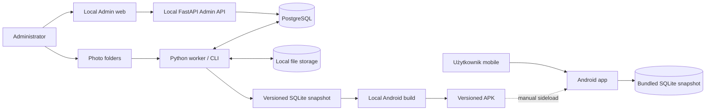
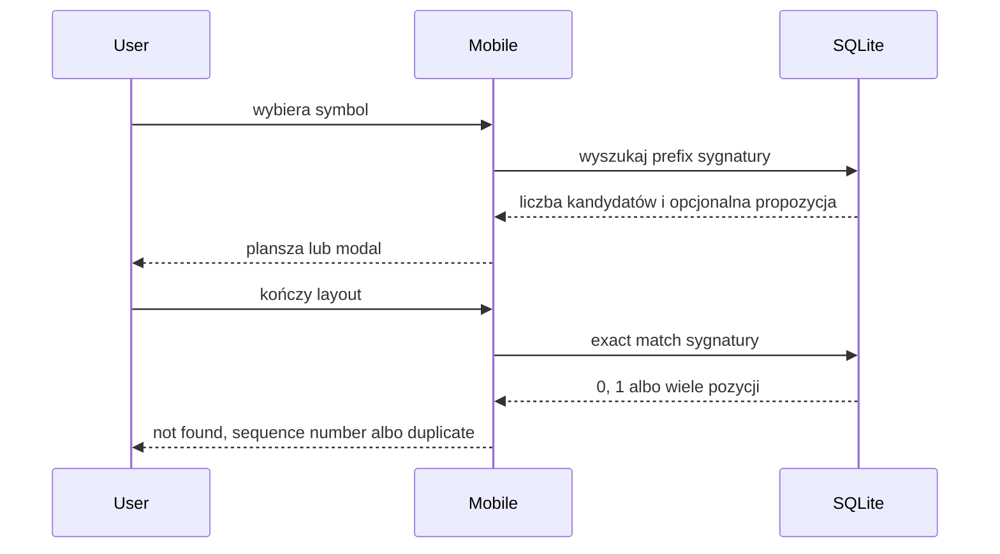
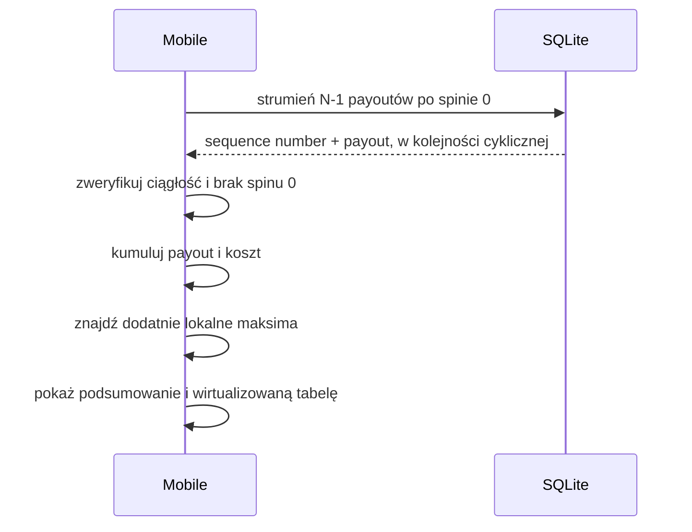
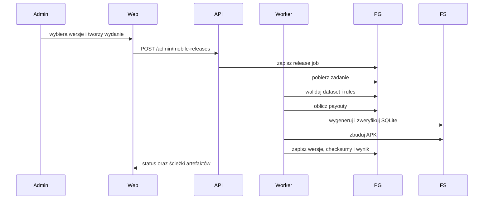

# Architektura systemu

## Kontekst



Najważniejsza granica: Android nie komunikuje się z Admin API ani PostgreSQL. Jedynym źródłem danych runtime jest snapshot dołączony do konkretnego APK.

## Odpowiedzialności

### Mobile app

- odczyt konfiguracji i symboli z lokalnego SQLite,
- stan planszy, undo i reset,
- lokalny exact/prefix matching,
- wykrycie duplikatu bez arbitralnego wyboru pozycji,
- skan gotowych payoutów dla pełnego cyklu,
- wykrycie dodatnich lokalnych maksimów,
- prezentacja wyniku i wirtualizowanej tabeli,
- diagnostyka wersji i integralności snapshotu.

### Admin web

- CRUD konfiguracji,
- edytor paylines i payoutów,
- generowanie/import i podgląd layoutów,
- uruchamianie i obserwacja jobs,
- manual review,
- publikacja wersji datasetów i reguł,
- zlecenie przygotowania snapshotu i APK.

### Admin API

- walidacja kontraktów,
- transakcje PostgreSQL,
- operacje administracyjne,
- kontrolowane zlecanie typowanych jobs,
- raportowanie postępu i artefaktów,
- generowanie OpenAPI dla klienta admin.

Admin API nie wykonuje długiego importu, pełnego precomputingu ani Android build wewnątrz requestu.
Wyjątkiem jest jawnie ograniczony mock M2: dokładnie 1000 małych layoutów
tworzonych synchronicznie i atomowo. Limit nie może zostać zwiększony do skali
produkcyjnej; większe generowanie przechodzi przez worker/job.

### Worker / CLI

- operacje długotrwałe i wznawialne,
- skanowanie folderów,
- OpenCV/OCR/klasyfikacja,
- zapis stagingu,
- walidacja ciągłości i integralności,
- obliczanie payoutów,
- generowanie SQLite,
- kontrolowane uruchamianie lokalnego workflow Android build,
- raportowanie postępu i błędów.

Admin API wyłącznie zapisuje typowany job w stanie `created`. Wspólny status
cyklu życia jest niezależny od `stage` konkretnego workflow. Żądanie anulowania
działającego joba zapisuje timestamp; dopiero worker może potwierdzić
`cancelled` po domknięciu bezpiecznej partii. Atomowy lease i ograniczenie
jednego ciężkiego wykonania należą do granicy workera.

Worker przejmuje najstarszy `created` przez `FOR UPDATE SKIP LOCKED`, a
unikalny slot w PostgreSQL dopuszcza tylko jeden rekord `processing`.
Handler działa poza transakcją i odnawia domyślny 60-sekundowy lease przez
heartbeat albo atomowy zapis checkpointu z postępem. Losowy token odcina stare
procesy od zapisu po wygaśnięciu lease. Następny claim najpierw odzyskuje
osierocony rekord: wraca on do `created` z zachowanym checkpointem albo do
`cancelled`, jeżeli wcześniej zażądano anulowania.

### PostgreSQL

- kanoniczne konfiguracje,
- wersje danych i reguł,
- sekwencje layoutów,
- staging, review i historia jobs,
- payouty powiązane z wersjami,
- manifesty wydań.

### File storage

- oryginalne zdjęcia,
- pliki robocze i wycinki,
- dane treningowe i modele,
- eksporty,
- wygenerowane snapshoty i APK.

## Przepływ dopasowania offline



## Przepływ Target offline



Port forecastu przyjmuje uporządkowany strumień `N - 1` par
`(sequence_number, payout)` wraz z metadanymi wydania. Adapter SQLite odpowiada
za cykliczny odczyt partiami, a czysty engine ponownie weryfikuje oczekiwany
numer każdej pozycji i wykonuje jeden przebieg.

Payout reguł nie jest liczony w runtime mobile. Został obliczony przy przygotowaniu wydania.

## Przepływ publikacji wydania



Publikacja jest niezmienna. Zmiana danych tworzy nowe wydanie i nie modyfikuje już zainstalowanego APK.

## Przepływ importu zdjęć

1. Admin tworzy import job.
2. Worker skanuje folder i zapisuje checksumy.
3. Każde zdjęcie przechodzi wersjonowany pipeline.
4. Niepewne elementy trafiają do review.
5. Admin zatwierdza poprawki.
6. Worker wykonuje walidację ciągłości.
7. Zatwierdzony staging tworzy nową wersję datasetu.

## Granice kodu

```text
services/api/app/
  api/
  application/
  domain/
  storage/
  models/
  schemas/

services/worker/
  jobs/
  image/
    geometry/
    ocr/
    classification/
  publication/
  build/

apps/mobile/src/
  features/
  domain/
    matching/
    forecasting/
  data/
    sqlite/
  ui/
```

Moduły `domain/` nie importują FastAPI, React, Expo ani ORM. Porty oddzielają:

- matching od formatu sygnatury i SQLite,
- forecast od sposobu pobierania payoutów,
- OCR i klasyfikację od konkretnych bibliotek,
- przygotowanie wydania od konkretnej komendy Android build.

### Kontrakt lokalnego repozytorium M1

`LocalLayoutRepository` otrzymuje już otwartą instancję SQLite od warstwy
aplikacyjnej. Nie kopiuje assetu, nie aktywuje wydania i nie otwiera bazy przy
każdym spinie.

- katalog gier mapuje identyfikator techniczny SQLite osobno od kodu domenowego,
- exact match zwraca `not_found`, `unique` albo `duplicate` i nigdy nie wybiera
  pierwszego duplikatu,
- prefix match zwraca dokładny licznik kandydatów, ale pełny rekord tylko dla
  jednego kandydata,
- prefix tekstowej sygnatury v1 jest zakresem
  `[prefix, prefix + ":")`,
- strumień Target jest jednym uporządkowanym zapytaniem `UNION ALL` i zawiera
  dokładnie `layout_count - 1` payoutów,
- adapter waliduje rekordy oraz kolejność i mapuje awarię na
  `local_data_error`,
- adapter nie importuje React ani komponentów UI.

## Model wdrożenia

### Mobile

- prywatne, podpisane lub testowe APK,
- ręczny sideload na maksymalnie 3–5 urządzeń,
- brak usług runtime poza systemem Android,
- nowy APK po każdej opublikowanej zmianie danych,
- stały `applicationId` i ten sam klucz podpisujący pozwalają aktualizować
  istniejącą instalację,
- snapshot jest aktywowany według release version/checksum, a nie według samego
  faktu istnienia lokalnego pliku,
- finalny manifest nie deklaruje uprawnienia `INTERNET`.

### Administracja

- PostgreSQL w Docker Compose na komputerze Windows,
- FastAPI, Next.js i worker uruchamiane lokalnie,
- lokalny system plików dla zdjęć i artefaktów,
- brak publicznego hostingu i chmury.

## Integralność i bezpieczeństwo publikacji

- `sequence_number` jest unikalny i ciągły w ramach wersji datasetu,
- sygnatura layoutu nie jest unikalna,
- wszystkie symbole layoutu należą do gry,
- opublikowane wersje danych, reguł i wydań są niezmienne,
- raport gotowości i publikacja reguł używają tego samego deterministycznego
  walidatora; publikacja oraz każda mutacja draftu blokują rekord
  `rules_versions`, aby nie dopuścić do wyścigu,
- raport integralności i publikacja datasetu używają tego samego czystego
  walidatora; bounded `mock-v1` może zostać sprawdzony synchronicznie, ale
  importy i duże datasety przechodzą przez worker/job,
- publikacja datasetu oraz każda przyszła mutacja jego stagingu blokują ten sam
  rekord `dataset_versions`; publikacja atomowo ustawia status i czas,
- raport datasetu zachowuje dokładne liczniki, ogranicza wyłącznie próbki
  diagnostyczne i traktuje duplikaty sygnatur jako ostrzeżenie,
- niegotowa wersja reguł pozostaje draftem, a niegotowy dataset stagingiem bez
  `published_at`; jawna archiwizacja opublikowanej wersji zachowuje czas
  publikacji i dane potomne,
- staging nie trafia do mobile,
- snapshot zawiera manifest wersji i checksumę,
- aplikacja odmawia obliczeń przy niezgodnym lub uszkodzonym schemacie,
- aktualizacja APK nie może po cichu pozostawić aktywnego snapshotu poprzedniego
  wydania,
- worker buduje tylko wskazane, zatwierdzone wersje,
- wynik Target wskazuje wersję wydania.

Walidacja finalnego snapshotu M1 ma dwie niezależne warstwy: SHA-256 pliku
sprawdzane względem manifestu oraz logiczną checksumę odtworzoną z
uporządkowanych rekordów SQLite. Przed aktywacją mobile porównuje schema
version, wersje wydania, fixture, datasetu, reguł i algorytmu oraz liczbę gier i
layoutów. Brak którejkolwiek zgodności daje `local_data_error`.
