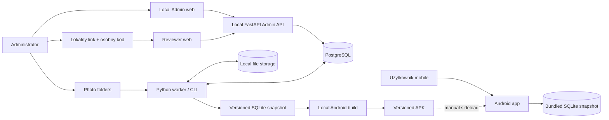
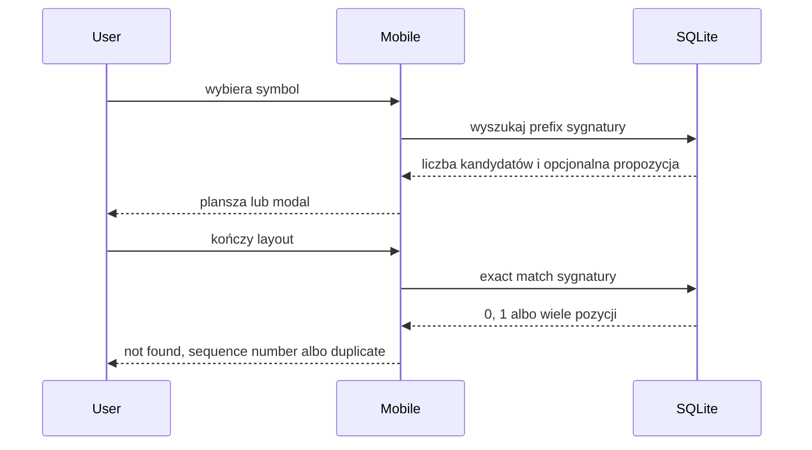
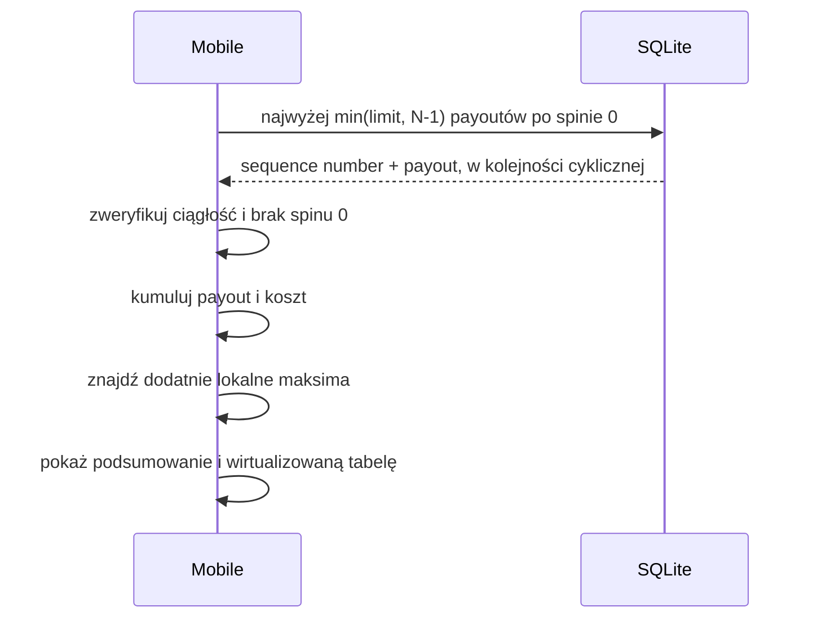
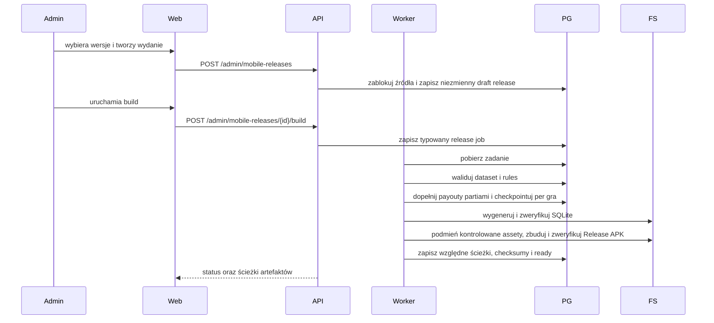

# Architektura systemu

## Aktualizacja granicy zdalnego Reviewera v0.1

Cloudflare Quick Tunnel publikuje wyłącznie origin osobnej aplikacji Reviewer
na `127.0.0.1:3001`. Reviewer udostępnia same-origin proxy z allowlistą i
przekazuje uwierzytelnione żądania do FastAPI na `127.0.0.1:8000`. API,
PostgreSQL, Admin, worker i pipeline wydań nie mają publicznego listenera.

Sesja jest trwała, game/import-scoped, odwoływalna i blokowana po pięciu
błędnych kodach. Opaque token jest hashowany w bazie i przechowywany przez
przeglądarkę w HttpOnly cookie. Backend nadpisuje aktora decyzji identyfikatorem
sesji. Szczegóły:
`../security/REMOTE_REVIEWER_THREAT_MODEL.md`.

Admin udostępnia kontrolę tego opcjonalnego ingressu przyciskami. FastAPI może
wykonać tylko trzy stałe operacje `start/status/stop` przez przypięte skrypty
PowerShell z timeoutem; request nie dostarcza komendy ani parametrów procesu.
Start uruchamia w razie potrzeby produkcyjny Reviewer, odrzuca działający tryb
developerski i dopiero potem tworzy Quick Tunnel. Stop zamyka wyłącznie
publiczną ekspozycję; PostgreSQL, API i Admin przez cały czas pozostają na
loopback.

Lifecycle jednego procesu Reviewera i Quick Tunnel jest serializowany między
procesami Windows nazwanym mutexem zależnym od repozytorium. Stan schema v2 jest
publikowany atomowo dopiero po health checku i wiąże PID z czasem uruchomienia,
pełną ścieżką executable oraz losowym `instanceId`, dlatego ponowne użycie PID
nie pozwala zatrzymać obcego procesu. Każda próba startu ma osobne logi, a
kontroler API ma osobny plik wyniku dla każdego wywołania. Operacja
compare-and-stop po `instanceId` stanowi fencing dla późniejszego
`stop-if-unused`; decyzja, kiedy wspólny tunel jest nieużywany, należy do
lifecycle'u assignments, nie do skryptów procesu.

## Kontekst



Najważniejsza granica: Android nie komunikuje się z Admin API ani PostgreSQL. Jedynym źródłem danych runtime jest snapshot dołączony do konkretnego APK.

## Odpowiedzialności

### Mobile app

- odczyt konfiguracji i symboli z lokalnego SQLite,
- stan planszy, jednoznaczny anchor pozycji sekwencji, next, undo i reset,
- lokalny exact/prefix matching,
- wykrycie duplikatu bez arbitralnego wyboru pozycji,
- ograniczony lub pełnocyklowy skan gotowych payoutów,
- wykrycie dodatnich lokalnych maksimów,
- prezentacja wyniku i wirtualizowanej tabeli,
- diagnostyka wersji i integralności snapshotu.

`Next` nie wyprowadza pozycji z samej zduplikowanej sygnatury. Może przejść do
następnego rekordu wyłącznie z jednoznacznego `sequence_number`, po czym jawnie
załadowana pozycja staje się nowym anchorem. Operacja zachowuje anchor, planszę,
limit skanu i wynik jako jeden odwracalny krok. Target otrzymuje
`target_scan_limit`, a adapter SQLite dostarcza najwyżej
`min(target_scan_limit, layout_count - 1)` kolejnych payoutów z zawinięciem.
Powtórzona sygnatura rekordu załadowanego przez `Next` nie unieważnia znanej
pozycji sesji; zakaz Targetu nadal obowiązuje dla duplikatu rozpoznanego z
ręcznego wejścia bez takiego anchora.

Od TASK-0139 warstwa prezentacji składa stan exact matchingu i stan Targetu w
jedną kartę wyniku, ale nie łączy ich logiki ani cyklu życia. Target nadal jest
osobnym, anulowalnym odczytem uruchamianym wyłącznie przez jednoznaczny anchor;
karta jedynie mapuje oba typowane stany na wspólne loading, success, warning i
error oraz zachowuje osobną komendę retry Targetu.

Od TASK-0140 jeden pionowy `FlatList` pozostaje właścicielem przewijania całego
ekranu. Kotwica wyników Targetu przekazuje swoją rzeczywistą pozycję przez
`onLayout`, a `onScroll` steruje widocznością pływającego przycisku dopiero po
osiągnięciu tej pozycji. Przycisk używa referencji tej samej listy do
`scrollToOffset(0)`, znajduje się wewnątrz `SafeAreaView`, a powiększony footer
zapewnia miejsce pod ostatnimi wierszami tabeli.

### Admin web

- trzy odrębne workspace’y (`Zarządzanie grami`, `Wersje Android`, `Joby`),
- jeden aktywny kontekst gry odtwarzany wraz z otwartą sekcją z URL,
- zależne moduły gry osadzone w accordionie bez własnych selectorów gry,
- CRUD konfiguracji,
- edytor paylines i payoutów,
- generowanie/import i podgląd layoutów,
- uruchamianie i obserwacja jobs,
- manual review,
- publikacja wersji datasetów i reguł,
- zlecenie przygotowania snapshotu i APK.

Powyższe trzy workspace'y są zamrożonym zakresem odbioru wersji 0.2. M7.0 w
wersji 0.4 dodaje czwarty workspace `Selekcja zdjęć`. Korzysta on z tego samego
game context i zleca osobny job `image_selection`; nie staje się accordionem
`Importu layoutów` ani nie zmienia historycznej bramki 0.2.

Workspace `Joby` jest prostą projekcją istniejącego kontraktu jobs. Główny
widok pobiera ograniczoną listę, filtruje wyłącznie po jednym statusie i pokazuje
typ, identyfikator/kontekst, status, postęp, czas utworzenia oraz krótki błąd.
Metadane lease/workera, liczniki, pełny błąd i operacje retry/cancel lub
diagnostyka importu są ładowane lub prezentowane w rozwijanych szczegółach.
Aktywne joby zachowują polling; UI nie wprowadza własnej kolejki, retencji ani
automatycznego cleanupu.

Dla image importu przejście do `waiting_for_review` jest trwałą granicą końca
automatycznego workflow. `updatedAt` tej projekcji oznacza zakończenie importu i
pipeline'u, natomiast `finishedAt` pozostaje znacznikiem terminalnego końca
całego joba. Admin oblicza czas automatycznego przetwarzania od `startedAt` do
tej granicy i nie dolicza czasu zależnego od ręcznej pracy reviewera.

### Reviewer web

Sesja Reviewera jest granicą dostępu do jednej gry i jednego importu. Gra może
mieć status `draft` albo `active`, ponieważ ręczne zatwierdzanie jest częścią
przygotowania danych przed publikacją. `archived` pozostaje niedostępne. Klient
nie nakłada dodatkowego filtra `active` na scope zwrócony przez backend.

- osobna aplikacja przeglądarkowa uruchamiana na innym porcie niż Admin web,
- lokalna brama kodu przed pobraniem danych plansz,
- kontekst ograniczony do gry oraz image import joba zapisanych w sesji,
- korekta symboli i geometrii, nawigacja oraz ponowna edycja ukończonych plansz,
- brak ekranów konfiguracji, jobów i wydań Android.

### Admin API

Niebezpieczne metody `/api/v1/admin/*` przechodzą przez wspólną bramkę
`LocalAdminSecurityMiddleware`. Bramka sprawdza adres klienta loopback,
dozwolony `Origin`, stałą intencję `local-owner`, a dla jawnej mapy operacji
wysokiego wpływu również potwierdzenie i dokładny cel. Próby oraz wyniki są
zapisywane append-only do kontrolowanego artefaktu JSONL. Reviewerowe mutacje
z Bearer tokenem mają osobną, wąską allowlistę i nie uzyskują dostępu do
pozostałej administracji.

- walidacja kontraktów,
- transakcje PostgreSQL,
- operacje administracyjne,
- kontrolowane zlecanie typowanych jobs,
- raportowanie postępu i artefaktów,
- generowanie OpenAPI dla klienta admin.

Admin API nie wykonuje długiego importu, pełnego precomputingu ani Android build wewnątrz requestu.
Wyjątkiem jest jawnie ograniczony mock M2: dokładnie 1000 małych layoutów
tworzonych synchronicznie i atomowo. Limit nie może zostać zwiększony do skali
produkcyjnej; większe generowanie przechodzi przez worker/job.

Drugim ograniczonym wyjątkiem operacyjnym jest start/stop Reviewera i Quick
Tunnel: stały kontroler ma maksymalnie 60 sekund, nie przetwarza danych
domenowych i nie przyjmuje dowolnej komendy. Długi build Reviewera nie odbywa
się w request — artefakt produkcyjny musi już istnieć.

Trzecim ograniczonym wyjątkiem jest natywny wybór folderu zdjęć na lokalnym
Windows. Stały helper PowerShell może oczekiwać na decyzję użytkownika najwyżej
120 sekund i nie przyjmuje ścieżki ani komendy z requestu. API wykonuje tylko
lekki preflight, wiąże zatwierdzoną ścieżkę z jednorazowym tokenem ważnym 15
minut i nie liczy checksum ani nie kopiuje obrazów w request. Token jest
przechowywany wyłącznie w pamięci procesu oraz nie jest dostępny Reviewerowi.

### Worker / CLI

- operacje długotrwałe i wznawialne,
- skanowanie folderów,
- OpenCV/OCR/klasyfikacja,
- zapis stagingu,
- walidacja ciągłości i integralności,
- obliczanie payoutów,
- generowanie SQLite,
- kontrolowane uruchamianie lokalnego workflow Android build,
- raportowanie postępu i błędów.

Admin API wyłącznie zapisuje typowany job w stanie `created`. Wspólny status
cyklu życia jest niezależny od `stage` konkretnego workflow. Żądanie anulowania
działającego joba zapisuje timestamp; dopiero worker może potwierdzić
`cancelled` po domknięciu bezpiecznej partii. Atomowy lease i ograniczenie
jednego ciężkiego wykonania należą do granicy workera.

Worker przejmuje najstarszy `created` przez `FOR UPDATE SKIP LOCKED`, a
unikalny slot w PostgreSQL dopuszcza tylko jeden rekord `processing`.
Handler działa poza transakcją i odnawia domyślny 60-sekundowy lease przez
heartbeat albo atomowy zapis checkpointu z postępem. Losowy token odcina stare
procesy od zapisu po wygaśnięciu lease. Następny claim najpierw odzyskuje
osierocony rekord: wraca on do `created` z zachowanym checkpointem albo do
`cancelled`, jeżeli wcześniej zażądano anulowania.

### PostgreSQL

- kanoniczne konfiguracje,
- wersje danych i reguł,
- sekwencje layoutów,
- staging, review i historia jobs,
- payouty powiązane z wersjami,
- manifesty wydań.

### File storage

- content-addressed kopie oryginalnych zdjęć z zachowanym pochodzeniem folderu,
- pliki robocze i wycinki,
- dane treningowe i modele,
- eksporty,
- strukturalne audyty payoutów JSONL,
- wygenerowane snapshoty i APK.

Import po wyborze folderu kopiuje oryginał do zarządzanego storage przed
uruchomieniem etapów obrazu. PostgreSQL przechowuje względną ścieżkę, checksumę
i referencję logiczną. Identyczne bajty mogą współdzielić fizyczny blob, ale
każda gra/import zachowuje własne pochodzenie i lifecycle referencji.

Worker zapisuje najpierw niezmienny manifest
`data/originals/manifests/<job_id>.json`, następnie kopiuje unikalne bajty do
`data/originals/<pierwsze-2-znaki-sha256>/<sha256>.jpg`. Kopia i manifest są
tworzone atomowo. Checkpoint zawiera względną ścieżkę i checksumę manifestu;
po restarcie worker weryfikuje istniejące bloby i kopiuje tylko brakujące.
Dalsze etapy mogą używać zarządzanych ścieżek bez dostępu do folderu źródłowego.

### Kontrolowany reset danych layoutów gry

TASK-0133 udostępnia operacje wysokiego wpływu przywracające wskazaną grę do
stanu sprzed importu albo usuwające jedno wydanie. Najpierw read-only preview wylicza dokładny `game_id` lub `release_id`,
liczbę rekordów według klas, wydania i listę zarządzanych artefaktów. Wykonanie
wymaga zgodnego preview tokenu, wpisania identyfikatora gry i dodatkowego
potwierdzenia lokalnej intencji.

Reset zachowuje rekord `games` i minimalny append-only audyt, lecz usuwa
game-scoped importy obrazów, review, datasety/layouty, payouty, katalog
symboli, reguły, wydania oraz ich dedykowane artefakty. Rekordy i blob
współdzielone nie są fizycznie usuwane, dopóki istnieje referencja innej gry.
Content-addressed cache wykonań pipeline'u i joby pozostają jako współdzielony
cache oraz audyt operacyjny. Aktywny job, build, sesja Reviewera albo wydanie
współdzielone przez gry blokuje reset.

Serwis blokuje rekord celu i ponownie wylicza token, usuwa wyłącznie jawnie
wyliczone ścieżki wewnątrz zarządzanego katalogu, a następnie wykonuje zmiany
PostgreSQL w jednej transakcji. Błąd pliku nie uruchamia zmian bazy, a jawny
rekord `cleanup_operations` pozwala rozpoznać poprawne wykonanie po utracie
odpowiedzi. Częściowa awaria pozostaje widoczna i możliwa do bezpiecznego
ponowienia.

### Batch payout precomputation

Przed zapisaniem payout joba Admin API wykonuje lekki preflight referencji:
sprawdza status, kompletność, grę, wymiary i jawną wersję algorytmu. Nie czyta
przy tym layoutów i nie wykonuje obliczeń. Dzięki temu oczywiście błędna
kombinacja nie trafia do kolejki, natomiast właściwa walidacja partii i
resumowalne wykonanie pozostają odpowiedzialnością workera.

Handler `payout-v2` odczytuje wyłącznie opublikowany dataset i opublikowane
reguły tej samej gry o zgodnych wymiarach. Źródło jest mapowane do czystych
kontraktów engine, a layouty są pobierane rosnąco po `sequence_number` w
partiach po 1000, bez ładowania pełnego datasetu do pamięci.

Dla każdej partii worker:

1. sprawdza ciągłość sekwencji i ocenia layouty czystym engine,
2. atomowo podmienia deterministyczny plik audytu JSONL,
3. wykonuje idempotentny upsert `layout_payouts`,
4. dopiero potem zapisuje checkpoint z ostatnim numerem i licznikami.

Awaria przed checkpointem może więc powtórzyć ostatnią partię, ale nie tworzy
drugiego wyniku ani innej ścieżki audytu. Katalog artefaktów jest lokalny i
konfigurowalny argumentem CLI; mobile nigdy go nie odczytuje.

Przed generowaniem snapshotu wielokrotnie używalna bramka gotowości sprawdza
dokładną kombinację dataset/rules/algorithm. Liczniki są obliczane agregatami
SQL bez materializowania pełnego datasetu w workerze, a próbka braków jest
ograniczona do 100 rosnących `sequence_number`. Bramka blokuje staging,
archiwalne źródło, niezgodną grę lub wymiary, niepełny zestaw i brak przypisania
audytu. Wyniki innych wersji pozostają w bazie, lecz nie wpływają na raport.

Osobny strumieniowy weryfikator JSONL porównuje nagłówek i każdy rekord z
oczekiwanym wynikiem partii. Potwierdza kolejność, payout, sumę matches,
komórki, jokery i ich interpretacje bez ładowania całego pliku do pamięci.

### Production SQLite generation

Generator schema v3 przyjmuje jawne wybory
`(dataset_version_id, rules_version_id, algorithm_version)` oraz deterministyczne
metadata wydania. Każdy wybór przechodzi bramkę kompletności M3.2. Źródła są
porządkowane po stabilnym kodzie gry, a mobilne identyfikatory techniczne są
przydzielane dopiero po tym sortowaniu.

Schema v3 rozszerza katalog symboli o nullable `name_pl` i `name_en`. Obie
etykiety uczestniczą w logicznym checksumie snapshotu, a wymagane `name`
pozostaje fallbackiem zgodności. Mobile 0.3 nie otwiera snapshotu v2.

Katalog gier i symboli jest mały i powstaje przed zapisem. Layouty z dokładnie
wybraną wersją payoutu są odczytywane z PostgreSQL keysetowo i zapisywane do
tymczasowego SQLite partiami po 1000. W tym samym przebiegu powstaje logiczny
SHA-256 kanonicznych rekordów. Dopiero kompletny plik z finalnym
`content_checksum` staje się widoczny pod ścieżką docelową; generator odrzuca
istniejący cel.

Generator snapshotu nie jest osobnym child-jobem release. Handler
`android_build` z TASK-0037 wywołuje go jako jeden z resumowalnych etapów
nadrzędnego workflow.

Publisher TASK-0035 buduje SQLite i kanoniczny manifest w prywatnym katalogu
stagingowym. Niezależny walidator otwiera bazę read-only, potwierdza fizyczny
SHA-256, schema/application id, dokładny zestaw tabel i indeks signature,
metadata, FK oraz `quick_check`. Następnie odczytuje layouty po 1000, kontroluje
ciągłość, symbole, codec sygnatury i payout oraz rekonstruuje logiczny SHA-256.

Dopiero zweryfikowany staging jest atomowo przenoszony do
`snapshots/<releaseVersion>/<logicalContentSha256>/`. Katalog końcowy zawiera
wyłącznie `snapshot.db` i `manifest.json`. Retry nie zmienia istniejących
plików; pełna walidacja identycznego manifestu pozwala użyć ich ponownie, a
każda rozbieżność kończy się stabilną kolizją.

## Przepływ dopasowania offline



## Przepływ Target offline



Port forecastu przyjmuje uporządkowany strumień
`min(target_scan_limit, N - 1)` par
`(sequence_number, payout)` wraz z metadanymi wydania. Adapter SQLite odpowiada
za jeden cykliczny odczyt ograniczony parametrem `LIMIT`, a czysty engine
ponownie weryfikuje limit, długość i oczekiwany numer każdej pozycji oraz
wykonuje jeden przebieg.

Payout reguł nie jest liczony w runtime mobile. Został obliczony przy przygotowaniu wydania.

## Przepływ publikacji wydania



Publikacja jest niezmienna. Zmiana danych tworzy nowe wydanie i nie modyfikuje już zainstalowanego APK.

Dokładnie jeden job `android_build` posiada cały przebieg. Checkpoint schema v1
zapisuje ukończone gry i aktywny checkpoint payoutu, dlatego po wygaśnięciu
lease albo retry nie powstają child-joby i nie są nadpisywane gotowe artefakty.
Kontrolowany adapter przyjmuje wyłącznie utrwalony release, stały wariant
`Release` i architekturę `arm64-v8a`; klient nie przekazuje komendy. Na czas
builda produkcyjny manifest schema v1 i `snapshot.db` zastępują stały asset
Metro, a pliki bazowe są bezwarunkowo odtwarzane. Weryfikacja potwierdza podpis,
brak `INTERNET`, standalone bundle oraz SQLite o dokładnym checksumie release.

Panel 0.2 wybiera dokładnie jedną aktywną grę i automatycznie przypina jej
najnowszą opublikowaną, zgodną wymiarami parę dataset/reguły. Jedna akcja UI
tworzy niezmienny draft, a następnie wywołuje kontrolowany build; awaria drugiego
kroku zachowuje draft do jawnego wznowienia. Podczas builda panel odświeża
szczegół release i dokładnie jeden przypięty job, a pełną diagnostykę deleguje do
workspace'u `Joby`. Gotowy APK jest pobierany przez kontrolowany endpoint po
ponownej weryfikacji SHA-256 względem wspólnego katalogu artefaktów; przeglądarka
nie przekazuje ścieżki ani komendy systemowej.

Utworzenie release i uruchomienie builda są osobnymi operacjami. TASK-0036
utrwala globalnie unikalną wersję oraz 1–15 dokładnych wyborów dataset/rules.
Serwer ustala obsługiwany algorytm i schema, blokuje źródła, wymaga statusu
`published`, wspólnej aktywnej gry oraz zgodnych wymiarów i zapisuje wszystkie
rekordy w jednej transakcji. Dopiero TASK-0037 tworzy job i zmienia lifecycle.
Zakres 1–15 pozostaje kontraktem backendowym przygotowanym dla 0.5; Admin 0.2
wysyła dokładnie jeden wybór.

## Przepływ ręcznego importu layoutów

1. Operator umieszcza CSV/JSONL pod skonfigurowanym lokalnym `import_root`.
2. Panel przekazuje Admin API wyłącznie względny `sourcePath` i wersję
   kontraktu.
3. Warstwa application rozwiązuje ścieżkę pod rootem, sprawdza limit i preview,
   a następnie liczy SHA-256 bounded partiami.
4. API tworzy istniejący job `import` z poświadczonym formatem, rozmiarem,
   checksumą i kanoniczną ścieżką względną.
5. `input_key` blokuje drugi import tej samej treści/kontraktu dla tej samej gry.
6. Worker `worker-v3` ponownie sprawdza checksum i usuwa ewentualny nietrwały
   ogon znajdujący się za checkpointem.
7. CSV/JSONL jest czytany po jednej ograniczonej linii i partiami po 1000
   niepustych rekordów; poprawny rekord albo bezpieczny błąd trafia do
   `layout_import_rows`.
8. Po idempotentnym upsercie partii worker zapisuje offset bajtowy, numer linii,
   liczniki i łańcuch checksumy prefiksu w checkpoint schema v1.
9. Pełny SHA-256 jest ponownie potwierdzany przed końcowym checkpointem; każda
   rozbieżność usuwa surowy staging i zeruje kursor do bezpiecznego replay.
10. API tworzy osobny job `validate` dla zakończonego importu i wybranej
    opublikowanej wersji reguł tej samej gry.
11. Worker `worker-v4` pobiera surowe wiersze bounded partiami po fizycznym
    `line_number`, sprawdza `rows * columns` i aktywny alfabet oraz koduje
    stałoszeroką sygnaturę.
12. Znormalizowana partia jest idempotentnie zapisywana przed checkpointem.
    Błędy parsera i błędy domenowe pozostają osobnymi rekordami, więc jeden
    wadliwy wiersz nie zatrzymuje pozostałych.
13. Po zakończeniu walidacji Admin API liczy dokładne agregaty integralności
    bez ładowania całego stagingu do pamięci: zgodność liczby wierszy, ciąg od
    `1`, luki, duplikaty numerów, duplikaty sygnatur i kody błędów.
14. Panel może pobierać bounded, deterministyczne próbki oraz stronicować
    znormalizowane wiersze po fizycznym `line_number`; raport nadal nie tworzy
    datasetu.
15. Jawne odrzucenie zakończonej walidacji usuwa wszystkie znormalizowane
    stagingi jej importu przed surowymi wierszami, pozostawiając joby jako audyt;
    aktywna walidacja albo istniejący dataset blokuje operację.
16. Publikacja blokuje job importu, jego walidacje, opublikowane reguły i grę,
    ponownie liczy ten sam raport, a następnie w jednej transakcji tworzy
    serwerowo numerowaną wersję datasetu i kopiuje poprawne rekordy setowym
    `INSERT ... SELECT`. Dataset staje się `published` dopiero po sprawdzeniu
    liczby skopiowanych layoutów.

HTTP nie przesyła dużego pliku i nie wykonuje pełnego importu w requestcie.
Inspekcja czyta najwyżej bounded preview oraz jeden przebieg SHA-256; staging i
pełna walidacja pozostają w workerze. Surowy staging nie tworzy jeszcze
`dataset_version` ani `layouts` i nie jest widoczny dla wydania mobilnego.
To samo dotyczy znormalizowanego stagingu: TASK-0047 raportuje luki i duplikaty,
a TASK-0049 dopiero transakcyjnie tworzy dataset.
Retry publikacji identyfikuje wynik przez unikalny
`dataset_versions.source_job_id = validation_job_id` i zwraca tę samą wersję.
Odrzucenie i publikacja blokują najpierw ten sam job importu, dzięki czemu nie
mogą równolegle usunąć oraz skopiować stagingu.

## Przepływ selekcji reprezentatywnych zdjęć

1. Admin wybiera folder 10 000–30 000 JPEG-ów przez browser-native directory
   input z poświadczonym purpose `photo_selection`.
2. API tworzy game-scoped run i osobny job `image_selection`.
3. Worker strumieniowo dekoduje miniatury, ocenia jakość oraz grupuje kolejne
   ujęcia przez geometrię, fingerprint i sparse OCR.
4. Dla każdego unikalnego dowolnego zakresu wybierany jest jeden bezpieczny
   reprezentant; zakresy nie muszą być ciągłe.
5. Niejednoznaczne grupy zwalniają worker w `waiting_for_review` i są
   uzupełniane pojedynczym plikiem w Adminie.
6. Kompletne wybrane JPEG-i oraz kanoniczny manifest są atomowo publikowane w
   kontrolowanym storage bez zmiany folderu użytkownika.
7. Jawny handoff tworzy poświadczone źródło dla istniejącego właściwego importu.

Selektor nie wywołuje croppera komórek, symbol ONNX ani pełnego review plansz.
Jego szczegółową granicę opisuje `architecture/IMAGE_SELECTION.md` i D-121.

## Przepływ importu zdjęć

1. Admin tworzy import job.
2. Worker skanuje folder i zapisuje checksumy.
3. Każde zdjęcie przechodzi wersjonowany pipeline.
4. Niepewne elementy trafiają do review.
5. Admin zatwierdza poprawki.
6. Worker wykonuje walidację ciągłości.
7. Zatwierdzony staging tworzy nową wersję datasetu.

Produkcyjny handler `image_directory` zarejestrowany w lokalnym CLI nie kończy
się po source ingestion. Jedno kliknięcie `Rozpocznij import` uruchamia w tym
samym trwałym jobie zapis managed originals, rejestrację plików oraz adaptery
`discovery` → `normalization` → `board_detection` → `board_crops` →
`sequence_ocr` → `symbol_inference`. Wyniki tworzą job-scoped projekcje
`source_images`, `recognized_boards`, `cell_observations` i
`image_review_items`. Checkpoint źródła oraz checkpoint per plik umożliwiają
wznowienie po restarcie workera bez ponownego uploadu i bez nadpisywania
ukończonych etapów. OCR numerów jednej strony jest wykonywany jako jeden batch
od jednego do dziewięciu cropów.

TASK-0068 scala wersje etapów w kanoniczny
`image-pipeline-manifest-v1`. Manifest nie jest konfigurowalnym skrótem typu
„latest”: zawiera komplet adapterów, modele i ich SHA-256, preprocessing,
kalibrację, confidence policy oraz stałą kolejność ośmiu etapów.
`pipelineFingerprint` jest wyprowadzany z sortowanego kanonicznego JSON bez
envelope, timestampów i danych hosta. Envelope przechowuje fingerprint obok
manifestu i jest odrzucany, gdy oba elementy nie są zgodne.

Tożsamość wykonania pojedynczego pliku ma kontrakt
`image-file-execution-v1`:

```text
SHA-256("image-file-execution-v1\0" + sourceSha256 + "\0" + pipelineFingerprint)
```

Ten sam plik i identyczny pipeline mają jeden klucz idempotencji. Zmiana
adaptera, modelu, checksumy, kalibracji albo polityki tworzy nowy klucz i nowy
namespace wyniku. Persistence, lease i transakcje zostają w TASK-0069, ale
muszą utrwalać ten klucz bez zmiany jego semantyki.

Checkpoint per plik używa kontraktu `image-pipeline-file-checkpoint-v1`.
`completedStages` jest unikalnym uporządkowanym prefiksem manifestu, a
`nextStage` jest dokładnie następnym elementem. Przejście jest idempotentne albo
kończy jeden kolejny etap. Ponieważ aktualne OCR i symbol ONNX są
`manual_review_only`, checkpoint po `symbol_inference` musi mieć
`waiting_for_review`; nie wolno przejść bezpośrednio do walidacji.

TASK-0069 utrwala wykonanie w dwóch warstwach. Globalne
`image_file_executions` ma PK równy `fileExecutionKey`; asocjacja
`image_import_job_files` dodaje job, deterministyczny `order_index` i
diagnostyczną ścieżkę. Dwa joby mogą więc wykorzystać ten sam kompletny wynik,
ale zmiana pipeline'u tworzy nowy rekord bez nadpisania historii.

`ImageBatchHandler` przyjmuje port wykonania jednego etapu. Po każdym etapie
najpierw, w krótkiej transakcji z blokadą, zapisuje file checkpoint i ponownie
sprawdza fencing token aktywnego joba. Dopiero potem zapisuje checkpoint i
liczniki joba. Awaria pomiędzy tymi operacjami pozostawia postęp pliku i
powtarza najwyżej idempotentny checkpoint joba. Anulowanie jest zauważane przez
wspólny runtime przy tym drugim zapisie, więc nie rozpoczyna następnego etapu.

TASK-0158 usuwa pełną agregację `image_import_job_files` z każdego przejścia
etapu. Handler pobiera dokładny snapshot liczników raz na wejściu, aktualizuje go
przyrostowo wyłącznie na podstawie zapisanego przejścia statusu pliku i wykonuje
ponowną pełną agregację na granicy końcowej. File checkpoint, fencing i zapis
postępu joba nadal występują w tej samej bezpiecznej kolejności. Dzięki temu
liczba pełnych skanów jednego uruchomienia jest stała zamiast proporcjonalna do
liczby zdjęć razy liczbę etapów.

Handler najpierw rewaliduje pliki, które już na wejściu oczekiwały na review, a
następnie kończy pliki `processing`. Świeże przejście po `symbol_inference`
wykonuje pierwszą kontrolę `manual_review` na projekcji pozostającej w bieżącym
wykonaniu i nie uruchamia jej ponownej rehydratacji. Nierozwiązana plansza nie
blokuje zatem diagnostyki pozostałych źródeł, a wznowienie istniejącej granicy
review nadal odbudowuje job-local projekcję przed kontynuacją. Orkiestrator nie
publikuje datasetu; rzeczywiste adaptery i seeding z discovery podłącza
TASK-0070.

TASK-0070 dodaje `ImageDirectoryBatchSeeder`, który uruchamia prawdziwy
`image-discovery-v1`, deduplikuje wejście po SHA-256 i rejestruje unikalne
obrazy w kolejności manifestu. `ImagePipelineStageExecutor` łączy
`ImageBatchHandler` z sześcioma wymiennymi, wersjonowanymi portami M5–M6.
Każdy port otrzymuje tylko poświadczone provenance i wyniki wcześniejszych
etapów; wynik jest walidowany przed zapisem.

Automatyczne wyniki są zapisywane globalnie w
`image_pipeline_stage_results`, natomiast `source_images`,
`recognized_boards`, 15 `cell_observations` i `image_review_items` są
projekcjami konkretnego joba. Projekcja po `symbol_inference` zawsze ma status
`pending_review`. Dopiero atomowa decyzja całej planszy materializuje
`image_layout_staging_rows`; rejected nie tworzy layoutu. Walidacja ciągłości
raportuje luki i duplikaty bez modyfikowania raw OCR ani zaakceptowanego numeru.
TASK-0071 izoluje wyjątek adaptera do jednego powiązania job–plik. Checkpoint
pozostaje ostatnim poprawnym prefiksem, a trwały błąd zapisuje dokładny etap,
stabilny kod, bezpieczny opis i czas. Batch kończy diagnostykę pozostałych
plików, po czym przechodzi do `waiting_for_review`; jawny retry może wznowić
wyłącznie dokładny `nextStage`.

TASK-0072 wystawia job-local projekcję operacyjną bez czytania logów. API
agreguje liczniki i etapy bezpośrednio z `image_import_job_files`, oblicza czas
i throughput z trwałych timestampów oraz zwraca deterministyczną, bounded listę
plików. Retry z panelu blokuje job i wskazane powiązanie, wymaga dokładnego
failed `nextStage`, zachowuje globalne wyniki etapów i ponownie kolejkuje ten
sam zatrzymany job. Wspólny cancel/retry lifecycle jobs nie został
zduplikowany.

TASK-0073 ogranicza zarządzany image storage do `<artifact-root>/data` i
przestrzeni `originals`, `working`, `crops`, `training`, `models`, `exports`.
Read-only scanner nie wychodzi poza ten root ani nie podąża za symlinkami.
Warstwa application nie oferuje delete/GC; inwentarz udostępnia politykę,
rozmiar i liczbę plików, a `automaticDeletion` zawsze ma wartość `false`.

TASK-0074 utrzymuje streaming discovery, ale rejestruje lekkie rekordy plików
deterministycznie w transakcjach po najwyżej 500 elementów. Partia zachowuje
unikalny `order_index`, idempotentny `fileExecutionKey` i walidację provenance;
nie zmienia granicy retry ani checkpointu pojedynczego pliku. Fizyczny pomiar
55 556 plików nie wykazał potrzeby dodania kolejki dla samego PostgreSQL lub
storage. Pełna decyzja pozostaje odłożona do pomiaru pipeline/recovery w
TASK-0075.

TASK-0075 potwierdza fizycznie, że checkpoint zapisany przed crashem jest
wznawiany bez powtórzenia zakończonego etapu, a awaria każdego z sześciu
adapterów jest izolowana i retry zaczyna się od dokładnego `nextStage`.
Persistence/recovery i jakość ML pozostają osobnymi bramkami: ciągły staging
387 plansz nie osłabia `manual-review-only` ani nie zezwala na masową
publikację.

TASK-0077 ustanowił PostgreSQL `jobs` z fenced lease bez Redis/Celery,
mikroserwisów i zdalnych workerów. TASK-0172 rozszerza wykonanie lokalne na dwa
filtrowane lane tego samego pakietu: general `execution_slot = 1` oraz
image-selection `execution_slot = 2`. Każdy lane ma najwyżej jeden aktywny job;
mogą działać równolegle, zachowując jedno API i bazę.
TASK-0173 dodaje wyłącznie lokalną warstwę operatorską: jeden supervisor
PowerShell uruchamia te dwa procesy w tle, atomowo zapisuje PID wraz z czasem
startu i kieruje stdout/stderr do osobnych logów w `.runtime`. Status jest
odczytem tego stanu i rzeczywistego procesu, a stop nie wysyła sygnału do PID,
którego nazwa i czas startu nie odpowiadają zapisowi. Supervisor nie jest nową
usługą, nie działa w ścieżce joba i nie zmienia lease ani execution slotów.
Warunki ponownej oceny są częścią D-085 i raportu
`m7-queue-architecture-decision-v1`; ich spełnienie otwiera nowe zadanie, ale
nie uruchamia automatycznej migracji.

Domyślny profil operatorski uruchamia wyłącznie general lane z kooperacyjnym
budżetem siedmiu wątków. Nie zmienia to unikalnego slotu: równocześnie nadal
działa najwyżej jeden general job. Budżet jest przekazywany adapterom z bounded
równoległością; rejestracja geometrii obrabia do siedmiu stron przy
jednowątkowym OpenCV/BLAS. Dedykowany image-selection lane pozostaje dostępny
w jawnym historycznym profilu `general=2`, `image-selection=5`.

Eksport diagnostyczny pobiera trwały snapshot joba z PostgreSQL, serializuje
kanoniczny `image-job-diagnostics-v1`, ogranicza uporządkowaną listę błędów do
10 000 i zapisuje dokładne bajty content-addressed pod
`data/exports/image-jobs/<jobId>/<sha256>/diagnostics.json`. System plików jest
źródłem niezmiennych artefaktów, dlatego nie dodano tabeli eksportów. Lista
ponownie odczytuje i waliduje manifesty, a download sprawdza bezpieczną ścieżkę,
kanoniczność i pełny SHA-256 przed zwróceniem pliku.

Globalne wyniki sześciu automatycznych etapów pozostają współdzielone, natomiast
`image_import_job_files` przechowuje job-local checkpoint/status review i
walidacji. Rehydratacja odtwarza source/board/cell/review z immutable stage
results bez ponownej inferencji. Konflikt numeracji otwiera do review plansze z
duplikatem albo sąsiadujące z luką, zachowuje wcześniejsze decyzje jako eventy
i usuwa tylko ich nieopublikowany staging.

Discovery używa kontraktu `image-discovery-v1`. Read-only scanner zapisuje poza
katalogiem źródłowym deterministyczny manifest ścieżek względnych POSIX,
SHA-256, rozmiarów, mtime, wymiarów oraz stabilnych problemów. Identyczne bajty
pod wieloma nazwami tworzą jedną tożsamość treści z listą ścieżek. Znany
manifest pozwala wybrać wyłącznie nowe checksumy bez zmiany pełnego manifestu
źródła. Manifest nie zawiera ścieżki absolutnej ani binarnej treści zdjęcia.

Nowe joby używają `image-normalization-v2-in-memory-source-v1` i Pillow
`ImageOps.exif_transpose`. Znormalizowana macierz RGB jest przechowywana tylko
w cache jednego bieżącego file execution, a trwały stage result zawiera
tożsamość managed original, wymiary, orientację i checksumę pikseli. Downstream
korzysta ze wspólnego loadera i nie wymaga pełnowymiarowego `normalized.png`.
Historyczny v1 pozostaje przypięty do starych jobów; brakujący PNG może zostać
odbudowany wyłącznie przy identycznej checksumie oczekiwanych bajtów.

Geometria używa portu `PageBoardDetector` oraz kontraktu
`page-board-detector-v1`. Klasyczna implementacja OpenCV/NumPy przyjmuje
znormalizowany RGB, wykrywa czerwone ramki w HSV i zwraca stronę oraz dokładnie
dziewięć plansz w kolejności row-major. Każda plansza zawiera indeks, quad,
bounding box, ocenę czerwonej ramki i jawny znacznik korekty względem siatki.
Confidence obrazu składa się z dowodu ramki, zgodności rozmiaru, wyrównania
wierszy/kolumn i stabilności korekty. Niespełniona geometria zwraca
`needs_review` ze stabilnymi powodami zamiast częściowego wyniku.

Overlaye detektora są niezmiennymi artefaktami roboczymi pod
`page-board-detector-v1/<prefix>/<source-sha256>/overlay.png`. Warstwa domenowa
detektora nie zna CLI ani systemu plików; runner odpowiada za weryfikację
raportu normalizacji, bezpieczne ścieżki, checksumy i idempotentny zapis.

Prostowanie i podział komórek używa osobnego portu `BoardCellCropper`.
`board-cell-crops-v1` jest niezmiennym, odrzuconym wejściem historycznym:
globalny inset zmienił krok siatki i przeciął symbole. Nowe etykiety mogą
powstawać wyłącznie z `board-cell-crops-v2`. Runner ponownie weryfikuje raport normalizacji,
jego checksumę zapisaną przez TASK-0054, tożsamość źródła i checksumę
znormalizowanego PNG. Dopiero kompletny wynik dziewięciu plansz trafia do
indywidualnych transformacji perspektywy 500 × 300 i siatki 3 × 5.

Artefakty v2 mają układ
`board-cell-crops-v2/<prefix>/<source-sha256>/board-<index>/`: `board.png`,
`grid-overlay.png` oraz `cells/r<row>-c<column>.png`. Raport przechowuje
macierz transformacji i SHA-256 każdego pliku. Port nie zna systemu plików,
natomiast runner gwarantuje bezpieczne ścieżki, content-addressed zapis,
idempotencję i brak częściowych artefaktów przy wyniku `needs_review`.

## Granice kodu

```text
services/api/app/
  api/
  application/
  domain/
  storage/
  models/
  schemas/

services/worker/
  jobs/
  image/
    geometry/
    ocr/
    classification/
  publication/
  build/

apps/mobile/src/
  features/
  domain/
    matching/
    forecasting/
  data/
    sqlite/
  ui/
```

Moduły `domain/` nie importują FastAPI, React, Expo ani ORM. Porty oddzielają:

- matching od formatu sygnatury i SQLite,
- forecast od sposobu pobierania payoutów,
- OCR i klasyfikację od konkretnych bibliotek,
- przygotowanie wydania od konkretnej komendy Android build.

`SequenceNumberRecognizer` jest wersjonowanym portem recognition-only. Runner
`sequence-number-ocr-v1` samodzielnie weryfikuje checksumy manifestu,
normalizacji, detekcji i lokalnego modelu, tworzy content-addressed `raw.png`
oraz `foreground.png`, a następnie zapisuje raw text, normalized number i
confidence. Pierwszy adapter D-055 uruchamia oficjalny model
`en_PP-OCRv5_mobile_rec` bezpośrednio przez PaddlePaddle CPU; brak modelu ma
stabilny błąd i nie może uruchomić pobierania. Walidacja ciągłości jest osobną
czystą funkcją: dodaje powody review, lecz nie poprawia odpowiedzi OCR.

Benchmark `m5-image-benchmark-v2` jest osobnym, read-only agregatorem raportów
etapowych. Weryfikuje ich łańcuch checksum, liczy tylko wskazane artefakty,
przechowuje surowe próbki czasu i odtwarza z nich deterministyczne podsumowanie.
Mierzy geometrię na 43 przejrzanych obrazach i 387 pozycjach oraz OCR osobno
na podziale held-out według zdjęcia źródłowego. Kontrola alternatywy zmienia
tylko wersjonowaną politykę wejścia OCR i nie zmienia stagingu ani baseline
adaptera.

Po D-057 pipeline obrazu ma trzy jawne poziomy dojrzałości:

- `retain`: kontrakty plików, checksum, idempotentnych artefaktów, portów,
  detektor `page-board-detector-v2` jest stabilną granicą, natomiast cropper
  komórek przechodzi korektę v2,
- `supported`: strona zawiera od 1 do 9 pozycji row-major; krótsza strona jest
  dozwolona tylko jako jawnie opisana ostatnia strona sekwencji, a recovery
  wymaga oczekiwanej liczby pozycji i dowodu czerwonej ramki,
- `manual_review_only`: obecny adapter OCR może tworzyć propozycję i
  diagnostykę, lecz jego wynik nie może sam zatwierdzić ani opublikować
  `sequence_number`.

Golden narożników detektora został zainicjalizowany jego własnym wynikiem i
zaakceptowany po wizualnym przeglądzie overlayów. Nie jest niezależnym ręcznym
pomiarem i nie wystarcza do rectyfikacji piętnastu komórek. Zgodnie z D-060
osobny `cell-grid-golden-v1` zawiera ręcznie zaakceptowany `sourceQuad`
rzeczywistej ramy planszy na oryginalnym zdjęciu. Homografia quadu tworzy
kanoniczne 500 × 300, gdzie linie 100 × 100 są osiowe; na zdjęciu te same linie
są ukośną siatką perspektywiczną. M6 może korzystać wyłącznie z cropów, które
przejdą tę bramkę; właściciel nie wycina ich ręcznie.

Domyślny cropper v2 dzieli 500 × 300 na logiczne sloty 100 × 100, po czym
stosuje wersjonowany inset wewnątrz każdego slotu. `GridCalibrationProfile`
ma zakres `(source_group, board_position)` i przechowuje niezmienne anchory
zaakceptowanych quadów jako korekty narożników w lokalnej bazie quadu detektora.
Korekta jest interpolowana liniowo po domenowym `sequence_number`, a poza
zakresem anchorów klamrowana do najbliższego z nich bez ekstrapolacji. Profil
nie nadpisuje wcześniejszych artefaktów; skalibrowany cropper materializuje
osobny namespace `board-cell-crops-v2-calibrated-v1` z identyfikatorem profilu,
wersją i pochodzeniem anchorów w każdym rekordzie planszy.

Po D-063 również profile exact source-image z D-062 są historyczne jako
produkcjne źródło finalnych granic komórek: jedna korekta ramy nie może być
przenoszona między pozycjami tej samej strony. Produkcyjny cropper rozpoczyna
od quadu detektora każdej planszy osobno, lokalizuje 15 środków symboli i
dopasowuje odporną korektę afiniczną. Każdy rekord zachowuje wersję refinera,
coverage, inliery, residual i źródło geometrii. Niespełnienie któregokolwiek
guardu zatrzymuje całą stronę jako `needs_review`; odrzucona plansza trafia do
exact-observation review bez poluzowania progów globalnych. Dopiero kompletna
regeneracja i przegląd pełnych stron mogą ustawić `trainingAllowed = true`.

Po odrzuceniu osiowego v9 D-064 zastępuje transform afiniczny nowym kandydatem
projektowym, bez modyfikowania historycznych artefaktów. Quad detektora jest
rozszerzany w kanonicznych współrzędnych tej samej płaszczyzny, więc nie traci
nachylenia. `symbol-lattice-homography-ransac-v1` następnie dopasowuje jedną
homografię ideal-to-observed do wszystkich wiarygodnych środków znanej siatki
5 × 3. RANSAC odrzuca lokalne błędy, a cztery wirtualne narożniki są projekcją
kanonicznych granic wyznaczoną ze wszystkich inlierów. Guardy wymagają pełnego
pokrycia wierszy i kolumn, liczby punktów, residualu, wypukłości, pola,
marginesu i prawdopodobnych odstępów. Krok estymacji nie tworzy cropów.
Osobny kolejny etap prostuje planszę przez zaakceptowaną homografię, stosuje
stały padding w kanonicznej komórce i przechodzi małą bramkę regresji przed
uruchomieniem pełnego korpusu.

Pierwsza implementacja tego etapu,
`board-cell-crops-v12-projective-lattice-fixed-padding-preflight-v1`,
stosuje inset `10 px`, support mask i projekcję czterech narożników każdego
cropu. Zapobiega to użyciu pikseli spoza rozszerzonej ramki, ale ograniczona
bramka odrzuciła rozwiązanie. Przyczyną nie jest warp ani padding: wejściowy
lokalizator nadal szuka jednego środka wewnątrz każdego przybliżonego slotu i
może wybrać fragment ramy lub już przeciętego symbolu. Spójnie błędna kolumna
może przejść przez RANSAC. Następny wariant musi najpierw utworzyć globalny
zbiór kandydatów symboli na całej planszy, a następnie jawnie przypisać go do
5 × 3 przed użyciem niezmienionych guardów homografii i fixed padding.

Wariant v13 realizuje tę granicę jako
`global-bright-component-lattice-assignment-v1`. Kompaktowe komponenty są
wykrywane na całej płaszczyźnie analizy, wspólnie wyznaczają pięć kolumn i trzy
rzędy, a każdy komponent może wspierać najwyżej jeden slot. Refinement lokalny
następuje dopiero wokół przypisanej bazy; slot bez globalnego komponentu nie
może zostać wiarygodnym punktem tylko na podstawie fragmentu ramy.
`symbol-lattice-homography-ransac-v2-global-assignment-v1` nadal wymaga tej
samej liczby kandydatów i inlierów, pełnego coverage oraz P95 residualu.

Rozszerzona plansza 500 × 300 jest wyłącznie płaszczyzną analizy, a nie
fizycznym źródłem pikseli. Dlatego
`board-cell-crops-v13-global-lattice-source-aware-fixed-padding-preflight-v1`
składa homografię `ideal -> analysis -> normalized source` i prostuje komórki
bezpośrednio z oryginalnego znormalizowanego zdjęcia. Wirtualna siatka może
wyjść w ograniczonym zakresie poza płaszczyznę analizy, ale każdy narożnik
padded cropu musi pozostać wewnątrz realnego źródła, a osobna maska musi dać
support fraction `1.0`. To usuwa sztuczne ograniczenie błędnego quadu
pośredniego bez dopuszczania border replication, czarnych pikseli ani
poluzowania progów RANSAC.

Ograniczona regresja v13 odzyskała `29`, wszystkie zgłoszone `4`, `6`, `7`,
`26`, `30` oraz 12 z 14 kontroli. Kontrole `3` i `11` pozostają bezpiecznie
odrzucone z powodu braku kompletnego globalnego przypisania. Z tego powodu v13
jest nadal kandydatem preflight, nie produkcyjnym źródłem datasetu; pełny
korpus i trening pozostają zatrzymane.

Wariant v14 dodaje pojedynczy, kontrolowany retry na szerszej płaszczyźnie
analizy wyprowadzonej z `boundingBox` detektora. Retry wolno uruchomić wyłącznie
po braku komponentów, nieudanym przypisaniu osi albo zbyt małej liczbie
przypisań globalnego locatora. Prostokąt z paddingiem `6%` w poziomie i `4%`
w pionie nie jest geometrią komórek: służy tylko do ponownego zebrania punktów,
po czym obowiązują te same globalne przypisanie, RANSAC, pełne coverage,
residual, kompozycja do źródła i support fraction `1.0`. Inne błędy pozostają
fail-closed.

Ograniczona regresja v14 przechodzi technicznie `20/20`. Tylko kontrole `3`
i `11` użyły retry; pozostałe 18 kart jest bajtowo zgodne z v13. V14 pozostaje
kandydatem preflight do czasu jawnej akceptacji galerii przez właściciela.
Pełny korpus i trening nadal są zatrzymane.

Po akceptacji galerii pełny runner zachowuje wynik każdej planszy i komórki
w osobnym, niezmiennym artefakcie oraz grupuje review po obrazie źródłowym.
Pierwszy przebieg v14 przetworzył wszystkie 387 plansz, ale tylko 373 przeszły
guardy. Czternaście wyników fail-closed nie jest pomijanych ani zastępowanych
geometrią v7; blokują one publikację całego namespace'u i trening. Dalsza
korekta może rozszerzać wyłącznie jawne ścieżki analizy tych przypadków.

Zgodnie z D-067 te 14 przypadków może skonsumować osobny, zaakceptowany zbiór
ręcznych override'ów. Klucz override'u to checksum obrazu źródłowego oraz
`position_index`. Ścieżka ręczna omija lokalizator symboli tylko dla tej jednej
obserwacji, ale nadal wykonuje source-aware fixed padding, kontrolę wszystkich
narożników, support fraction `1.0` i pełny page-level gate.

TASK-0249 rozdziela teraz geometrię strony i geometrię komórek formalnym
`BoardCellGeometryManifestV1`. Manifest v1 zapisuje source-order, checksumę i
wymiary JPEG-a, pozycję oraz numer planszy, `latticeBoundsQuad`, dokładnie 15
pochodnych `cellQuads` i wersjonowane evidence. Płaszczyzna kanoniczna ma 5 × 3
prostokątne sloty, lecz jej obraz w źródle może być dowolnym poprawnym wypukłym
quadem perspektywicznym. Walidator celowo nie ma guardu prostopadłości w
źródle.

Read-only adapter `manual-board-cell-geometry-v19-preview-v1` pozwala
Reviewerowi sprawdzić tę geometrię przed jej utrwaleniem. UI przesyła tylko
cztery narożniki `latticeBoundsQuad`; cztery punkty krawędziowe są projekcyjną
pochodną prezentacyjną. Worker wyprowadza 15 cell quadów tym samym kontraktem,
wykonuje source-direct cropper v19 i składa finalne cropy w contact sheet `5 ×
3`. Podgląd nie zapisuje artefaktów ani nie zmienia aktywnego pipeline'u v18.

Adapter `manual-board-cell-geometry-v19-append-only-v1` jest jedyną aktywną
ścieżką zapisu z tego edytora. Najpierw wykonuje dokładnie tę samą budowę
`BoardCellGeometryEntry` i walidację croppera co preview, a następnie zapisuje
15 finalnych PNG w content-addressed nazwach pod rewizjonowanym namespace.
Warstwa aplikacyjna zapisuje ich ścieżki, source/padded quady i pełną
proweniencję w istniejącym `image_board_geometry_revisions`; nowa tabela ani
BLOB nie są potrzebne.

Osobna checksum decyzji wiąże źródło, stałą pozycję planszy, numer, quad,
wersję geometrii, fingerprint croppera, rewizje komendy i aktora. Bieżąca
projekcja przechodzi na nową rewizję dopiero po ponownej kontroli revision w
repozytorium. Exact retry zwraca poprzedni rekord, a konkurencyjny zapis ze
starymi rewizjami nie zmienia projekcji. Historyczny adapter
`manual-review-geometry-v1` pozostaje dostępny wyłącznie do odtwarzania dawnych
artefaktów.

Kontrakt rozróżnia evidence automatyczne od `human_reviewed/manual_override`.
Automat nie przechodzi bez co najmniej 10 wiarygodnych centrów, 9 unikalnych
inlierów oraz pokrycia wszystkich wierszy i kolumn; człowiek nie otrzymuje
fikcyjnych metryk RANSAC i zapisuje checksumę decyzji. Manifest produkcyjny
wymaga checksumy `PageGeometryManifestV1`, natomiast manifest regresyjny wymaga
checksumy zaakceptowanych adnotacji. Bajty są kanoniczne, a zapis odbywa się
atomowo pod nazwą SHA-256.

Pierwszy realny corpus adaptera wykorzystuje istniejący
`cell-grid-golden-v1`: 27 niezależnie zaakceptowanych geometrii, trzy dla każdej
pozycji strony, pochodzące z dwóch grup źródłowych. Adapter ponownie weryfikuje
źródłowy manifest, checksumy i wymiary JPEG-ów oraz checksumę całego
wyprowadzonego manifestu.

Automatyczny estymator v19 pozostaje czystym adapterem pomiędzy zweryfikowanym
quadem planszy a `BoardCellGeometryManifestV1`. Historyczne
wykrywanie jasnych komponentów dostarcza globalny zbiór kandydatów, natomiast
nowy bounded-hypothesis locator wyprowadza wspólne osie 5 × 3 bez kosztownego
skanu wszystkich półpikselowych początków i odstępów. Każdy komponent może
zająć najwyżej jeden slot. Dopiero pełne przypisanie zasila istniejący guarded
RANSAC; jego macierz jest składana z transformem analizy do oryginalnego JPEG-a.
Wynikiem są source-space `latticeBoundsQuad`, 15 pochodnych quadów i kompletne
evidence, nigdy raster ani confidence symboli.

Rzeczywista bramka 27 plansz przepuszcza 25 geometrii z błędem narożników do
`6,25 px`; dwa okludowane przypadki są jawnie odrzucone przez niezmienione
progi 10 wiarygodnych centrów/9 inlierów.

Read-only checkpoint `board-cell-geometry-v19-real-page-audit-v1` wiąże
checksumę manifestu stron, wersję estymatora, progi i deterministyczną próbkę.
Raport przechowuje wyniki wszystkich dziewięciu plansz strony, a osobny renderer
tworzy source-space overlays i arkusze do ręcznej kontroli. Nie zapisuje bazy ani
nie ingeruje w joby. Audyt 100 stron zaakceptował 888 geometrii; 12 plansz
pozostało fail-closed bez komórek. Checkpoint nie zmienia pełnego pipeline'u ani
aktywnego croppera v18, ale jego checksum jest obowiązkową częścią snapshotu
jawnego pending-only recropu.

Adapter
`board-cell-crops-v19-multi-point-source-direct-fixed-padding-v1`, oddziela
zwalidowaną geometrię od rasteryzacji. Najpierw sprawdza atomowo wszystkie 15
komórek, ich kolejność, wyprowadzenie z `latticeBoundsQuad`, evidence, wymiary
źródła i pełne położenie padded quadów. Dopiero kompletny wynik wykonuje po
jednym source-to-output `warpPerspective` na komórkę. Kanoniczny slot ma
`100 × 100` i inset `10 px`, ale ani slot, ani plansza `500 × 300` nie są
materializowane. Cropper nie wykonuje dodatkowego `resize` i nie syntetyzuje
brakujących pikseli. Wersje geometrii, paddingu, interpolacji, polityki brzegu i
rozmiar wejścia modelu tworzą immutable fingerprint. Jest używany przez ręczny
edytor i osobno uruchamiany pending-only recrop, ale nie zmienia aktywnego
adaptera v18 ani kontraktu pełnego pipeline'u importu.

Integracja `pending-board-cell-recrop-v19-v1` jest wersjonowaną ścieżką joba
`image_grid_reinference` schema v2. API przypina checksumę zaakceptowanego
audytu oraz wszystkie wersje i fingerprinty konfiguracji. Worker odrzuca drift
snapshotu, korzysta wyłącznie z istniejącego quadu zweryfikowanej planszy i nie
uruchamia discovery, detektora strony ani OCR. Historyczna schema v1 nadal
odtwarza dawny detektor i cropper.

Worker grupuje plansze po źródle, weryfikuje checksumę i wymiary JPEG-a oraz
dekoduje go raz. Niepełne evidence 3 × 5 daje `needsManualGeometry` bez
częściowych plików. Pełny wynik tworzy immutable 15 PNG i append-only rewizję
geometrii. Bezpośrednio przed zmianą projekcji blokowane są item i plansza;
status, rewizje, źródło, numer, pozycja, geometria i checksumy muszą nadal
odpowiadać snapshotowi. Tym samym równoległa decyzja człowieka zawsze wygrywa,
a istniejąca ręczna lub automatyczna rewizja v19 nie jest ponownie zapisywana.

Implementacja v16 zachowuje 373 zaakceptowane artefakty v14 bajtowo: każdy
plik jest ponownie odczytywany i sprawdzany względem zapisanej checksumy przed
materializacją nowego namespace'u. Tylko 14 ręcznych quadów przechodzi ponowną
rectyfikację i fixed padding. Dzięki temu merge nie uruchamia ponownie RANSAC
dla poprawnych plansz i nie wprowadza niedeterministycznej regresji między
dwoma przebiegami pełnego preflightu.

Zgodnie z D-058 bootstrap M6 nie łączy cropów z fikcyjnymi rekordami layoutów.
Historyczne zachowanie v2 po D-061 pozostaje audytowalne, ale produkcyjny
`symbol-crop-inventory-v3` ponownie sprawdza manifest korpusu, reviewed
sequences, dokładny raport v16, osobną akceptację właściciela oraz rzeczywiste
pliki plansz RGB 500 × 300 i komórek RGB 90 × 90, checksumy i pozycje
row-major, a następnie nadaje stabilne
`observationId` niezależne od bajtów cropu oraz wersjonowane `cropSampleId`
zależne od croppera, proweniencji geometrii i checksumy. Osobny kontrakt decyzji wiąże obserwację i
dokładną wersję cropu z symbolem dopiero po
jawnej decyzji człowieka. Eksporter `labeled-symbol-dataset-v1` materializuje
jeden content-addressed asset na checksumę, zachowując osobne wystąpienia i
pochodzenie. Brak decyzji nie jest błędem danych, lecz stanem `pending`;
konflikt dwóch zatwierdzonych klas dla identycznych bajtów jest błędem
blokującym. Eksporter jawnie odrzuca inwentarz v1 i przenosi do manifestu
checksumy całego zaakceptowanego łańcucha oraz identyfikatory obserwacji,
cropu, planszy i geometrii. Stare decyzje v2 nie przechodzą automatycznie do
v3; pozostają powiązane z historycznym `cropSampleId`.

TASK-0097 dodatkowo grupuje obserwacje według stabilnego `boardId`, ponownie
weryfikuje kanoniczny obraz planszy RGB 500 × 300 i udostępnia wyłącznie
loopbackowy endpoint planszy. Zapis zestawu decyzji komórek jest atomowy,
idempotentny i nie może obejmować cropu z innej planszy. Częściowe decyzje
pozostają poprawnym, wznawialnym stanem `reviewed-cell-labels-v1`.

Bootstrap review pokazuje pełną planszę 5 × 3. Pierwsza iteracja etykiet tworzy
wersjonowany batch treningowy; model nie jest aktualizowany online. Kolejne
TASK-0061–TASK-0063 tworzą model, ONNX i skalibrowaną politykę active learning,
która priorytetyzuje niepewne przypadki, ale nie uruchamia auto-accept przed
przejściem held-out.

Baseline TASK-0061 jest małym, lokalnym CNN bez pretrained weights. Otrzymuje
deterministycznie znormalizowane RGB 64 × 64, uczy się batchowo wyłącznie na
train i wybiera checkpoint według validation macro-recall. Test jest oceniany
dopiero po zamrożeniu checkpointu. Raport wiąże dataset, source-aware split,
konfigurację, class mapping, wersje PyTorch/torchvision oraz logiczny checksum
`state_dict`. Model ma status `bootstrap` i nie może auto-akceptować etykiet.

TASK-0099 wykorzystuje zamrożony checkpoint wyłącznie jako pomoc w ręcznym
review. Indeks najbliższych przykładów zawiera tylko zaakceptowane próbki
partycji train z zatwierdzoną geometrią. Dla każdej komórki wyklucza self-match
i wszystkie referencje z tego samego obrazu źródłowego, po czym zwraca najwyżej
jedną referencję na klasę i deterministyczne top-3. Próg cosinusowy `0,9975`
jest bramką wyświetlenia, nie confidence policy ani auto-accept. Brak
wystarczającego podobieństwa daje `no_suggestion`. Historyczna etykieta
powiązana przez `observationId` jest osobnym dowodem poprzedniej geometrii.
Żadna sugestia nie zmienia `reviewed-cell-labels-v1`; dopiero kliknięcie albo
skrót użytkownika tworzy zwykłą decyzję review.

TASK-0062 ustanawia produkcyjną granicę inferencji jako
`bootstrap-symbol-cnn-onnx-v1`: aktualny eksporter `torch.export` materializuje
ONNX opset 18 z dynamicznym wyłącznie batchem oraz stałymi wymiarami
`N × 3 × 64 × 64 -> N × 8 logits`. Artefakt wskazuje dokładny checkpoint
PyTorch, preprocessing i kolejność klas, przechodzi pełny ONNX checker oraz
jest ponownie generowany bajtowo w trybie `--check`. Lokalny adapter weryfikuje
SHA-256 przed utworzeniem sesji, wymusza wyłącznie
`CPUExecutionProvider`, jeden wątek i sekwencyjne wykonanie oraz odrzuca
niepoprawny kształt, typ i wartości niefinitywne. Akceptowany limit parytetu
wynosi `1e-5` osobno dla logits i prawdopodobieństw; zmiana top-1 jest błędem
blokującym. Adapter nie pobiera modelu ani danych z sieci.

TASK-0063 nakłada na logits jedną dodatnią temperaturę
`symbol-temperature-calibration-v1`, dopasowaną deterministycznie przez
ograniczoną optymalizację NLL wyłącznie na validation. Skalowanie nie zmienia
top-1. Raport przechowuje NLL, Brier, ECE, reliability bins, metryki każdej
klasy i pełny pomiar progów; test służy wyłącznie jednorazowej ocenie po
zamrożeniu temperatury. Polityka `symbol-confidence-policy-v1` jest
fail-closed: status bootstrapowy, nieosiągnięty cel liczności albo brak
wymaganego precision/support wyłącza auto-accept. Automatyczny reject jest
zawsze wyłączony, ponieważ niska pewność modelu nie jest dowodem błędnej
geometrii ani nieważnej obserwacji.

`whole-layout-active-learning-v1` uruchamia ten sam checksum-bound adapter ONNX
na pending cropach, weryfikując każdy plik przed inferencją. Do kandydatów
dopuszcza wyłącznie plansze z kompletem 15 pending komórek. Deterministyczny
greedy ranking waży niepewność, różnorodność w przestrzeni predykcji, nowe
źródło i rzadko przewidywane klasy; do pokrycia dostępnych źródeł wybiera
najwyżej jedną planszę na zdjęcie. Wynik jest tylko wersjonowaną kolejką
manual review i nie mutuje źródła etykiet ani modelu.

TASK-0102 przekazuje uporządkowane `selectedBoards` do istniejącego
whole-layout review jako jawny priorytet. Tryb priority-only ogranicza
nawigację do wybranego batcha, ale zapis nadal trafia do tego samego
`reviewed-cell-labels-v1`, dzięki czemu wcześniejsze decyzje pozostają
niezmienne i wznawialne. Samo otwarcie batcha, sugestia ani zmiana widoku nie
tworzą etykiety.

Po zamknięciu batcha retraining nie nadpisuje bootstrapu. Iteracja otrzymuje
osobny root assetów, osobne raporty dataset/split/model/ONNX/kalibracji oraz
checksum-bound manifest wydania modelu. Wersje kontraktów mogą pozostać `v1`,
jeżeli ich schema i semantyka się nie zmieniły; tożsamością wytrenowanego
wydania jest `iterationVersion` wraz z SHA-256 wszystkich wejść i wyników.
Vertical slice wyprowadza liczby kompletnych i częściowych plansz z
checksum-bound datasetu zamiast utrzymywać historyczne stałe 416/24/56.
`massImportAllowed` wynika z aktualnej polityki confidence: brak wymaganego
wsparcia danych albo precision pozostawia wartość `false`, nawet gdy sam pion
techniczny przechodzi.

Jeżeli każda klasa osiągnęła minimalne wsparcie, ale validation nie ma żadnego
progu spełniającego jednocześnie precision ogólne i per-class, kolejna iteracja
nie powinna automatycznie powtarzać etykietowania. Najpierw porównuje się
checksum-bound warianty architektury, augmentacji i treningu na tym samym
source-aware split. Test pozostaje zamrożony do wyboru wariantu, a dopiero
brak poprawy uzasadnia następny batch danych. Status `production_candidate`
może zostać nadany wyłącznie wybranemu wariantowi po przejściu validation gate;
nie może służyć do obejścia tego gate.

TASK-0104 porównał control `small-symbol-cnn-v1` z dwoma wariantami
`spatial-symbol-cnn-v1`. Kandydaci zachowują mapę cech 4 × 4 przed
klasyfikatorem zamiast globalnego 1 × 1 pooling. Raporty kandydatów zawierają
wyłącznie validation; historyczne pola testowe control nie uczestniczą w
rankingu. Oba warianty spatial osiągnęły ten sam validation macro recall i
accuracy, dlatego deterministyczny tie-break wybrał wariant bez augmentacji po
niższym loss. Dopiero checksum-bound selection otworzył test dla jednego
checkpointu. Wynik benchmarku jest rekomendacją do osobnego
productionization/ONNX/calibration, a nie bezpośrednim przełączeniem aktywnego
modelu ani `massImportAllowed`.

TASK-0105 promuje dokładnie wybrany checkpoint do checksum-bound wydania
`production-spatial-symbol-cnn-v1`. Jeden manifest wiąże checkpoint,
`spatial-symbol-cnn-onnx-v1`, preprocessing, kolejność klas, scalar
temperature, confidence policy, parity i dynamiczny vertical slice. Test nie
uczestniczy w doborze temperatury ani progu. Adapter zwraca top-one oraz
maksymalnie cztery alternatywy uporządkowane przez confidence malejąco, a przy
remisie przez `symbolCode`. Przejście symbol confidence gate nie zmienia
niezależnej dojrzałości OCR: `symbolAutoAcceptEnabled = true` może współistnieć
z globalnym `massImportAllowed = false`.

Granica persistence M6.3 przyjmuje wyłącznie kompletny, checksum-bound raport
active-learning. Warstwa domenowa waliduje katalog symboli, 15 komórek
row-major, źródła, ścieżki i provenance przed jakimkolwiek zapisem.
`review_batches` zachowuje niezmienny raport, a `review_items` jego
deterministycznie uporządkowane snapshoty plansz. Ponowienie importu po tym
samym SHA-256 jest idempotentne; inny payload lub gra z tym samym kluczem są
konfliktem. Read-only Admin API jest osobnym pionem od późniejszego zapisu
decyzji, dzięki czemu samo wyświetlenie sugestii nie może zmienić etykiet,
datasetu ani modelu.

Przeglądarka nie otrzymuje ścieżki systemu Windows ani nie może wskazać
dowolnego pliku. Read-only endpoint assetu jest zawsze związany z
`review_item`: oryginał jest wyszukiwany pod skonfigurowanym lokalnym rootem po
SHA-256, a plansza i crop po zapisanej względnej ścieżce pod osobnym crop
rootem. Wyjście poza root, nieobsługiwany typ obrazu, brak pliku lub więcej niż
jeden oryginał o tej samej checksumie kończą się kontrolowanym błędem. Obraz
nie przechodzi przez JSON ani PostgreSQL.

Write path TASK-0066 jest osobnym atomowym kontraktem. Domena wiąże pełne 15
etykiet z niezmiennymi `sampleId`, wymaga zaakceptowanej geometrii i aktywnego
katalogu symboli. Repozytorium blokuje element, porównuje oczekiwaną rewizję,
dopisuje `review_resolution` i aktualizuje bieżącą projekcję w jednej
transakcji. Klucz idempotencji chroni przed podwójnym kliknięciem, a zmiana
decyzji nigdy nie usuwa poprzedniego zdarzenia.

Eksport feedbacku blokuje batch oraz jego elementy, odrzuca stan z pending i
zamraża current-state checksum. Odrzucone plansze są dowodem audytowym, ale nie
próbkami treningowymi. Każdy inny stan otrzymuje kolejną wersję i osobny
checksum payloadu; pojedyncza decyzja ani eksport nie uruchamia treningu i nie
zmienia działającego modelu.

M6.5 nie rozszerza ograniczonych `review_batches` do tysięcy elementów.
Minimalistyczne stanowisko operatorskie czyta i zapisuje job-local
`image_review_items` M7 przez osobny kontrakt kursorowy ograniczony grą i
import jobem. Aktywna sesja Reviewera nawiguje po jednej deterministycznej
kolejności wszystkich plansz importu, bez usuwania accepted/corrected po
zapisie. Widoki `Do weryfikacji` i `Plansze kompletne` pozostają projekcjami
statusów i liczników, lecz nie wyznaczają osobnych kolejek nawigacyjnych ani
drugiego magazynu decyzji.

Topologia tej kolejki jest utrwalona osobno w
`image_review_queue_items` pod niezmiennym kluczem
`(source_order_index, position_index, review_item_id)`. Stan per import w
`image_review_queue_states` zawiera trwałe liczniki oraz `queueVersion`, który
opisuje wyłącznie zmianę topologii, nie zmianę statusu czy numeru planszy.
Transakcyjne triggery bazy utrzymują projekcję jednakowo dla zapisów API i
workera oraz nie dopuszczają elementu bez jednoznacznego source-order. Bieżący
kontrakt listowania nie konsumuje jeszcze tej projekcji; przepięcie keyset,
resume i sąsiadów jest osobnym krokiem TASK-0249.

Po wejściu lub reloadzie backend wskazuje pierwszą planszę pending, a gdy jej
nie ma — pierwszą planszę importu. Pomyślny zapis przesuwa kursor do następnego
elementu pełnej kolejności, natomiast poprzedni kursor nadal może wskazać
planszę właśnie zatwierdzoną. Klient pobiera każdą pozycję bounded z
`limit = 1`; pełna nawigacja nie oznacza materializacji wszystkich itemów w
React ani odpowiedzi API. Reviewer utrzymuje dokładnie ograniczone okno
`previous/current/next two`: poprzednik i pierwszy następnik mogą być pobierane
równolegle, drugi następnik dopiero po kursorze pierwszego. Zasoby obrazu
sąsiadów są ładowane z wyprzedzeniem, lecz po przesunięciu okna ich strony nie
pozostają w stanie React. Buforowany następnik dziedziczy autorytatywne liczniki
i `queueVersion` zwrócone przez późniejszą komendę bieżącego itemu.

Akceptacja pozostaje atomową komendą całej planszy z expected revision i UUID
idempotencji. Pojedyncze `Enter` albo kliknięcie wysyła jedną komendę bez
dodatkowego modala. Backend nie ufa klawiaturze ani stanowi klienta i nadal
egzekwuje komplet 15 komórek, aktywny katalog symboli, geometrię, rewizję oraz
idempotencję.

Klient zachowuje UUID dla ponowienia tej samej, niezmienionej komendy po błędzie
transportu. Backend odróżnia konflikt rewizji bieżącego itemu od zmiany
liczników lub sąsiada. Po poprawnym zapisie zwraca snapshot trwałych liczników i
`queueVersion` z tej samej transakcji; Reviewer nie wykonuje lokalnej projekcji
statusów dla resolution.

Korekta siatki działa przed decyzją symbolu. Zapisuje nową immutable rewizję
geometrii, wyprostowanej planszy i 15 cropów z checksumami, a następnie
ponownie otwiera operacyjny review item. Stare `cropSampleId`, etykiety i
eventy pozostają w audycie; nie ma automatycznej migracji etykiety na nowe
bajty cropu. Zbiór korekt geometrii może wejść do późniejszego benchmarku
profilu, ale nie zmienia aktywnego pipeline'u bez nowego fingerprintu.

Reviewer renderuje geometrię w stałym lokalnym viewportcie obejmującym tylko
wybraną planszę i margines potrzebny do korekty. Jest to wyłącznie transformacja
prezentacji: przeciągnięcia są mapowane z viewportu do współrzędnych pełnego
obrazu źródłowego. Backend nie otrzymuje współrzędnych lokalnego cropu i zawsze
wykonuje preview oraz materializację z oryginalnego assetu. Nie wolno używać
istniejącego board cropu jako źródła korekty, ponieważ nie zawiera pikseli już
odciętych przez wcześniejszą błędną geometrię.

Warstwa wejścia canvas najpierw odtwarza rzeczywisty prostokąt treści po
`object-fit: contain`, łącznie z letterboxingiem, a dopiero później mapuje punkt
do lokalnego viewportu i źródła. Zapis geometrii nie wykonuje wtórnego lookupu
po `sequence_number`: klient przyjmuje scope-bound item zwrócony przez komendę
i podmienia nim bieżącą projekcję. Endpointy assetów zachowują długi immutable
cache, dlatego Reviewer dodaje do URL `v=<checksum>`; zmiana geometrii zmienia
checksumę, URL i wymusza pobranie nowych bajtów planszy oraz 15 cropów.

Adapter `manual-review-geometry-v1` przyjmuje wyłącznie uporządkowany quad
źródłowy, ponownie używa kontraktu logicznych slotów v2 (500 × 300, siatka
5 × 3, inset 5 px) i zapisuje artefakty content-addressed. Endpoint preview
wykonuje identyczne prostowanie w pamięci bez mutacji storage. Dopiero komenda
zapisu, chroniona expected geometry/resolution revision i UUID idempotencji,
materializuje pliki, zmienia bieżącą projekcję i dodaje event `reopened`.

Zamrożenie zweryfikowanej kohorty jest osobną operacją od treningu. Niezmienny
eksport wskazuje dokładne rewizje plansz, geometrii, cropów, numerów i symboli.
Nowy model może wygenerować sugestie jedynie dla unresolved items.
Accepted/corrected nigdy nie są nadpisywane. Ręcznie rozwiązany, ciągły zakres
może przejść standardową walidację stagingu przy
`massImportAllowed = false`; ta flaga nadal blokuje automatyczną ścieżkę
publikacji bez kompletnego nadzoru człowieka.

TASK-0110 materializuje eksport jako kanoniczny JSON
`verified-image-review-cohort-v1` pod `<artifact-root>/data/cohorts`. Baza
przechowuje wyłącznie checksumy, względną ścieżkę, liczniki i audyt. Stan jest
blokowany w jednej transakcji per import job, a istniejący artefakt jest
ponownie sprawdzany po SHA-256 przed idempotentną odpowiedzią. Endpoint nie ma
parametru treningu ani publikacji.

M6.6 rozwija ten fundament przez osobny, game-scoped rejestr skumulowanych
kohort i wersji modeli opisany w
`architecture/SUPERVISED_MODEL_IMPROVEMENT.md`. Trening i aktywacja pozostają
jawnymi operacjami. Ponowna inferencja dopisuje rewizję wyłącznie do itemu,
który w chwili warunkowego zapisu nadal jest `pending`; `accepted`, `corrected`
i `rejected` nie są przeliczane ani modyfikowane.

TASK-0067 składa te granice w bounded pion odbioru, ale nie tworzy nowego
runtime ani magazynu decyzji. Runner ponownie buduje
`symbol-crop-inventory-v3` z zaakceptowanego v16 i porównuje bajty, weryfikuje
dataset, source-aware split, ONNX, kalibrację oraz raport active-learning, a
następnie uruchamia checksum-bound ONNX na 416 oznaczonych próbkach. Dla 24
kompletnych plansz ground truth jest przepuszczany przez ten sam domenowy
kontrakt accept/correct, którego używa Admin API. Cztery częściowe plansze z
historycznego bootstrapu pozostają jawnie wyłączone z whole-board resolution.

Raport `classifier-review-vertical-slice-v1` oddziela deterministyczną treść od
pomiaru ściennego czasu. `--check` ponownie liczy predykcje, metryki i
provenance, zachowuje zamrożoną obserwację czasu i wymaga identycznych bajtów
raportu. Przejście pionu nie oznacza promocji modelu: manifest modelu,
datasetu, splitu, ONNX, kalibracji i raportu odbioru jest promowany albo
wycofywany jako całość. Historyczne artefakty i batche nie są nadpisywane.

Manual review nie może ufać samemu confidence OCR. Dopóki osobny held-out
benchmark nie wyznaczy zaakceptowanych progów, każdy numer wymaga potwierdzenia
człowieka. Continuity pozostaje walidatorem i nie jest źródłem zastępczej
wartości. Nie wolno łączyć tego wyjątku z automatyczną publikacją datasetu.

### Kontrakt lokalnego repozytorium M1

`LocalLayoutRepository` otrzymuje już otwartą instancję SQLite od warstwy
aplikacyjnej. Nie kopiuje assetu, nie aktywuje wydania i nie otwiera bazy przy
każdym spinie.

- katalog gier mapuje identyfikator techniczny SQLite osobno od kodu domenowego,
- exact match zwraca `not_found`, `unique` albo `duplicate` i nigdy nie wybiera
  pierwszego duplikatu,
- prefix match zwraca dokładny licznik kandydatów, ale pełny rekord tylko dla
  jednego kandydata,
- prefix tekstowej sygnatury v1 jest zakresem
  `[prefix, prefix + ":")`,
- strumień Target jest jednym uporządkowanym zapytaniem `UNION ALL` i zawiera
  dokładnie `layout_count - 1` payoutów,
- adapter waliduje rekordy oraz kolejność i mapuje awarię na
  `local_data_error`,
- adapter nie importuje React ani komponentów UI.

## Model wdrożenia

### Mobile

- prywatne, podpisane lub testowe APK,
- ręczny sideload na maksymalnie 3–5 urządzeń,
- brak usług runtime poza systemem Android,
- nowy APK po każdej opublikowanej zmianie danych,
- stały `applicationId` i ten sam klucz podpisujący pozwalają aktualizować
  istniejącą instalację,
- snapshot jest aktywowany według release version/checksum, a nie według samego
  faktu istnienia lokalnego pliku,
- finalny manifest nie deklaruje uprawnienia `INTERNET`.

### Administracja

- PostgreSQL w Docker Compose na komputerze Windows,
- FastAPI, Next.js i worker uruchamiane lokalnie,
- Admin web i Reviewer web są osobnymi procesami Next.js na różnych portach,
- lokalny system plików dla zdjęć i artefaktów,
- trwały model retencji rozdziela read-only inwentarz, niezmienny preview i
  przyszły job `storage_gc`; kandydaci przechowują w bazie wyłącznie metadane i
  ścieżki względne, a nie binaria,
- `browser_selection_retention_states` przechowuje lifecycle browser stagingu;
  API zapisuje `ready`/`in_use`, a worker zapisuje `ingested` dopiero po
  weryfikacji wszystkich managed originals. Kopiowanie poprzedza filtrowanie
  kanoniczne i geometrii, dzięki czemu cleanup stagingu nie odbiera źródła do
  późniejszego rerunu,
- domyślny binding panelu, API i PostgreSQL wyłącznie do loopback,
- brak publicznego hostingu i chmury w lokalnej bramce M6.5.

Admin web otwiera typowane przypisanie dla wybranego gotowego importu. Pierwsze
otwarcie online tworzy trwałą, wygasającą sesję i pokazuje link oraz kod osobno;
kod jest zwracany tylko w tej odpowiedzi, a PostgreSQL przechowuje wyłącznie
jego hash. Lista po restarcie odtwarza aktywne assignments bez kodów i tokenów.
Zamknięcie jest operacją per assignment, a nie globalnym stopem składanym przez
frontend z osobnych wywołań sesji i tunelu.

TASK-0249 wprowadza osobną, trwałą warstwę `reviewer_work_assignments`.
Assignment określa scope gry/importu, tryb local/online oraz ogrodzony lease z
heartbeat i historią zamknięcia. Częściowy unikalny indeks gwarantuje najwyżej
jedno aktywne przypisanie dla importu, ale nie ogranicza równoległej pracy nad
różnymi importami.

Lifecycle pracy korzysta z jednego współdzielonego procesu Reviewera. Zdrowy
lokalny proces jest ponownie używany przez kolejne scope'y, a zdrowy online
ingress dostarcza jeden publiczny origin dla oddzielnych sesji. Assignment
online wskazuje własną scoped `reviewer_access_session`; assignment local nie
tworzy sesji i nie zajmuje online capacity. Transakcyjny advisory lock
serializuje otwarcie, zamknięcie i lazy recovery wygasłych prac online między
procesami API. Najwyżej trzy różne importy mogą mieć aktywny tryb online.
Zamknięcie pracy unieważnia tylko powiązaną sesję; Quick Tunnel pozostaje przy
innych pracach i jest zatrzymywany ogrodzonym `instanceId` dopiero po ostatnim
online assignment. Produkcyjny proces Reviewera na loopback pozostaje wspólny
także dla pracy lokalnej.

Kontrakt HTTP TASK 18 wystawia list/open/heartbeat/close jako lokalne Admin API.
Warstwa composition root tworzy `ReviewerWorkLifecycleService` z repozytoriami
assignmentu i sesji współdzielącymi jedną transakcję SQL. Idempotentne ponowienie
open zwraca istniejący scope bez ponownego ujawnienia kodu. Wygenerowany klient
i Admin nie wywołują już globalnego `start/stop` w normalnym przepływie sekcji
zatwierdzania.

Zdalny recenzent jest osobną granicą M8.7. Nie otrzymuje dostępu do PostgreSQL,
workera ani pełnego Admin API. Jawnie włączona brama HTTPS udostępnia tylko
game-scoped review API po odwoływalnej sesji, kodzie, limicie prób i czasie
wygaśnięcia. Surowe przekierowanie portu routera nie jest wspierane. Domyślny
tryb loopback oraz całkowicie offline aplikacja mobilna nie zmieniają się.

## Integralność i bezpieczeństwo publikacji

- `sequence_number` jest unikalny i ciągły w ramach wersji datasetu,
- sygnatura layoutu nie jest unikalna,
- wszystkie symbole layoutu należą do gry,
- opublikowane wersje danych, reguł i wydań są niezmienne,
- raport gotowości i publikacja reguł używają tego samego deterministycznego
  walidatora; publikacja oraz każda mutacja draftu blokują rekord
  `rules_versions`, aby nie dopuścić do wyścigu,
- raport integralności i publikacja datasetu używają tego samego czystego
  walidatora; bounded `mock-v1` może zostać sprawdzony synchronicznie, ale
  importy i duże datasety przechodzą przez worker/job,
- publikacja datasetu oraz każda przyszła mutacja jego stagingu blokują ten sam
  rekord `dataset_versions`; publikacja atomowo ustawia status i czas,
- raport datasetu zachowuje dokładne liczniki, ogranicza wyłącznie próbki
  diagnostyczne i traktuje duplikaty sygnatur jako ostrzeżenie,
- niegotowa wersja reguł pozostaje draftem, a niegotowy dataset stagingiem bez
  `published_at`; jawna archiwizacja opublikowanej wersji zachowuje czas
  publikacji i dane potomne,
- staging nie trafia do mobile,
- snapshot zawiera manifest wersji i checksumę,
- aplikacja odmawia obliczeń przy niezgodnym lub uszkodzonym schemacie,
- aktualizacja APK nie może po cichu pozostawić aktywnego snapshotu poprzedniego
  wydania,
- worker buduje tylko wskazane, zatwierdzone wersje,
- wynik Target wskazuje wersję wydania.

Walidacja finalnego snapshotu M1 ma dwie niezależne warstwy: SHA-256 pliku
sprawdzane względem manifestu oraz logiczną checksumę odtworzoną z
uporządkowanych rekordów SQLite. Przed aktywacją mobile porównuje schema
version, wersje wydania, fixture, datasetu, reguł i algorytmu oraz liczbę gier i
layoutów. Brak którejkolwiek zgodności daje `local_data_error`.
