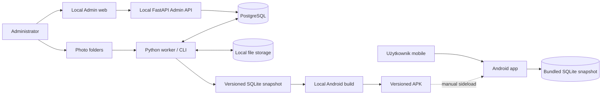
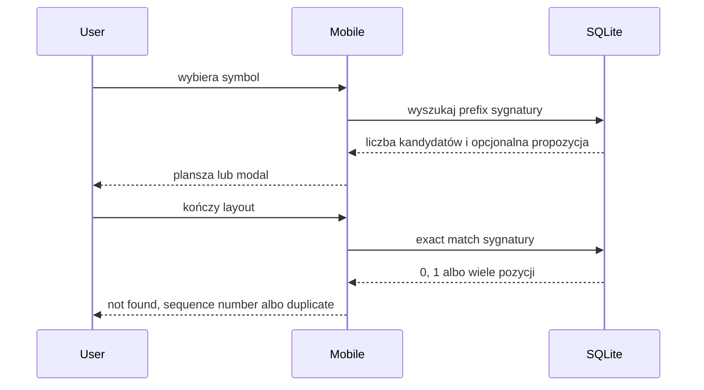
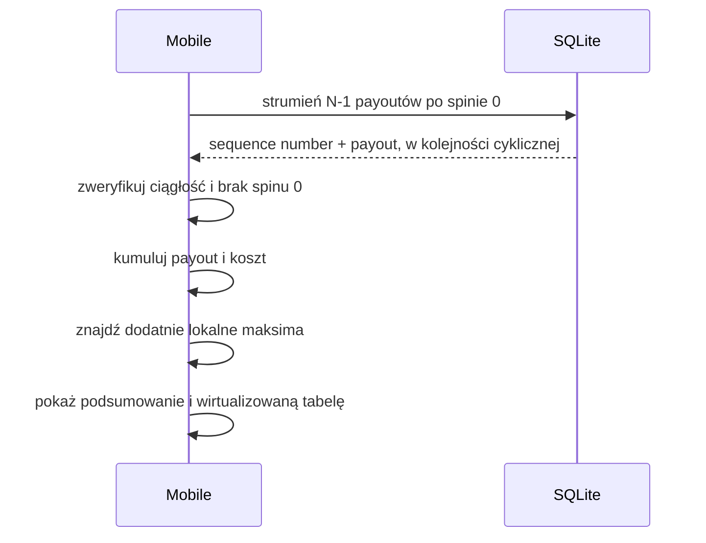
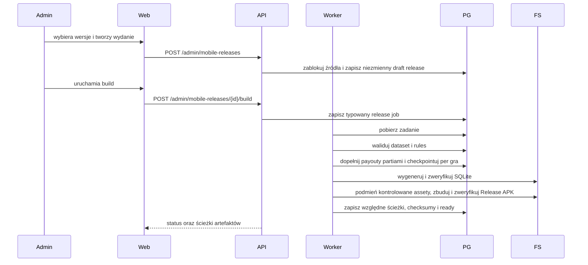

# Architektura systemu

## Kontekst



Najważniejsza granica: Android nie komunikuje się z Admin API ani PostgreSQL. Jedynym źródłem danych runtime jest snapshot dołączony do konkretnego APK.

## Odpowiedzialności

### Mobile app

- odczyt konfiguracji i symboli z lokalnego SQLite,
- stan planszy, undo i reset,
- lokalny exact/prefix matching,
- wykrycie duplikatu bez arbitralnego wyboru pozycji,
- skan gotowych payoutów dla pełnego cyklu,
- wykrycie dodatnich lokalnych maksimów,
- prezentacja wyniku i wirtualizowanej tabeli,
- diagnostyka wersji i integralności snapshotu.

### Admin web

- CRUD konfiguracji,
- edytor paylines i payoutów,
- generowanie/import i podgląd layoutów,
- uruchamianie i obserwacja jobs,
- manual review,
- publikacja wersji datasetów i reguł,
- zlecenie przygotowania snapshotu i APK.

### Admin API

- walidacja kontraktów,
- transakcje PostgreSQL,
- operacje administracyjne,
- kontrolowane zlecanie typowanych jobs,
- raportowanie postępu i artefaktów,
- generowanie OpenAPI dla klienta admin.

Admin API nie wykonuje długiego importu, pełnego precomputingu ani Android build wewnątrz requestu.
Wyjątkiem jest jawnie ograniczony mock M2: dokładnie 1000 małych layoutów
tworzonych synchronicznie i atomowo. Limit nie może zostać zwiększony do skali
produkcyjnej; większe generowanie przechodzi przez worker/job.

### Worker / CLI

- operacje długotrwałe i wznawialne,
- skanowanie folderów,
- OpenCV/OCR/klasyfikacja,
- zapis stagingu,
- walidacja ciągłości i integralności,
- obliczanie payoutów,
- generowanie SQLite,
- kontrolowane uruchamianie lokalnego workflow Android build,
- raportowanie postępu i błędów.

Admin API wyłącznie zapisuje typowany job w stanie `created`. Wspólny status
cyklu życia jest niezależny od `stage` konkretnego workflow. Żądanie anulowania
działającego joba zapisuje timestamp; dopiero worker może potwierdzić
`cancelled` po domknięciu bezpiecznej partii. Atomowy lease i ograniczenie
jednego ciężkiego wykonania należą do granicy workera.

Worker przejmuje najstarszy `created` przez `FOR UPDATE SKIP LOCKED`, a
unikalny slot w PostgreSQL dopuszcza tylko jeden rekord `processing`.
Handler działa poza transakcją i odnawia domyślny 60-sekundowy lease przez
heartbeat albo atomowy zapis checkpointu z postępem. Losowy token odcina stare
procesy od zapisu po wygaśnięciu lease. Następny claim najpierw odzyskuje
osierocony rekord: wraca on do `created` z zachowanym checkpointem albo do
`cancelled`, jeżeli wcześniej zażądano anulowania.

### PostgreSQL

- kanoniczne konfiguracje,
- wersje danych i reguł,
- sekwencje layoutów,
- staging, review i historia jobs,
- payouty powiązane z wersjami,
- manifesty wydań.

### File storage

- oryginalne zdjęcia,
- pliki robocze i wycinki,
- dane treningowe i modele,
- eksporty,
- strukturalne audyty payoutów JSONL,
- wygenerowane snapshoty i APK.

### Batch payout precomputation

Handler `payout-v2` odczytuje wyłącznie opublikowany dataset i opublikowane
reguły tej samej gry o zgodnych wymiarach. Źródło jest mapowane do czystych
kontraktów engine, a layouty są pobierane rosnąco po `sequence_number` w
partiach po 1000, bez ładowania pełnego datasetu do pamięci.

Dla każdej partii worker:

1. sprawdza ciągłość sekwencji i ocenia layouty czystym engine,
2. atomowo podmienia deterministyczny plik audytu JSONL,
3. wykonuje idempotentny upsert `layout_payouts`,
4. dopiero potem zapisuje checkpoint z ostatnim numerem i licznikami.

Awaria przed checkpointem może więc powtórzyć ostatnią partię, ale nie tworzy
drugiego wyniku ani innej ścieżki audytu. Katalog artefaktów jest lokalny i
konfigurowalny argumentem CLI; mobile nigdy go nie odczytuje.

Przed generowaniem snapshotu wielokrotnie używalna bramka gotowości sprawdza
dokładną kombinację dataset/rules/algorithm. Liczniki są obliczane agregatami
SQL bez materializowania pełnego datasetu w workerze, a próbka braków jest
ograniczona do 100 rosnących `sequence_number`. Bramka blokuje staging,
archiwalne źródło, niezgodną grę lub wymiary, niepełny zestaw i brak przypisania
audytu. Wyniki innych wersji pozostają w bazie, lecz nie wpływają na raport.

Osobny strumieniowy weryfikator JSONL porównuje nagłówek i każdy rekord z
oczekiwanym wynikiem partii. Potwierdza kolejność, payout, sumę matches,
komórki, jokery i ich interpretacje bez ładowania całego pliku do pamięci.

### Production SQLite generation

Generator schema v2 przyjmuje jawne wybory
`(dataset_version_id, rules_version_id, algorithm_version)` oraz deterministyczne
metadata wydania. Każdy wybór przechodzi bramkę kompletności M3.2. Źródła są
porządkowane po stabilnym kodzie gry, a mobilne identyfikatory techniczne są
przydzielane dopiero po tym sortowaniu.

Katalog gier i symboli jest mały i powstaje przed zapisem. Layouty z dokładnie
wybraną wersją payoutu są odczytywane z PostgreSQL keysetowo i zapisywane do
tymczasowego SQLite partiami po 1000. W tym samym przebiegu powstaje logiczny
SHA-256 kanonicznych rekordów. Dopiero kompletny plik z finalnym
`content_checksum` staje się widoczny pod ścieżką docelową; generator odrzuca
istniejący cel.

Generator snapshotu nie jest osobnym child-jobem release. Handler
`android_build` z TASK-0037 wywołuje go jako jeden z resumowalnych etapów
nadrzędnego workflow.

Publisher TASK-0035 buduje SQLite i kanoniczny manifest w prywatnym katalogu
stagingowym. Niezależny walidator otwiera bazę read-only, potwierdza fizyczny
SHA-256, schema/application id, dokładny zestaw tabel i indeks signature,
metadata, FK oraz `quick_check`. Następnie odczytuje layouty po 1000, kontroluje
ciągłość, symbole, codec sygnatury i payout oraz rekonstruuje logiczny SHA-256.

Dopiero zweryfikowany staging jest atomowo przenoszony do
`snapshots/<releaseVersion>/<logicalContentSha256>/`. Katalog końcowy zawiera
wyłącznie `snapshot.db` i `manifest.json`. Retry nie zmienia istniejących
plików; pełna walidacja identycznego manifestu pozwala użyć ich ponownie, a
każda rozbieżność kończy się stabilną kolizją.

## Przepływ dopasowania offline



## Przepływ Target offline



Port forecastu przyjmuje uporządkowany strumień `N - 1` par
`(sequence_number, payout)` wraz z metadanymi wydania. Adapter SQLite odpowiada
za cykliczny odczyt partiami, a czysty engine ponownie weryfikuje oczekiwany
numer każdej pozycji i wykonuje jeden przebieg.

Payout reguł nie jest liczony w runtime mobile. Został obliczony przy przygotowaniu wydania.

## Przepływ publikacji wydania



Publikacja jest niezmienna. Zmiana danych tworzy nowe wydanie i nie modyfikuje już zainstalowanego APK.

Dokładnie jeden job `android_build` posiada cały przebieg. Checkpoint schema v1
zapisuje ukończone gry i aktywny checkpoint payoutu, dlatego po wygaśnięciu
lease albo retry nie powstają child-joby i nie są nadpisywane gotowe artefakty.
Kontrolowany adapter przyjmuje wyłącznie utrwalony release, stały wariant
`Release` i architekturę `arm64-v8a`; klient nie przekazuje komendy. Na czas
builda produkcyjny manifest schema v1 i `snapshot.db` zastępują stały asset
Metro, a pliki bazowe są bezwarunkowo odtwarzane. Weryfikacja potwierdza podpis,
brak `INTERNET`, standalone bundle oraz SQLite o dokładnym checksumie release.

Panel wybiera wyłącznie aktywne gry oraz opublikowane, zgodne wymiarami pary
dataset/reguły. Po utworzeniu draftu nie edytuje jego składu. Podczas builda
odświeża szczegół release i dokładnie jeden przypięty job, a retry wznawia ten
sam rekord. Gotowy APK jest pobierany przez kontrolowany endpoint po ponownej
weryfikacji SHA-256 względem wspólnego katalogu artefaktów; przeglądarka nie
przekazuje ścieżki ani komendy systemowej.

Utworzenie release i uruchomienie builda są osobnymi operacjami. TASK-0036
utrwala globalnie unikalną wersję oraz 1–15 dokładnych wyborów dataset/rules.
Serwer ustala obsługiwany algorytm i schema, blokuje źródła, wymaga statusu
`published`, wspólnej aktywnej gry oraz zgodnych wymiarów i zapisuje wszystkie
rekordy w jednej transakcji. Dopiero TASK-0037 tworzy job i zmienia lifecycle.

## Przepływ ręcznego importu layoutów

1. Operator umieszcza CSV/JSONL pod skonfigurowanym lokalnym `import_root`.
2. Panel przekazuje Admin API wyłącznie względny `sourcePath` i wersję
   kontraktu.
3. Warstwa application rozwiązuje ścieżkę pod rootem, sprawdza limit i preview,
   a następnie liczy SHA-256 bounded partiami.
4. API tworzy istniejący job `import` z poświadczonym formatem, rozmiarem,
   checksumą i kanoniczną ścieżką względną.
5. `input_key` blokuje drugi import tej samej treści/kontraktu dla tej samej gry.
6. Worker `worker-v3` ponownie sprawdza checksum i usuwa ewentualny nietrwały
   ogon znajdujący się za checkpointem.
7. CSV/JSONL jest czytany po jednej ograniczonej linii i partiami po 1000
   niepustych rekordów; poprawny rekord albo bezpieczny błąd trafia do
   `layout_import_rows`.
8. Po idempotentnym upsercie partii worker zapisuje offset bajtowy, numer linii,
   liczniki i łańcuch checksumy prefiksu w checkpoint schema v1.
9. Pełny SHA-256 jest ponownie potwierdzany przed końcowym checkpointem; każda
   rozbieżność usuwa surowy staging i zeruje kursor do bezpiecznego replay.
10. API tworzy osobny job `validate` dla zakończonego importu i wybranej
    opublikowanej wersji reguł tej samej gry.
11. Worker `worker-v4` pobiera surowe wiersze bounded partiami po fizycznym
    `line_number`, sprawdza `rows * columns` i aktywny alfabet oraz koduje
    stałoszeroką sygnaturę.
12. Znormalizowana partia jest idempotentnie zapisywana przed checkpointem.
    Błędy parsera i błędy domenowe pozostają osobnymi rekordami, więc jeden
    wadliwy wiersz nie zatrzymuje pozostałych.
13. Po zakończeniu walidacji Admin API liczy dokładne agregaty integralności
    bez ładowania całego stagingu do pamięci: zgodność liczby wierszy, ciąg od
    `1`, luki, duplikaty numerów, duplikaty sygnatur i kody błędów.
14. Panel może pobierać bounded, deterministyczne próbki oraz stronicować
    znormalizowane wiersze po fizycznym `line_number`; raport nadal nie tworzy
    datasetu.
15. Jawne odrzucenie zakończonej walidacji usuwa wszystkie znormalizowane
    stagingi jej importu przed surowymi wierszami, pozostawiając joby jako audyt;
    aktywna walidacja albo istniejący dataset blokuje operację.
16. Publikacja blokuje job importu, jego walidacje, opublikowane reguły i grę,
    ponownie liczy ten sam raport, a następnie w jednej transakcji tworzy
    serwerowo numerowaną wersję datasetu i kopiuje poprawne rekordy setowym
    `INSERT ... SELECT`. Dataset staje się `published` dopiero po sprawdzeniu
    liczby skopiowanych layoutów.

HTTP nie przesyła dużego pliku i nie wykonuje pełnego importu w requestcie.
Inspekcja czyta najwyżej bounded preview oraz jeden przebieg SHA-256; staging i
pełna walidacja pozostają w workerze. Surowy staging nie tworzy jeszcze
`dataset_version` ani `layouts` i nie jest widoczny dla wydania mobilnego.
To samo dotyczy znormalizowanego stagingu: TASK-0047 raportuje luki i duplikaty,
a TASK-0049 dopiero transakcyjnie tworzy dataset.
Retry publikacji identyfikuje wynik przez unikalny
`dataset_versions.source_job_id = validation_job_id` i zwraca tę samą wersję.
Odrzucenie i publikacja blokują najpierw ten sam job importu, dzięki czemu nie
mogą równolegle usunąć oraz skopiować stagingu.

## Przepływ importu zdjęć

1. Admin tworzy import job.
2. Worker skanuje folder i zapisuje checksumy.
3. Każde zdjęcie przechodzi wersjonowany pipeline.
4. Niepewne elementy trafiają do review.
5. Admin zatwierdza poprawki.
6. Worker wykonuje walidację ciągłości.
7. Zatwierdzony staging tworzy nową wersję datasetu.

## Granice kodu

```text
services/api/app/
  api/
  application/
  domain/
  storage/
  models/
  schemas/

services/worker/
  jobs/
  image/
    geometry/
    ocr/
    classification/
  publication/
  build/

apps/mobile/src/
  features/
  domain/
    matching/
    forecasting/
  data/
    sqlite/
  ui/
```

Moduły `domain/` nie importują FastAPI, React, Expo ani ORM. Porty oddzielają:

- matching od formatu sygnatury i SQLite,
- forecast od sposobu pobierania payoutów,
- OCR i klasyfikację od konkretnych bibliotek,
- przygotowanie wydania od konkretnej komendy Android build.

### Kontrakt lokalnego repozytorium M1

`LocalLayoutRepository` otrzymuje już otwartą instancję SQLite od warstwy
aplikacyjnej. Nie kopiuje assetu, nie aktywuje wydania i nie otwiera bazy przy
każdym spinie.

- katalog gier mapuje identyfikator techniczny SQLite osobno od kodu domenowego,
- exact match zwraca `not_found`, `unique` albo `duplicate` i nigdy nie wybiera
  pierwszego duplikatu,
- prefix match zwraca dokładny licznik kandydatów, ale pełny rekord tylko dla
  jednego kandydata,
- prefix tekstowej sygnatury v1 jest zakresem
  `[prefix, prefix + ":")`,
- strumień Target jest jednym uporządkowanym zapytaniem `UNION ALL` i zawiera
  dokładnie `layout_count - 1` payoutów,
- adapter waliduje rekordy oraz kolejność i mapuje awarię na
  `local_data_error`,
- adapter nie importuje React ani komponentów UI.

## Model wdrożenia

### Mobile

- prywatne, podpisane lub testowe APK,
- ręczny sideload na maksymalnie 3–5 urządzeń,
- brak usług runtime poza systemem Android,
- nowy APK po każdej opublikowanej zmianie danych,
- stały `applicationId` i ten sam klucz podpisujący pozwalają aktualizować
  istniejącą instalację,
- snapshot jest aktywowany według release version/checksum, a nie według samego
  faktu istnienia lokalnego pliku,
- finalny manifest nie deklaruje uprawnienia `INTERNET`.

### Administracja

- PostgreSQL w Docker Compose na komputerze Windows,
- FastAPI, Next.js i worker uruchamiane lokalnie,
- lokalny system plików dla zdjęć i artefaktów,
- brak publicznego hostingu i chmury.

## Integralność i bezpieczeństwo publikacji

- `sequence_number` jest unikalny i ciągły w ramach wersji datasetu,
- sygnatura layoutu nie jest unikalna,
- wszystkie symbole layoutu należą do gry,
- opublikowane wersje danych, reguł i wydań są niezmienne,
- raport gotowości i publikacja reguł używają tego samego deterministycznego
  walidatora; publikacja oraz każda mutacja draftu blokują rekord
  `rules_versions`, aby nie dopuścić do wyścigu,
- raport integralności i publikacja datasetu używają tego samego czystego
  walidatora; bounded `mock-v1` może zostać sprawdzony synchronicznie, ale
  importy i duże datasety przechodzą przez worker/job,
- publikacja datasetu oraz każda przyszła mutacja jego stagingu blokują ten sam
  rekord `dataset_versions`; publikacja atomowo ustawia status i czas,
- raport datasetu zachowuje dokładne liczniki, ogranicza wyłącznie próbki
  diagnostyczne i traktuje duplikaty sygnatur jako ostrzeżenie,
- niegotowa wersja reguł pozostaje draftem, a niegotowy dataset stagingiem bez
  `published_at`; jawna archiwizacja opublikowanej wersji zachowuje czas
  publikacji i dane potomne,
- staging nie trafia do mobile,
- snapshot zawiera manifest wersji i checksumę,
- aplikacja odmawia obliczeń przy niezgodnym lub uszkodzonym schemacie,
- aktualizacja APK nie może po cichu pozostawić aktywnego snapshotu poprzedniego
  wydania,
- worker buduje tylko wskazane, zatwierdzone wersje,
- wynik Target wskazuje wersję wydania.

Walidacja finalnego snapshotu M1 ma dwie niezależne warstwy: SHA-256 pliku
sprawdzane względem manifestu oraz logiczną checksumę odtworzoną z
uporządkowanych rekordów SQLite. Przed aktywacją mobile porównuje schema
version, wersje wydania, fixture, datasetu, reguł i algorytmu oraz liczbę gier i
layoutów. Brak którejkolwiek zgodności daje `local_data_error`.
