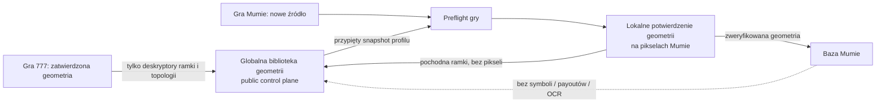

# Plan wykonania — globalna biblioteka geometrii plansz v1

## Cel i zalecana decyzja

Wprowadzić **globalną bibliotekę geometrii**, dzięki której nowa gra może
rozpocząć preflight z wiedzą zebraną z wcześniej zweryfikowanych gier: topologią
strony, proporcjami planszy i komórek oraz opisem wizualnym obramowań. Biblioteka
ma wyłącznie proponować i weryfikować nakładkę siatki. Nie klasyfikuje symboli,
nie odczytuje numerów, nie zna wypłat, nie tworzy layoutów i nie jest modelem
symboli.

Zalecam wersję v1 jako wersjonowany, deterministyczny silnik CV z biblioteką
opisów geometrii i ramek, a nie jako nową sieć neuronową. Jest on prostszy do
audytu, może bezpiecznie odziedziczyć wiedzę już po pierwszej grze, nie wymaga
kopiowania zdjęć między bazami gier i pozwala odroczyć trening, jeżeli pomiary
pokażą jego potrzebę.

Nowa gra automatycznie dostaje **kandydata** wspólnego profilu zgodnego z jej
topologią. Kandydat wyznacza tylko początkowe quady; lokalna weryfikacja ramki,
siatki i pikseli źródłowych nadal musi potwierdzić każdą planszę. Brak własnego
dowodu z obrazu kończy się `needs_manual_review`, a nigdy automatycznym cropem.

## Stan sprawdzony przed planem

| Obserwacja | Dowód | Wniosek |
| --- | --- | --- |
| Obecna rejestracja ma własność `VerifiedPageRegistrar` i po ORB/RANSAC wymaga `_red_mask`, której zakres HSV jest czerwony. | `services/worker/src/game_predictor_worker/images/page_geometry_registration.py` | Nie należy rozszerzać po cichu progu czerwieni dla wszystkich gier. Potrzebny jest wersjonowany, wielokolorowy dowód ramki. |
| Tryb ogólny `GENERIC_FRAME_LINES` jest opisany jako `generic-red-gradient-lsd-page-frame-v1`. | `structured_geometry/global_initialization.py` | Musi dostać neutralny kolorystycznie następnik; obecne wyniki historyczne muszą zachować swój fingerprint i replay. |
| Read-only probe czterech obrazów Mumie z jednym ręcznie oszacowanym profilem 3×3 uzyskał silne dopasowanie ORB, lecz odrzucił wszystkie obrazy przez `PAGE_GEOMETRY_RED_EDGE_COVERAGE_INSUFFICIENT`; średnia pokrycia wyniosła 0,405–0,442, a minimum planszy 0,102–0,151. Ogólny initializer zwrócił dla wszystkich `generic_frame_line_evidence_insufficient`. | Uruchomiono 2026-09-21 na `seq_1-9.jpg` … `seq_28-36.jpg`, bez zapisu do katalogu lub bazy. | Cztery próbki są dobrym testem problemu kolorowej czerwono-złotej ramki, ale nie są dowodem gotowości obecnego silnika ani kalibracją produkcyjną. |
| Obecne profile są jawnie związane z grą (`GameGeometryEvidenceProfileV2`), a preflight przypina profil do joba. | `structured_geometry/configuration_v2.py`, `page_geometry_preflight.py` | Dziedziczenie wymaga nowego, świadomie zaprojektowanego poziomu globalnego; nie może oznaczać odczytania profilu 777 jako profilu Mumie. |
| Modele symboli i ich aktywacje mają `game_id`; router odmawia transakcji obejmującej więcej niż jeden magazyn gry. | `symbol_model_iterations`, `game_symbol_model_activations`, `GameStorageRouter` | Potwierdzone: symbole, predykcje, payouty i layouty pozostają odrębne dla gry. Globalna zmiana nie może ich łączyć. |

Powyższy probe jest eksperymentem diagnostycznym. Ręcznie oszacowane quady nie
stają się danymi uczącymi ani goldenem; task G00 utworzy checksum-bound,
zweryfikowane anotacje przed pomiarem jakości.

## Granice danych i odpowiedzialności

### Co może przechodzić między grami

- wersja topologii: liczba plansz na stronie, ich uporządkowanie, proporcje
  quadów oraz liczba wierszy i kolumn komórek;
- pochodne opisujące ramkę: statystyki kolorów CIE Lab i HSV, rozrzut,
  kontrast po obu stronach obrysu, ciągłość krawędzi oraz informacja, która
  strona ramki była rzeczywiście widoczna;
- checksumy, wersja ekstraktora, wersja profilu, wynik kalibracji i anonimizowana
  proweniencja `source_game_ref` + checksum źródła.

### Co nigdy nie przechodzi między grami

- JPEG, crop, piksele wnętrza planszy, ORB deskryptory pobrane z symboli,
  OCR, etykiety symboli, katalog symboli, payout, numery sekwencji, layout,
  review operatora w sprawie symboli oraz snapshot modelu symboli;
- lokalny anchor ORB gry. Pozostaje on w jej bazie, ponieważ może kodować
  treść planszy. Globalny profil może wskazać geometrię startową, lecz nie
  udaje cross-game anchora ORB.

`game_data_v2` pozostaje magazynem danych domenowych jednej gry. Biblioteka
globalna ma działać w istniejącym publicznym control plane, w osobnym
repozytorium sesji niesterowanym przez `GameStorageRouter`. Jej model nie może
mieć pola nazywanego `game_id`, bo router traktuje je jako sygnał routowania do
magazynu gry; używa neutralnego `source_game_ref`. Binding nowej gry do
profilu, snapshot i metadane joba są kontrol-plane, a wynik geometrii nadal
trafia tylko do bazy tej gry.

## Kontrakt globalnego profilu

Każdy niezmienny `SharedGeometryProfileVersion` ma:

| Pole | Znaczenie |
| --- | --- |
| `topology` | Struktura strony i planszy, np. 3×3 plansze, każda 3×5 komórek; bez numerów sekwencji. |
| `normalized_template` | Znormalizowane quady i dopuszczalne proporcje, nie współrzędne konkretnej fotografii. |
| `frame_appearance` | Wiele klastrów koloru i kontrastu dla każdej widocznej strony ramki, z minimalną licznością oraz rozrzutem. |
| `evidence_summary` | Liczba pełnych i częściowych źródeł, widoczne strony, gry źródłowe, wersja ekstraktora i metryki kalibracji. |
| `status` | `candidate`, `active` albo `retired`; tylko `active` może zostać automatycznie zaproponowany nowej grze. |
| `checksum_sha256` | Checksumowana, kanoniczna treść całego snapshotu. |

Próbka pełnej, ręcznie zweryfikowanej strony może wzbogacić topologię i wszystkie
cztery strony ramek. Próbka częściowa może wzbogacić **wyłącznie** deskryptory
tych boków, których piksele oraz quad są potwierdzone. Nie może tworzyć
brakujących quadów, globalnej homografii pełnej strony ani automatycznie
zatwierdzać planszy innej gry.

Ocena ramki nie używa stałego przedziału czerwieni. Dla kandydackiego quada
silnik mierzy na pasach po obu stronach krawędzi: zgodność z jednym z klastrów
Lab/HSV, kontrast ramka–tło, ciągłość i lokalny gradient. Kolor jest jednym z
dowodów, a nie samodzielnym zezwoleniem. Czerwona, złota, miedziana lub inna
zarejestrowana ramka może przejść, gdy spełnia pełny kontrakt geometryczny.
Nieznany kolor kończy się review i może dopiero po ręcznej weryfikacji zostać
dodany jako nowe `candidate` evidence.

Każdy zapis geometrii przechowuje snapshot globalnego profilu, jego checksumę,
wersję ekstraktora oraz wynik per krawędź. Późniejsza zmiana palety nie
przelicza historycznych quadów. Ponowne użycie nowszej wiedzy jest nowym,
checksum-bound preflightem.

## Sekwencja zadań

Wszystkie zadania są wykonywane kolejno. Po każdym: targeted testy, kontrola
typów i formatowania zmienionych modułów, porównanie z Definition of Done,
audyt diffu przed commitem, niezależny review Astra Medium, poprawa znalezionych
usterek, osobny commit wersjonowany oraz raport. Następnego zadania nie zaczyna
się przed raportem poprzedniego.

### G00 — Korpus geometrii i pomiar stanu zerowego

**Cel:** utworzyć checksum-bound korpus wyłącznie do pomiaru geometrii oraz
zweryfikować, jakie dane mają wejść do wspólnego profilu.

**Zakres:**

- Dodać read-only narzędzie korpusowe przyjmujące katalog jako argument, bez
  stałej ścieżki użytkownika i bez kopiowania zdjęć. Lokalny manifest opisuje
  role: 777 pełne, 777 częściowo zasłonięte, Mumie `seq_1-9`–`seq_28-36`,
  pełna/częściowa, widoczne strony ramki, topologia oraz SHA-256.
- Ręcznie oznaczyć pełne quady dziewięciu plansz i ich 3×5 komórek dla czterech
  Mumii; oznaczyć wyłącznie potwierdzone boki w przykładach częściowych 777.
  Anotacja jest oddzielona od OCR i symboli.
- Powtórzyć obecny preflight i zapisać raport baseline: wynik, reason code,
  błąd narożników, false complete, false review i czas. Raport potwierdza
  opisany problem czerwono-złotej ramki, lecz nie aktywuje żadnego profilu.

**Niedozwolone:** import danych Mumie do gry 777, zapis cropów, poprawianie
progów na podstawie holdoutu albo używanie nazw `seq_*` jako dowodu geometrii.

**Testy i odbiór:** manifest odrzuca zmianę pliku, duplikat bajtowy i brak
oznaczenia strony; wszystkie cztery Mumie przechodzą baseline; pełne i częściowe
źródła są rozliczane osobno. Anotacja nie zawiera pól symboli, payoutu ani OCR.

**Spodziewane pliki:** nowe `services/worker/.../shared_geometry_corpus.py`,
`scripts/evaluate_shared_geometry_baseline.py`, testy workera oraz raport
`ai_docs/quality/`; lokalne obrazy i ich bezwzględne ścieżki pozostają poza Git.

### G01 — Kontrakt i izolowane przechowywanie globalnej wiedzy

**Cel:** wprowadzić wersjonowany model danych globalnej biblioteki bez
naruszenia routowania baz gier.

**Zakres:**

- Dodać migrację Alembic w publicznym control plane i modele/repozytorium dla
  `shared_geometry_families`, `shared_geometry_profile_versions`,
  `shared_geometry_evidence_samples` i `game_shared_geometry_adoptions`.
- Wymusić content-addressed profil, idempotencję wkładu, historię statusu,
  referencję `source_game_ref` oraz zakaz ścieżki, JPEG-a, cropa, symbolu,
  sekwencji i payoutu w payloadzie evidence.
- Dodać decyzję architektoniczną, która rozdziela publiczną bibliotekę od
  `game_data_v2`, symbol modelu i per-game anchorów. Migracja jest addytywna;
  brak aktywnego profilu zachowuje historyczne preflighty bit w bit.

**Warunki błędu:** checksum mismatch, niekompatybilna topologia, dowód
częściowy udający pełny, próbka z zabronionym polem albo drugi wkład z tym samym
kluczem i inną treścią kończą się stałym błędem bez zapisu.

**Testy i odbiór:** test Postgres potwierdza, że publiczna sesja nie binduje się
do magazynu gry; `GameStorageRouter` nadal odmawia transakcji obejmującej dwie
gry; migracja upgrade/downgrade jest bezpieczna dla pustej biblioteki;
historyczny model symboli oraz preflight działają bez snapshotu globalnego.

**Spodziewane pliki:** `services/api/alembic/versions/`,
`storage/models.py`, nowe domain/application/storage repository i testy API;
aktualizacje `DATA_MODEL.md`, `VIRTUAL_GEOMETRY_SCHEMA_OWNERSHIP.md` oraz
`DECISION_LOG.md`.

### G02 — Ekstrakcja bezpiecznego evidence pełnego i częściowego

**Cel:** wyprowadzać z ręcznie potwierdzonej geometrii wyłącznie informacje
potrzebne do przyszłego nałożenia siatki.

**Zakres:**

- Zbudować czystą funkcję ekstrakcji descriptorów ramki z kanonicznego RGB i
  potwierdzonego quada: segmenty czterech boków, Lab/HSV, MAD/kwantyle,
  kontrast normalny do krawędzi, ciągłość i dowód source support.
- Pełna plansza kwalifikuje się tylko z kompletną geometrią; częściowa wyłącznie
  z `pending_partial` i eksplicytną maską widocznych boków. Wspólny profil nie
  otrzymuje niewidocznych boków ani syntetycznych punktów.
- Zapis do globalnej biblioteki jest outboxem: worker najpierw zamyka geometrię
  we własnej grze, później publikuje mały checksumowany artefakt evidence.
  Importer control-plane jest idempotentny i może bezpiecznie wznowić po awarii.

**Przykład:** pełna plansza z czerwoną lewą i złotą prawą ramką aktualizuje oba
klastry; plansza ucięta z prawej aktualizuje tylko lewy, górny i dolny dowód,
nie uczy „braku prawej ramki”.

**Testy i odbiór:** syntetyczne czerwone, złote i ciemniejsze warianty tworzą
różne, lecz zgodne klastry; częściowy dowód nie może podnieść liczności pełnej
strony; serializacja nie zawiera pikseli/cropów/symboli; retry importera nie
tworzy drugiego evidence.

**Spodziewane pliki:** nowe moduły domain/worker dla `shared_geometry_evidence`,
outbox i importer, testy z obrazami syntetycznymi. Żadne artefakty symboli nie
są zmieniane.

### G03 — Wielokolorowa weryfikacja ramki i inicjalizacja siatki

**Cel:** zastąpić twarde założenie „ramka jest czerwona” snapshotową oceną
ramki, zachowując historyczny replay.

**Zakres:**

- Dodać `FrameEvidenceEvaluator` jako wersjonowany konsument profilu; zwraca
  per-bok score i reason code, bez samodzielnej akceptacji quada.
- Nowy `VerifiedPageRegistrar`/initializer najpierw proponuje geometrię,
  następnie sprawdza kolejność, nakładanie, wielkość, linie i lokalny dowód
  ramki według przypiętego snapshotu. Wynik otrzymuje checksum snapshotu oraz
  obserwowane evidence.
- Zostawić `_red_mask` i `generic-red-gradient-lsd-page-frame-v1` wyłącznie do
  replayu historycznych jobów. Nowa wersja nie zmienia ich wyników ani nie
  rozszerza globalnie hue czerwieni.
- Z profilu częściowego można zasugerować ROI aktywnej planszy, ale nie pełną
  stronę. Brak wspieranych pikseli zawsze wymaga lokalnego review.

**Testy i odbiór:** goldeny obecnej czerwonej gry zachowują historyczne wyniki;
ten sam geometryczny obraz z ramką czerwoną, złotą i miedzianą uzyskuje te same
quady przy zgodnym profilu; niezgodny kolor lub tylko kolor bez ciągłej krawędzi
nie daje `ready`; wszystkie cztery Mumie uzyskują poprawną propozycję albo
review z konkretnym reason code, nigdy fałszywy complete crop.

**Spodziewane pliki:** `page_geometry_registration.py`,
`structured_geometry/global_initialization.py`, nowe moduły evaluatorów oraz
testy `test_page_geometry_registration.py` i
`test_structured_geometry_global_initialization.py`.

### G04 — Snapshot globalny w preflight, API i interfejsie Admina

**Cel:** umożliwić nowej grze automatyczne użycie bezpiecznego, globalnego
kandydata bez zapytania workera do mutowalnej biblioteki podczas joba.

**Zakres:**

- Resolver control-plane wybiera aktywne profile tylko o zgodnej topologii,
  deterministycznie sortuje je według wersji i jakości, a API przypina pełny
  snapshot oraz checksumę do payloadu preflightu.
- `PageGeometryPreflightHandler` czyta wyłącznie przypięty snapshot. Zmiana,
  wycofanie albo drift globalnego profilu po utworzeniu joba nie zmienia joba;
  nowy preflight tworzy nowy snapshot.
- Admin pokazuje nazwę/wersję zastosowanego profilu, jego zakres
  „tylko geometria”, stan `candidate`/`active`/`review` i reason codes. Nie
  pokazuje symboli innej gry i nie dodaje równoległego ręcznego typu frontend.
- Brak zgodnego profilu zachowuje dzisiejszy lokalny preflight. Ta zmiana nie
  odblokowuje selekcji V7 ani nie zmienia jej API gate.

**Testy i odbiór:** historyczny input bez globalnego snapshotu ma identyczny
payload i wynik; nowy input ma dokładnie jeden snapshot; zmiana aktywnego
profilu po utworzeniu joba nie wpływa na retry; OpenAPI, wygenerowany klient,
wrapper Admina oraz test żądania są zgodne.

**Spodziewane pliki:** istniejące schema/service endpointów image importu i
jobów, `page_geometry_preflight.py`, klient wygenerowany i moduły Admina;
nowe testy API/worker/Admin.

### G05 — Kontrolowany bootstrap z 777 i adopcja przez Mumie

**Cel:** zasilić pierwszą kandydacką rodzinę geometrii danymi 777 oraz sprawdzić,
czy Mumie przyspiesza preflight bez mieszania domen gry.

**Zakres:**

- Przygotować read-only preview istniejących **ręcznie zweryfikowanych** pełnych
  i częściowych geometrii 777, z raportem kwalifikacji i wykluczeń. Nie wolno
  automatycznie promować historycznych automatic/review wyników.
- Po jawnej akceptacji preview opublikować wyłącznie descriptorowe evidence do
  `candidate` profilu. Utrwalić checksumy, liczbę pełnych/częściowych dowodów
  i brak zabronionych danych.
- Utworzyć testowy binding Mumie do tego kandydata i uruchomić preflight na
  czterech `seq_*` poprzez lokalny manifest korpusu. Wynik mierzy czas,
  kompletność propozycji, reason codes oraz jakość overlayów, bez importu
  layoutów i bez modelu symboli.

**Testy i odbiór:** preview jest read-only i deterministyczny; anulowanie nie
zapisuje evidence; udział częściowy nie tworzy full anchor; Mumie nie może
czytać artefaktu symboli 777; wykonanie z tym samym snapshotem ma ten sam
wynik po restarcie.

**Spodziewane pliki:** preview/report runner, adapter evidence, testy integracji
magazynu gry z control plane oraz raport jakości. Rzeczywiste katalogi lokalne
są parametrami polecenia i pozostają poza repozytorium.

### G06 — Kalibracja między grami i bramka aktywacji

**Cel:** promować wspólny profil wyłącznie po mierzalnym dowodzie, że pomaga,
a nie tworzy fałszywych cutów.

**Zakres:**

- Zamrozić rozłączne zbiory development/calibration/holdout na poziomie
źródłowego zdjęcia, oddzielnie dla 777 i Mumie. Cztery obecne Mumie są pilotem,
nie wystarczającym holdoutem produkcyjnym.
- Raportować osobno: poprawność narożników, poprawność kolejności slotów,
false complete, false review, recall pełnych stron, wykrycie niepełnej strony,
fałszywe alarmy koloru, czas preflightu i zysk względem baseline G00.
- Dopuszczać `active` tylko, gdy wszystkie ręcznie oznaczone pełne strony
holdoutu mają prawidłową geometrię, żadna częściowa strona nie otrzyma statusu
complete, a raport obejmuje co najmniej dwie gry i źródła niewykorzystane do
budowy profilu. Do czasu spełnienia bramki profil jest `candidate` i może
wyłącznie przyspieszać review.

**Testy i odbiór:** evaluator odrzuca nakładanie się developmentu i holdoutu,
dryf checksumy, brak mianownika i próbę policzenia ręcznej korekty jako sukcesu
automatu. Raport ma licznik i mianownik dla każdej metryki; zero przypadków
nie jest sukcesem.

**Spodziewane pliki:** evaluator kalibracji, kontrakty raportu, testy i raport
`ai_docs/quality/`. Nie ma treningu sieci ani aktywacji modelu symboli.

### G07 — Wdrożenie, recovery i odbiór końcowy

**Cel:** udostępnić aktywną bibliotekę nowym grom bez ryzyka dla istniejących
geometrii i baz danych.

**Zakres:**

- Włączyć automatyczne proponowanie tylko dla `active` profilu, zostawić
  przełącznik wycofania blokujący nowe bindingi, ale umożliwiający odczyt,
  recovery oraz audit historycznych jobów.
- Sprawdzić restart w trakcie preflightu, retry outboxa evidence, wycofanie
  profilu i równoległe uruchomienia różnych gier. Nie może istnieć lock ani
  transakcja współdzieląca per-game dane domenowe.
- Zaktualizować dokumentację właścicielską, model danych, API/OpenAPI,
  instrukcję operatora i `CURRENT_STATE.md`; stworzyć raport odbioru z
  ograniczeniami, licznikami oraz profilem sprzętu.

**Testy i odbiór:** nowa gra bez aktywnego profilu działa jak wcześniej; nowa
gra z aktywnym profilem ma przypięty snapshot; istniejący job pozostaje
odtwarzalny po wycofaniu; symbol model, symbole, payout i layouty obu gier są
byte-for-byte/row-for-row niezmienione przez cały test. Ostateczny audyt
porównuje każdy wymóg tego planu z raportem oraz uruchomionymi testami.

**Spodziewane pliki:** dokumentacja właścicielska, testy recovery i raport
odbioru; tylko niezbędne zmiany API/UI do pokazania adopcji profilu.

## Mapa wymagań do zadań

| Wymaganie | Zadania | Dowód odbioru |
| --- | --- | --- |
| Nowa gra dziedziczy wiedzę o cięciu | G01–G05 | Przypięty shared snapshot z 777 użyty jako kandydat Mumie, bez cross-game anchorów ORB. |
| Ramki o różnych kolorach | G02, G03, G06 | Złote/czerwone/miedziane goldeny, metryki false complete/false review i cztery próbki Mumie. |
| Pełne i niepełne plansze | G02, G03, G05, G06 | Widoczne boki częściowe aktualizują tylko appearance evidence; brak fałszywej pełnej strony. |
| Tylko geometria, nie symbole/payout | G01, G02, G04, G07 | Schema validator, inspekcja payloadu, test separacji storage i regresja symbol-modelu. |
| Oddzielna baza każdej gry | G01, G04, G05, G07 | Public control-plane repozytorium + per-game router tests + brak cross-game transakcji. |
| Trwałość i retry | G02, G04, G07 | Content-addressed snapshot/outbox, restart, retry oraz wycofanie aktywacji. |
| Szybsze tworzenie gry | G00, G05, G06 | Porównanie czasu i udziału review przed/po przy zachowaniu bramki jakości. |

## Ryzyka, decyzje zastosowane i zakres wyłączony

- **Zastosowana decyzja:** globalnie dziedziczymy pochodne geometrii, a nie
  surowe anchor image/ORB. Tak unikamy niejawnego transferu symboli i fałszywej
  pewności na innej grze.
- **Zastosowana decyzja:** częściowa plansza jest dowodem tylko własnych,
  widocznych boków. Pozwala szybciej rozszerzać paletę ramek, ale nie może
  odtwarzać pełnej strony.
- **Zastosowana decyzja:** cztery Mumie są pierwszym pilotem funkcjonalnym. Nie
  aktywują profilu bez niezależnego holdoutu; G06 tworzy ten holdout z korpusu
  777/Mumie lub nowych obrazów podanych później przez operatora.
- **Zastosowana decyzja:** jeśli preflight nie ma odpowiedniego, aktywnego
  profilu, pozostaje przy starym workflow i ręcznym review; nie ma globalnego
  fallbacku „najbliższy kolor”.
- Poza zakresem: trening ML, klasyfikacja symboli, OCR, payout, import plansz,
  zmiana V7 selection gate, Redis/Celery/mikroserwisy oraz automatyczne
  przepisywanie historycznych geometry revisions.

## Przypisanie modeli do zadań

| Zadanie | Model | Reasoning | Uzasadnienie | Dodatkowy review |
| --- | --- | --- | --- | --- |
| G00 | gpt-5.6-terra | high | Ograniczony, read-only korpus i rzetelny baseline opierają się na istniejących runnerach oraz wymagają dokładnej proweniencji. | gpt-6-astra, medium — kontrola metodologii korpusu i mianowników. |
| G01 | gpt-5.6-terra | xhigh | Zmiana rozdziela publiczny control plane od routowanych magazynów gier i wymaga migracji, idempotencji oraz kompatybilności. | gpt-6-astra, medium — audyt migracji, izolacji i rollbacku. |
| G02 | gpt-5.6-terra | xhigh | Deskryptory kolorów, częściowe evidence i outbox wymagają precyzyjnych kontraktów danych oraz recovery. | gpt-6-astra, medium — audyt granicy „tylko geometria” i idempotencji. |
| G03 | gpt-5.6-terra | xhigh | Zastępuje krytyczną walidację czerwieni wersjonowanym algorytmem, przy zachowaniu historycznego replayu. | gpt-6-astra, medium — audit false-complete, koloru i regresji legacy. |
| G04 | gpt-5.6-terra | xhigh | Łączy backend, job, OpenAPI i Admin przez checksum-bound snapshot bez ręcznie rozbieżnych typów. | gpt-6-astra, medium — audit snapshotu, driftu i kompatybilności API. |
| G05 | gpt-5.6-terra | high | Bootstrap i pilot używają istniejących danych, wymagają read-only preview oraz bezpiecznego podziału między bazami. | gpt-6-astra, medium — audit cross-game data boundary i wyniku pilota. |
| G06 | gpt-5.6-terra | xhigh | Bramka jakości wymaga rozłącznych danych, jednoznacznych mianowników i ochrony przed dostrajaniem do holdoutu. | gpt-6-astra, medium — niezależny review metryk i decyzji aktywacji. |
| G07 | gpt-5.6-terra | high | Odbiór obejmuje recovery, rollback profilu, dokumentację i regresję izolacji gier. | gpt-6-astra, medium — końcowy audit odbioru oraz zakresu zmian. |
