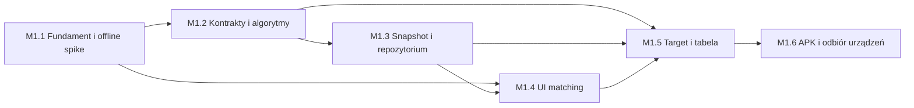

# Plan wykonania Milestone 01

## Wynik przeglądu pytań

Nie ma dodatkowego pytania produktowego blokującego M1.

Otwarte Q-015–Q-017 dotyczą image ingestion, Q-019 panelu
wieloadministratorskiego, a Q-020 opcjonalnej analizy aplikacji referencyjnej.
Nazwa sekcji `Result`/`Target` oraz zachowanie plansz szerszych niż 5 kolumn
również nie wpływają na fixture M1.

Decyzje techniczne toolchainu i Android build zostały rozstrzygnięte w M1.1 i
zapisane jako D-013.

## Decyzja wykonawcza

M1 pozostaje jednym milestone'em produktowym, ale nie może być realizowany jako
jedno zadanie, jeden duży prompt ani jeden nieprzerwany zestaw zmian.

Pełny zakres M1 łączy:

- bootstrap dwóch ekosystemów: TypeScript i Python,
- Android development/release build,
- kontrakt i generator SQLite,
- dwa języki logiki domenowej: build-time payout oraz mobile forecast,
- lokalne matching i indeksy,
- interaktywny UI,
- wirtualizowaną tabelę,
- testy na dwóch fizycznych urządzeniach.

Połączenie tych obszarów w jednym zadaniu utrudniłoby diagnozę błędów i
zwiększyłoby ryzyko, że problem z buildem zostanie pomylony z problemem
algorytmu albo danych. M1 jest dlatego dzielony na sześć kolejnych podetapów.

## Zasady realizacji

1. Jeden podetap jest realizowany i odbierany przed rozpoczęciem następnego.
2. Każdy podetap ma osobne zadania w `ai_docs/tasks/`.
3. Jedno zadanie obejmuje jeden spójny wynik i ma własny Outcome.
4. Nie tworzymy wszystkich warstw „na zapas”.
5. Każda bramka obejmuje testy, lint, typecheck i aktualizację dokumentacji
   właściwe dla zmienionego obszaru.
6. Błąd bramki zatrzymuje przejście dalej; nie jest maskowany tymczasowym
   obejściem w kolejnej warstwie.
7. Zmiana zachowania produktu wraca do wymagań i Decision Log, zamiast być
   ukryta w kodzie.

## Zależności

## M1.1 — Fundament monorepo i offline SQLite spike

**Status:** ukończone 2026-07-24 (`TASK-0002`).

### Cel

Najpierw usunąć największe ryzyko integracyjne: potwierdzić, że Android build
potrafi otworzyć wersjonowaną bazę SQLite dołączoną do aplikacji i działa bez
sieci.

### Zakres

- struktura monorepo zgodna z D-001,
- TypeScript strict oraz podstawowe narzędzia Python,
- root commands dla format, lint, typecheck i test,
- minimalna aplikacja Expo/React Native,
- minimalny snapshot z tabelą `metadata` i kilkoma rekordami testowymi,
- adapter inicjalizacji `expo-sqlite`,
- materializacja snapshotu pod nazwą zawierającą wersję lub checksumę,
- walidacja wersji schematu,
- prosty ekran diagnostyczny z wersją release i liczbą rekordów,
- Android development build i samodzielny testowy build offline na Windows,
- statyczna weryfikacja, że standalone bundle i dokładny snapshot SQLite są
  częścią APK.

Instalacja, test bez sieci i aktualizacja APK na fizycznych urządzeniach należą
do M1.6. M1.1 nie zastępuje tego odbioru.

### Decyzje techniczne zapisywane w tym podetapie

- menedżer workspace JavaScript i lockfile,
- sposób zarządzania środowiskiem Python,
- checker typów Python,
- stabilny Android `applicationId`,
- minimalne wersje Android wynikające z wybranej wersji Expo,
- dokładna komenda lokalnego development build,
- zasada nazewnictwa i aktywacji snapshotu.

Nie są to pytania produktowe. Wybór ma być oparty na kompatybilności aktualnych
stabilnych wersji i zapisany w Decision Log.

### Wynik demonstracyjny

Po uruchomieniu APK bez sieci ekran pokazuje dane odczytane z dołączonego
SQLite oraz jego wersję.

### Bramka G1

- build Android działa,
- baza jest rzeczywiście częścią aplikacji,
- zmiana wersji fixture powoduje użycie nowego snapshotu, nie starej kopii,
- niezgodny schemat daje kontrolowany `local_data_error`,
- podstawowe komendy jakości przechodzą,
- nie istnieje jeszcze właściwy UI planszy ani algorytm payout.

## M1.2 — Kontrakty domenowe i golden algorithms

**Status:** ukończone 2026-07-24 — TASK-0003, TASK-0004 i TASK-0005; bramka
G2 przeszła.

### Cel

Udowodnić poprawność reguł bez zależności od React Native, SQLite i UI.

### Zakres

- stałoszeroki codec sygnatury `row-major`,
- typy gry, symbolu, payline, payoutu i forecastu,
- walidacja wymiarów oraz `row_path`,
- czysty payout engine po stronie build-time,
- joker, longest match, przecinające się paylines i sumowanie,
- czysty Target engine po stronie TypeScript,
- pełny cykl `N - 1`,
- koszt każdego spinu i kumulacja wszystkich payoutów,
- dodatnie lokalne maksima oraz plateau,
- współdzielone golden fixtures niezależne od warstwy danych.

### Podział zadań

1. Kontrakty, signature codec i walidacja.
2. Payout engine oraz golden cases.
3. Target engine oraz golden cases.

Nie należy łączyć trzech punktów w jeden duży task, jeżeli ich implementacja
dotyka oddzielnych modułów lub języków.

### Wynik demonstracyjny

Zestaw jawnych fixture zwraca dokładnie oczekiwane payouty, interpretacje
jokera i wiersze Target bez uruchamiania aplikacji.

### Bramka G2

- wszystkie przypadki Q-005–Q-013 mają testy,
- golden values są policzone i opisane niezależnie od implementacji mobile,
- kod domenowy nie importuje Expo, React, SQLite, FastAPI ani ORM,
- brak nierozstrzygniętej semantyki dla planszy 3 × 5.

## M1.3 — Generator danych, snapshot i lokalne repozytorium

### Cel

Zbudować deterministyczny, sprawdzalny kontrakt między etapem build-time a
aplikacją mobilną.

### Zakres

- deterministyczny generator 3 gier × 1000 layoutów,
- kontrolowane przypadki duplikatów i golden Target,
- precomputed payout każdego layoutu,
- finalny schemat SQLite M1,
- manifest, schema version i checksum,
- validator ciągłości `sequence_number`,
- repozytorium exact match,
- repozytorium prefix match,
- cykliczny odczyt `N - 1` payoutów,
- testy indeksów oraz benchmark na skali M1.

### Podział zadań

1. Generator i walidator fixture.
2. Generator snapshotu i testy integralności.
3. Repozytorium SQLite exact/prefix/cyclic stream.

### Wynik demonstracyjny

Jedna komenda generuje powtarzalny SQLite, a test integracyjny lokalnie znajduje
unikalny layout, duplikat i pełny uporządkowany strumień payoutów.

### Bramka G3

- snapshot zawiera dokładnie 3 × 1000 layoutów,
- numery są ciągłe,
- payout istnieje dla każdego rekordu,
- checksum i manifest są zgodne,
- exact/prefix zwracają golden wyniki,
- nie wykonuje się jednego otwarcia bazy na każdy spin,
- rozmiar i czasy operacji są zapisane.

**Status:** ukończone 2026-07-24 (`TASK-0006`, `TASK-0007`, `TASK-0008`).
Dowód benchmarku znajduje się w
`ai_docs/quality/m1-repository-benchmark.json`.

## M1.4 — Wprowadzanie planszy i kompletny matching UI

### Cel

Dostarczyć pierwszy pełny przepływ użytkownika: od wyboru gry do wyniku
`unique`, `duplicate` albo `not_found`.

### Zakres

- reducer planszy,
- wybór gry i symboli,
- Layout 3 × 5,
- Undo i Reset,
- integracja prefix matching,
- modal jednego kandydata,
- automatyczne uzupełnienie jako jeden krok Undo,
- exact matching,
- stany `unique`, `duplicate`, `not_found`, `local_data_error`,
- wyczyszczenie kontekstu duplikatu po Reset,
- testy komponentowe.

### Podział zadań

1. Reducer i podstawowe komponenty planszy.
2. Integracja prefix matching i modal.
3. Pełne stany exact matching oraz błędów.

### Wynik demonstracyjny

Użytkownik w trybie offline wprowadza układ, akceptuje propozycję albo otrzymuje
poprawny komunikat o duplikacie.

### Bramka G4

- pełny matching działa bez Target,
- Reset i zmiana gry nie pozostawiają starego kontekstu,
- modal nie otwiera się w pętli dla odrzuconego prefiksu,
- ważne informacje nie są przekazywane tylko kolorem,
- komponenty nie znają formatu zapytań SQLite.

## M1.5 — Pełny Target i wirtualizowana tabela

### Cel

Połączyć jednoznaczny matching z pełnym obliczeniem i prezentacją wyników.

### Zakres

- uruchomienie Target wyłącznie dla `unique`,
- odczyt dokładnie `N - 1` payoutów z zawinięciem,
- kontrolowany stan obliczenia i błędu,
- integracja czystego Target engine,
- podsumowanie kosztu i liczby ocenionych spinów,
- tabela dodatnich lokalnych maksimów,
- jedna lista wirtualizowana z sekcjami wejściowymi jako header,
- anulowanie albo bezpieczne odrzucenie nieaktualnego wyniku po Reset/zmianie
  gry,
- pomiar płynności M1.

### Podział zadań

1. Integracja pełnego cyklu i zarządzanie stanem obliczenia.
2. Tabela, wirtualizacja oraz interakcje Reset/zmiana gry.

### Wynik demonstracyjny

Po odnalezieniu golden layoutu aplikacja pokazuje dokładnie oczekiwane lokalne
szczyty dla 999 spinów.

### Bramka G5

- wynik zgadza się z golden fixture,
- spin 0 nie jest liczony,
- zero nie trafia do tabeli,
- późniejszy niższy szczyt jest widoczny,
- plateau wskazuje pierwszy spin,
- długa lista nie renderuje wszystkich wierszy naraz,
- duplicate nigdy nie uruchamia Target.

## M1.6 — Release APK i odbiór na urządzeniach

### Cel

Udowodnić, że cały pion działa jako prywatna aplikacja, a nie wyłącznie w
środowisku deweloperskim.

### Zakres

- odtwarzalny lokalny Android release build,
- stabilny `applicationId`,
- trwały lokalny signing key poza repozytorium,
- brak sekretów w Git,
- brak uprawnienia `INTERNET` w finalnym APK,
- instalacja pierwszej wersji,
- aktualizacja do drugiego APK z innym snapshotem,
- test offline na Google Pixel 10 Pro XL,
- test offline na Samsung Galaxy S21 Ultra,
- pomiar rozmiaru APK/snapshotu i kluczowych czasów,
- instrukcja instalacji i aktualizacji,
- końcowy protokół demo M1.

### Wynik demonstracyjny

To samo APK działa na obu urządzeniach bez sieci, a instalacja nowej wersji
aktywuje nowy dataset.

### Bramka G6

- wszystkie kryteria akceptacyjne M1 są spełnione,
- manifest finalnego APK nie wymaga Internetu,
- obie instalacje przechodzą scenariusz unique/duplicate/Target,
- aktualizacja nie korzysta po cichu ze starego SQLite,
- wynik jakości i ograniczenia są zapisane,
- dokumentacja uruchomienia jest kompletna.

## Mapa planowanych zadań

Identyfikatory są rezerwacją planu. Każdy plik zadania powstaje dopiero przed
rozpoczęciem danego zakresu.

| Task | Podetap | Zakres |
|---|---|---|
| TASK-0002 | M1.1 | Monorepo, narzędzia i minimalny offline SQLite spike |
| TASK-0003 | M1.2 | Kontrakty, signature codec i walidacja |
| TASK-0004 | M1.2 | Payout engine i golden tests |
| TASK-0005 | M1.2 | Target engine i golden tests |
| TASK-0006 | M1.3 | Deterministyczny generator fixture i walidator sekwencji |
| TASK-0007 | M1.3 | Generator snapshotu SQLite i testy integralności |
| TASK-0008 | M1.3 | Repozytorium matching oraz cykliczny stream |
| TASK-0009 | M1.4 | Board reducer i podstawowe komponenty |
| TASK-0010 | M1.4 | Prefix matching i modal jednego kandydata |
| TASK-0011 | M1.4 | Exact matching oraz pełne stany wyniku |
| TASK-0012 | M1.5 | Integracja pełnego Target |
| TASK-0013 | M1.5 | Wirtualizowana tabela i zarządzanie stanem obliczenia |
| TASK-0014 | M1.6 | Release APK, aktualizacja i odbiór na urządzeniach |

Jeżeli w trakcie zadania zostanie odkryta niezależna zmiana schematu,
architektury lub zachowania, zadanie należy rozdzielić zamiast rozszerzać jego
Scope.

## Założenia M1 niewymagające odpowiedzi właściciela

- nazwy i wartości mock są fixture testowym, nie finalnymi danymi produktu,
- stan wprowadzanej planszy i wynik nie są trwale zachowywane po ubiciu procesu
  lub aktualizacji aplikacji,
- mobile nie przechowuje danych użytkownika wymagających migracji,
- finalna etykieta `Result`/`Target` może zostać zmieniona bez zmiany domeny,
- M1 obsługuje tylko plansze 3 × 5, więc pytanie o dwa rozłączne ciągi na
  szerszej payline nie blokuje realizacji.

## Następny krok

M1.1–M1.3 są zakończone. Po osobnym poleceniu należy utworzyć tylko
`TASK-0009 — Board reducer and basic components`. Nie należy równolegle
rozpoczynać kolejnych zadań podetapów M1.4–M1.6.
