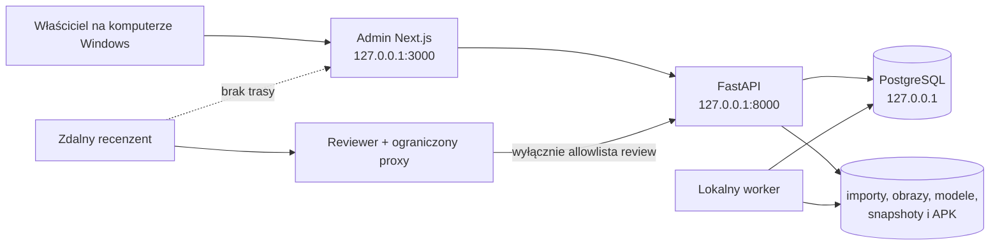

# Model zagrożeń lokalnego panelu Admin

## Cel i granica

Panel Admin wersji `0.1` jest narzędziem jednego zaufanego właściciela
uruchamianym na jego komputerze z Windows. Nie jest usługą publiczną ani
systemem współdzielonych kont. Granicę dostępu stanowią konto Windows,
uprawnienia systemu plików i procesy zbindowane wyłącznie do loopback.

Zdalny Reviewer jest osobną powierzchnią opisaną w
`REMOTE_REVIEWER_THREAT_MODEL.md`. Tunel może publikować wyłącznie aplikację
Reviewer i jej allowlistowany proxy. Nie zmienia bindingu ani modelu dostępu
Admina, API, PostgreSQL lub workera.

## Chronione zasoby

- integralność gier, symboli, reguł, datasetów i kolejności layoutów,
- niezmienność opublikowanych wersji, snapshotów, manifestów i wydań,
- obrazy źródłowe, modele, eksporty, APK i pozostałe artefakty plikowe,
- hasło PostgreSQL, klucz i hasło podpisu Android, kody oraz tokeny Reviewera,
- dostępność lokalnego pipeline’u, jobów i historii ich wykonania,
- możliwość ustalenia kto, kiedy i jaki cel zmienił lub zarchiwizował.

## Aktorzy i założenia zaufania

| Aktor | Uprawnienia i zaufanie |
|---|---|
| lokalny właściciel | pełna administracja w ramach własnego konta Windows |
| proces Admina i API | zaufane procesy lokalne; muszą odrzucać binding inny niż loopback |
| worker | wykonuje wyłącznie typowane joby i kontrolowane procesy build/import |
| zdalny Reviewer | niezaufany poza zakresem aktywnej sesji jednej gry/importu |
| zewnętrzna strona w przeglądarce | niezaufana; nie może inicjować skutecznej mutacji Admin API |
| lokalne malware lub przejęte konto Windows | poza granicą auth aplikacji; ryzyko ograniczane na poziomie systemu operacyjnego |

Brak hasła w lokalnym Adminie jest świadomą decyzją. Ekran z jednym hasłem
uruchomiony na tym samym komputerze nie chroniłby przed przejętym kontem,
malware ani bezpośrednim dostępem do plików i bazy, a tworzyłby pozorną granicę.
Dodanie wielu lokalnych użytkowników wymaga nowej decyzji, autoryzacji per rola
i migracji audytu; nie jest ukrytym rozszerzeniem wersji `0.1`.

## Zagrożenia, obecne zabezpieczenia i luki

| Zagrożenie | Obecne zabezpieczenie | Wymaganie / ryzyko resztkowe |
|---|---|---|
| przypadkowe wystawienie Admina, API lub bazy do LAN/Internetu | walidacja konfiguracji loopback, skrypty Admina na `127.0.0.1`, port PostgreSQL Compose na `127.0.0.1` | TASK-0079 dodaje regresję konfiguracji i listenerów; żaden tryb zdalny nie może omijać tej zasady |
| obejście potwierdzenia przez bezpośrednie wywołanie API | UI ma jawne potwierdzenia archiwizacji, odrzucenia stagingu i anulowania jobu | samo UI nie jest granicą bezpieczeństwa; TASK-0079 dodaje serwerowy kontrakt potwierdzenia operacji wysokiego wpływu |
| pomylenie celu operacji destrukcyjnej | UI pokazuje identyfikator/nazwę celu | żądanie musi przenosić jednoznaczny cel i aktualną rewizję lub równoważny warunek konfliktu |
| brak możliwości odtworzenia zmiany administracyjnej | wersjonowane domeny i audyty części pipeline’u | TASK-0079 dodaje wspólny append-only audyt operacji wysokiego wpływu z aktorem narzuconym przez serwer |
| podszycie się pod aktora przez payload | Reviewer ma aktora narzuconego z sesji | lokalny Admin używa stałego aktora `local-owner`; klient nie może dowolnie podać innej tożsamości |
| CSRF lub mutacja z obcej strony | ograniczony CORS, JSON API i loopback | CORS nie jest pełną ochroną przed wysłaniem żądania; TASK-0079 dodaje wymagany nagłówek intencji dla mutacji Admina i test obcego originu |
| ujawnienie sekretu w logu, raporcie lub OpenAPI | sekrety są konfigurowane poza repo, kod/token Reviewera jest hashowany | hasła, klucze, kody i tokeny muszą być redagowane; TASK-0079 dodaje test logów/diagnostyki |
| ujawnienie absolutnej ścieżki | publiczny Reviewer zwraca tylko kontrolowane assety | API publiczne i raport przenośny nie zwracają absolutnych ścieżek; lokalna diagnostyka operatorska może je pokazać tylko celowo i bez sekretów |
| path traversal albo podmiana artefaktu | kontrolowane rooty, rozwiązywanie ścieżek względnych, checksumy i blokada symlinków przy pobraniu | utrzymać testy traversal/symlink/checksum; zapis poza skonfigurowanym rootem jest błędem |
| dowolne polecenie systemowe przez job/build | typowane joby i kontrolowane skrypty | nie przyjmować surowej komendy, argumentów powłoki ani ścieżki wykonywalnej z HTTP |
| zmiana opublikowanej wersji | wersje są immutable, a nowe dane tworzą nową wersję | archiwizacja nie może modyfikować zawartości; audyt wskazuje wersję i wynik |
| utrata danych lub dostępności | transakcje, resumable joby i artefakty z checksumami | pełna ochrona wymaga backup/restore w M8.3; lokalne malware pozostaje zaakceptowanym ryzykiem systemowym |

## Operacje wysokiego wpływu

W wersji `0.1` co najmniej następujące klasy wymagają zabezpieczenia po stronie
serwera, a nie wyłącznie w UI:

- archiwizacja gry, symbolu, rules version, payline, payout rule i datasetu,
- odrzucenie nieopublikowanego stagingu,
- anulowanie uruchomionego jobu,
- publikacja datasetu lub reguł i utworzenie wydania mobile,
- zmiana aktywnej wersji albo operacja mogąca zastąpić artefakt.

Każde takie żądanie ma:

1. jawny typ akcji i jednoznaczny identyfikator celu,
2. sygnał świadomego potwierdzenia egzekwowany przez API,
3. ochronę przed konfliktem tam, gdzie stan mógł się zmienić,
4. idempotencję, jeżeli ponowienie mogłoby utworzyć drugi rezultat,
5. append-only zdarzenie z aktorem `local-owner`, czasem, celem, wynikiem i
   bezpiecznymi metadanymi bez sekretów.

Potwierdzenie nie oznacza modalnego okna w każdym przepływie. UI może użyć
potwierdzenia inline, wpisania celu albo świadomego przycisku. API musi jednak
odróżnić intencjonalną mutację Admina od przypadkowego lub cross-origin requestu.

## Priorytety implementacji TASK-0079

### P0 — granica sieciowa

- testy fail-closed dla konfiguracji Admina, API i PostgreSQL innej niż
  loopback,
- kontrola, że proxy Reviewera nie ma tras Admin API,
- test dokumentujący brak zdalnego trybu pełnej administracji.

### P1 — mutacje i audyt

- serwerowy guard intencji dla mutacji Admin API,
- jawny kontrakt potwierdzenia operacji wysokiego wpływu,
- append-only audyt z serwerowym aktorem `local-owner`,
- testy obejścia UI, obcego originu, powtórzenia oraz błędnego celu.

### P1 — sekrety i diagnostyka

- centralna redakcja haseł, tokenów, kodów i danych klucza podpisującego,
- testy logów, odpowiedzi błędów, OpenAPI i raportów,
- brak absolutnych ścieżek w powierzchni zdalnego Reviewera.

### P2 — hardening przeglądarki

- CSP, blokada osadzania i ograniczone nagłówki dla lokalnego Admina,
- zachowanie zgodności wygenerowanego klienta OpenAPI po zmianie kontraktu.

## Kryterium akceptacji ryzyka

Model jest adekwatny dla prywatnej wersji `0.1`, jeżeli usługi administracyjne
pozostają na loopback, zdalny dostęp kończy się na ograniczonym Reviewerze,
operacje wysokiego wpływu mają ochronę oraz audyt po stronie API, a testy nie
wykazują sekretów. Ochrona przed przejętym kontem Windows, lokalnym malware,
fizycznym dostępem do odblokowanego komputera i awarią dysku wymaga kontroli
systemowych oraz późniejszego backup/restore; nie może być pozorowana
aplikacyjnym hasłem.
