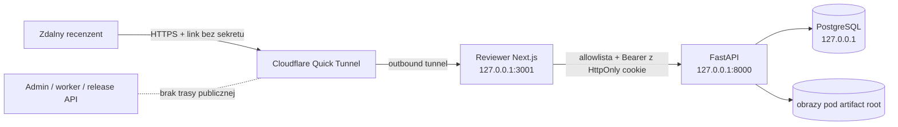

# Model zagrożeń zdalnego Reviewera

## Granica i przepływ

Publiczny origin kończy się w aplikacji Reviewer. Nie tunelujemy portu API,
Admina, PostgreSQL ani workera. Next.js przekazuje wyłącznie jawnie
dozwolone odczyty kontekstu jednej sesji, operacyjne review, assety, korektę
geometrii i decyzję planszy. Wszystkie pozostałe ścieżki zwracają `403`.

Tryb `Otwórz lokalnie` jest odrębną granicą operatorską. Nie uruchamia
Cloudflare ani sesji z kodem, a Reviewer odblokowuje wskazany scope tylko przy
żądaniu strony z nagłówkiem `Host` równym loopback na porcie 3001. Następnie
przeglądarka łączy się bezpośrednio z Admin API na `127.0.0.1`; zdalny komputer
interpretuje taki adres jako własny loopback i nie uzyskuje dostępu do API
właściciela. Publiczny host z parametrami trybu lokalnego pozostaje za bramką
sesji i kodu.

## Chronione zasoby i aktorzy

- prywatne obrazy źródłowe, plansze i cropy,
- etykiety symboli, statusy i audyt decyzji,
- kod wejścia, bearer token i identyfikator sesji,
- integralność zakresu `(gameId, importJobId)`,
- administrator tworzący i odwołujący sesję,
- zdalny recenzent podejmujący decyzje jako `reviewer-session:<UUID>`,
- dostawca tunelu transportujący zaszyfrowany ruch.

## Zagrożenia i zabezpieczenia

| Zagrożenie | Zabezpieczenie |
|---|---|
| wyciek samego linku | link nie zawiera kodu ani tokenu; dane są pobierane dopiero po unlock |
| brute force kodu | losowy alfabet bez mylących znaków, PBKDF2-SHA256, maksymalnie 5 prób i trwała blokada |
| wyciek bazy | kod i token występują tylko jako hash; kod jest pokazany raz |
| replay tokenu | token jest losowy, rotowany przy unlock, wygasa nie później niż sesja i jest natychmiast usuwany przy revoke |
| dostęp do innej gry/importu | każdy review read/write porównuje scope tokenu z parametrami żądania |
| dostęp administracyjny | publiczny proxy ma allowlistę; CRUD, eksporty, job mutations i wydania nie mają trasy |
| spoofing aktora | backend zastępuje `resolvedBy/correctedBy` identyfikatorem sesji |
| konflikt dwóch kart | istniejące UUID idempotencji i optimistic revision pozostają obowiązkowe |
| kradzież tokenu w JS | token trafia do `HttpOnly`, `SameSite=Strict` cookie proxy; nie trafia do URL ani localStorage |
| clickjacking/XSS | CSP, `frame-ancestors 'none'`, `X-Frame-Options: DENY`, brak zewnętrznych skryptów |
| utrata Internetu lub komputera | zapis atomowy; po powrocie recenzent wznawia kolejkę, a tunel można odtworzyć z nowym URL |
| logi z sekretami | skrypty zapisują wyłącznie publiczny URL/PID; kod i bearer nie są logowane |

## Retencja i prywatność

Sesja ma TTL od 5 minut do 24 godzin. Administrator przekazuje link i kod
osobnymi kanałami, a po zakończeniu unieważnia sesję i zatrzymuje tunel. Quick
Tunnel jest trybem czasowym do prywatnych testów pracy dyplomowej, a nie
usługą always-on ani trwałym hostingiem. Nie należy udostępniać linku szerszej
grupie ani pozostawiać tunelu uruchomionego bez aktywnej sesji.

## Awaria i reakcja na incydent

1. W panelu Admin kliknij `Unieważnij sesję`.
2. Kliknij `Zatrzymaj udostępnianie`; awaryjnie uruchom
   `npm run reviewer:remote:stop`.
3. Sprawdź `npm run reviewer:remote:status`; oczekiwany stan to `stopped`.
4. Utwórz nową sesję i nowy link dopiero po ustaleniu przyczyny.
5. Audyt `reviewer_access_audit_events` zachowuje utworzenie, błędne próby,
   unlock, blokadę i revoke bez sekretów.

## Zaakceptowany transport

W v0.1 używany jest Cloudflare Quick Tunnel: outbound-only, losowy adres HTTPS
`trycloudflare.com`, bez przekierowania portów, domeny i konta odbiorcy.
Oficjalna dokumentacja określa Quick Tunnels jako rozwiązanie
development/testing bez SLA, dlatego stały publiczny adres wymaga później
named tunnel i osobnej decyzji operacyjnej.

- <https://developers.cloudflare.com/cloudflare-one/networks/connectors/cloudflare-tunnel/>
- <https://developers.cloudflare.com/cloudflare-one/networks/connectors/cloudflare-tunnel/do-more-with-tunnels/trycloudflare/>
