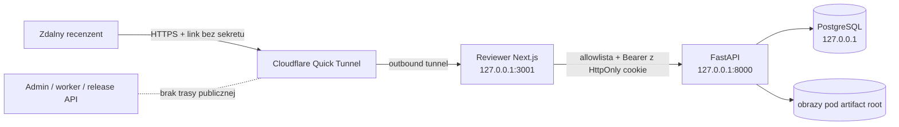

# Model zagrożeń zdalnego Reviewera

## Granica i przepływ

Publiczny origin kończy się w aplikacji Reviewer. Nie tunelujemy portu API,
Admina, PostgreSQL ani workera. Next.js przekazuje wyłącznie jawnie
dozwolone odczyty kontekstu jednej sesji, operacyjne review, assety, korektę
geometrii i decyzję planszy. Wszystkie pozostałe ścieżki zwracają `403`.

Zdalna ręczna selekcja współdzieli ten sam proces i tunel, ale nie tę samą
powierzchnię uprawnień. `/manual-selection` używa wyłącznie `/selection-api`,
osobnego cookie `gp_remote_selection_token` i stałej intencji proxy
`reviewer-v1`. Po TASK 11 zamknięta allowlista obejmuje unlock, context,
heartbeat, takeover oraz dokładne route tworzenia kolekcji/partii, stronicowanej
rejestracji metadanych, operacji, state delta, status transferu i jeden
checksum-bound binarny `PUT` na plik. Materializacja jest wykonywana wyłącznie
przez lokalny general worker i nie ma publicznego route. TASK 15 dodaje wyłącznie
GET preview i POST finalize dokładnej partii; allowlista nie obejmuje reopen,
zapisu manifestu ani dowolnej operacji Admina. Cookie starego Reviewera nie autoryzuje
selekcji, a cookie selekcji nie autoryzuje `/review-api`.

Tryb `Otwórz lokalnie` jest odrębną granicą operatorską. Nie uruchamia
Cloudflare ani sesji z kodem, a Reviewer odblokowuje wskazany scope tylko przy
żądaniu strony z nagłówkiem `Host` równym loopback na porcie 3001. Następnie
przeglądarka łączy się bezpośrednio z Admin API na `127.0.0.1`; zdalny komputer
interpretuje taki adres jako własny loopback i nie uzyskuje dostępu do API
właściciela. Publiczny host z parametrami trybu lokalnego pozostaje za bramką
sesji i kodu.

## Chronione zasoby i aktorzy

- prywatne obrazy źródłowe, plansze i cropy,
- etykiety symboli, statusy i audyt decyzji,
- kod wejścia, bearer token i identyfikator sesji,
- integralność zakresu `(gameId, importJobId)`,
- trwałe przypisanie pracy `local/online` ograniczone do tego samego scope'u,
- administrator tworzący i odwołujący sesję,
- zdalny recenzent podejmujący decyzje jako `reviewer-session:<UUID>`,
- dostawca tunelu transportujący zaszyfrowany ruch.

## Zagrożenia i zabezpieczenia

| Zagrożenie | Zabezpieczenie |
|---|---|
| wyciek samego linku | link nie zawiera kodu ani tokenu; dane są pobierane dopiero po unlock |
| brute force kodu | losowy alfabet bez mylących znaków, PBKDF2-SHA256, maksymalnie 5 prób i trwała blokada |
| wyciek bazy | kod i token występują tylko jako hash; kod jest pokazany raz |
| replay tokenu | token jest losowy, rotowany przy unlock, wygasa nie później niż sesja i jest natychmiast usuwany przy revoke |
| dostęp do innej gry/importu | każdy review read/write porównuje scope tokenu z parametrami żądania |
| dostęp administracyjny | publiczny proxy ma allowlistę; CRUD, eksporty, job mutations i wydania nie mają trasy |
| spoofing aktora | backend zastępuje `resolvedBy/correctedBy` identyfikatorem sesji |
| konflikt dwóch kart | istniejące UUID idempotencji i optimistic revision pozostają obowiązkowe |
| kradzież tokenu w JS | token trafia do `HttpOnly`, `SameSite=Strict` cookie proxy; nie trafia do URL ani localStorage |
| clickjacking/XSS | CSP, `frame-ancestors 'none'`, `X-Frame-Options: DENY`, brak zewnętrznych skryptów |
| utrata Internetu lub komputera | zapis atomowy; po powrocie recenzent wznawia kolejkę, a tunel można odtworzyć z nowym URL |
| logi z sekretami | skrypty zapisują wyłącznie publiczny URL/PID; kod i bearer nie są logowane |
| równoległy start z dwóch procesów API | nazwany mutex Windows serializuje start/status/stop dla repozytorium; stan jest publikowany dopiero po health checku |
| ponowne użycie PID albo stary plik stanu | pełna tożsamość procesu obejmuje PID, czas startu, executable i losowy instance id; niezgodny proces nie jest zatrzymywany |
| zatrzymanie nowszej instancji przez spóźnione żądanie | wewnętrzny compare-and-stop wymaga zgodnego instance id i pozostawia nowszą instancję bez zmian |
| blokada wspólnego pliku logu lub wyniku | każda próba startu i każde wywołanie kontrolera API używa unikalnej ścieżki |
| CSRF z obcego originu | mutacje `/selection-api` wymagają zgodnego `Origin`, `Sec-Fetch-Site: same-origin`, Strict cookie i JSON |
| nadużycie proxy jako ogólnego transportu | dokładna metoda/path allowlista, query tylko dla state delta/statusu, brak Authorization, control 128 KiB i jeden binarny PUT do 32 MiB z wymaganymi nagłówkami |
| złośliwy lub podmieniony JPEG | zgodność size/mtime z manifestem i checksumy z potwierdzonym SELECT, streaming do `.part`, limity per-file/session/concurrency, magic/format/full decode przed `verified` |
| zerwanie transferu lub utrata odpowiedzi | `.part` nie jest wynikiem, klient zachowuje transferId i przed retry pyta o status; zgodny artefakt po restarcie jest ponownie hashowany i dekodowany |
| crash między verified, tempem materializacji, publikacją i commitem | trwała host action z lease/fencing, same-volume temp, fsync, checksumowany journal i bounded reconciliation prowadzą do jednego synced wyniku albo kontrolowanego konfliktu |
| restart po rename `.verified`, ale przed commitem bazy | reconciler ponownie sprawdza regular file, rozmiar i SHA-256, a CAS po `updated_at` publikuje dokładnie jeden stan i jedną akcję |
| potraktowanie osieroconego `.part` jako wyniku | `.part` nigdy nie jest adoptowany; próba kończy się kontrolowanym `failed`, bajty pozostają tylko w niedestrukcyjnym preview GC |
| wyciek danych przez recovery/status | publiczny delta i lokalny recovery detail zawierają wyłącznie liczniki, heartbeat i stabilne findings; logi/audyt redagują credential-like keys oraz pełne ścieżki Windows |
| przypadkowe usunięcie podczas diagnostyki | GC ma wyłącznie agregatowy preview z `deletionEnabled=false`; brak endpointu i kodu wykonującego delete |
| nadpisanie obcego lub zmienionego `seq_*` | wyłączne utworzenie finalnej nazwy; adopcja tylko przy zgodnym journalu identity i checksumie, inaczej fail-closed bez replace/delete |
| stale generation po spóźnionym uploadzie | ponowna blokada pliku/transferu/partii i sprawdzenie desired state, generation i checksumy przed filesystemem oraz przed commitem |
| reparse/TOCTOU podczas materializacji | pinned final handles bez `FILE_SHARE_DELETE`, dokładna host-internal ścieżka verified, regular-file/reparse checks źródła, tempu, journalu i celu |
| odznaczenie po publikacji własnego pliku | generacyjny tombstone anuluje starsze transfery, superseduje materializację i uruchamia priorytetową akcję `remove` przed kolejną materializacją |
| usunięcie obcego albo zmienionego `seq_*` | usunięcie wymaga zgodnego materialization journalu i checksumy; pinned-handle rename przenosi tylko zweryfikowany własny plik do host-internal kwarantanny |
| crash podczas odznaczania | checksumowany removal journal rozróżnia prepared/quarantined, a retry adoptuje tylko zgodny półstan; kwarantanna pozostaje odwracalna i bez GC |
| spóźniona generacja po deselect/reselect | lease fencing, blokada wiersza, generation recheck i priorytet `remove` uniemożliwiają materializację N po zastosowaniu N+1 |
| awaria ingressu podczas revoke | revoke nie odczytuje ani nie zatrzymuje ingressu; token i lease są czyszczone niezależnie |
| replay albo utrata odpowiedzi operacji | trwały outbox, dokładne `operationId + checksum`, monotoniczny client sequence/revision/generation i zwrot zapisanego outcome bez ponownej mutacji |
| wysłanie operacji bez writer lease | autoryzacja writer ownership i mutacja odbywają się w tej samej transakcji; po expiry dozwolony jest wyłącznie exact retry istniejącego outcome |
| zalanie control plane | limit 1200 żądań na minutę per sesja oraz stabilny błąd `REMOTE_SELECTION_CONTROL_RATE_LIMITED`; rotacja client ID nie odnawia budżetu |
| podmiana źródeł po rozpoczęciu pracy | pełny checksum manifestu jest weryfikowany przed aktywacją; aktywny manifest jest niezmienny |
| przedwczesna albo powtórzona finalizacja | rewizyjny preview, transakcyjna blokada i kontrola wszystkich operacji/transferów/akcji/pliku; retry adoptuje tylko identyczny journal |
| podmiana finalnego manifestu | publikacja wymaga host ownership i poprzedniej checksummy; obcy lub zmieniony JSON daje konflikt bez nadpisania |
| zdalne ponowne otwarcie wyniku | reopen istnieje tylko pod lokalnym Admin API, wymaga exact targetu, rewizji i checksummy; `/selection-api` go odrzuca |

Host base zdalnej selekcji jest wybierany wyłącznie przez stały lokalny picker.
Publiczny request nie zawiera ścieżki. Każdy komponent collection/batch jest
walidowany jako pojedyncza nazwa Windows, a finalne katalogi są otwierane przez
uchwyty bez `FILE_SHARE_DELETE`. Reparse point/junction w istniejącym łańcuchu,
zmiana final path, case/Unicode collision oraz obcy lub uszkodzony ownership
marker kończą operację fail-closed. Uchwyt bazy, collection i batch pozostaje
otwarty przez utworzenie atomowego markera, ograniczając okno TOCTOU.

Materializacja otwiera ten sam zweryfikowany mapping, przypina verified source i
istniejący albo właśnie opublikowany target bez `FILE_SHARE_DELETE`. Pliki
robocze i journale znajdują się wyłącznie pod
`.game-predictor/remote-selection-v1/materializations/<file>/<generation>`.
Journal wiąże action/session/batch/file/transfer/generation/output/checksum;
niezgodny lub zbyt duży journal jest konfliktem. Kod nie usuwa obcego targetu,
nie nadpisuje go i nie usuwa żadnej ścieżki poza własnym working artifactem.

Odznaczenie używa osobnego journalu pod
`.game-predictor/remote-selection-v1/quarantine/<file>/<generation>/<action>`.
Executor blokuje immutable mapping partii, weryfikuje tożsamość wcześniejszej
materializacji i jej checksumę, a następnie zmienia nazwę przez przypięty uchwyt
Windows. Przejściowy konflikt antywirusa/indeksera ma krótki, ograniczony retry
na tym samym uchwycie; każdy inny błąd pozostaje fail-closed. Kwarantanna nie
jest czyszczona przed rozstrzygnięciem polityki retencji.

Zdalna ręczna selekcja ma osobny purpose i nie używa scope
`gameId/importJobId` istniejącego Reviewera. Kod jest pokazany tylko przy
lokalnym create, ma maksymalnie pięć trwałych prób i jest przechowywany jako
PBKDF2-SHA256. Unlock rotuje losowy token zapisany wyłącznie jako SHA-256;
publiczna odpowiedź ustawia go w cookie `HttpOnly`, `Secure`,
`SameSite=Strict`, `Path=/selection-api` i nie zawiera bearer w JSON. Revoke i
piąta błędna próba atomowo usuwają token oraz writer lease.

Jedna sesja ma jeden 45-sekundowy writer lease. Klient przesyła wyłącznie
`clientInstanceId`; fencing token nie opuszcza bazy. Aktywny lease innego
klienta daje tryb read-only, heartbeat nie przyjmuje fencing tokenu, a takeover
przed expiry kończy się konfliktem. Audyt zapisuje wynik i licznik prób, ale
odrzuca kod, token, salt, lease token i ścieżkę hosta.

Control plane nie przyjmuje host base path ani bajtów obrazu. UUID kolekcji,
partii, pliku i operacji są sprawdzane względem purpose-scoped sesji. Rejestracja
źródła jest ograniczona do 500 metadanych na request; aktywacja następuje tylko
po zgodności liczby, indeksów i checksumy pełnego manifestu. State delta ma
limit 100, a mutacje i rate limit zwracają stabilne kody bez sekretów i ścieżek.

Dedykowany CSP `/manual-selection` i `/selection-api` zezwala na transport tylko
do własnego originu; nie zawiera loopback FastAPI. Route ogólne Reviewera nadal
mają dotychczasową politykę, ale matcher nie nakłada jej na nową powierzchnię.
Nieprawidłowa wartość feature flagi kończy się fail-closed. Wyłączenie flagi
usuwa shell i proxy bez usuwania trwałej sesji lub audytu.

`reviewer_work_assignments` nie rozszerza granicy dostępu. Tabela przechowuje
scope, typ pracy, identyfikator sesji online, fencing token lease, heartbeat i
historię zamknięcia. Nie zawiera kodu, bearer tokenu, publicznego URL ani
parametrów procesu. Złożony FK nie pozwala przypiąć sesji innej gry/importu, a
aktywny assignment nadal nie zastępuje autoryzacji przez
`reviewer_access_sessions`. Zamknięcie jednego assignmentu unieważnia wyłącznie
jego sesję i nie zatrzymuje współdzielonego ingressu, jeżeli istnieje inny
aktywny scope online. Globalny limit trzech online assignmentów i decyzja
`stop-if-unused` są serializowane transakcyjnym advisory lockiem. Ostatni stop
używa `instanceId`, dlatego spóźniona operacja nie zamknie nowszej instancji.
Wygasłe lease'y są domykane jako `lease_expired`, a ich scoped sesje odwoływane
przed ponownym użyciem capacity.

Admin API TASK 18 nie ujawnia w liście assignments kodu wejścia, bearer tokenu,
fencing tokenu ani osobnego pola identyfikatora sesji. Publiczny URL może
zawierać opaque identyfikator sesji, ale nie jest on sekretem. Kod występuje wyłącznie w odpowiedzi
na pierwsze utworzenie online; idempotentne ponowienie zwraca `null`. Frontend
nie przechowuje sekretu w trwałym storage. Open i close wymagają dokładnego
lokalnego high-impact targetu, a heartbeat nie przyjmuje lease tokenu od
przeglądarki. Legacy globalne endpointy ingressu nie są używane przez zwykły
przepływ sekcji zatwierdzania.

## Bramka bezpieczeństwa TASK-0289

Formalna bramka ma osiem obowiązkowych kontroli: zamkniętą allowlistę zgodną z
OpenAPI, izolację purpose/sesji, cookie i CSRF, rate/quota, bezpieczeństwo
Windows/reparse/TOCTOU, redakcję, stabilne błędy HTTP oraz lokalny production
build z izolowanym stanem klientów. Maszynowy raport znajduje się w
`ai_docs/quality/remote-manual-selection-security-gate-v1.json`; jego kanoniczna
treść ma SHA-256
`8386c3676422ecb3d98994c854bb7c447f5c5452592990485f7bd9af3e4b4360`.

Audyt TASK-0289 zamknął cztery findings: brak obowiązkowego Fetch Metadata dla
mutacji, zaufanie do caller-controlled forwarded host, brak rekurencyjnej
kontroli publicznego JSON/audytu oraz ominięcie rate limitu przez exact replay.
Nie pozostał otwarty finding `critical` ani `high`. Publiczny Quick Tunnel,
pentest strony trzeciej i rollout skali są nadal poza bramką i należą do TASK 18.

## Retencja i prywatność

Sesja ma TTL od 5 minut do 24 godzin. Administrator przekazuje link i kod
osobnymi kanałami, a po zakończeniu unieważnia sesję i zatrzymuje tunel. Quick
Tunnel jest trybem czasowym do prywatnych testów pracy dyplomowej, a nie
usługą always-on ani trwałym hostingiem. Nie należy udostępniać linku szerszej
grupie ani pozostawiać tunelu uruchomionego bez aktywnej sesji.

## Awaria i reakcja na incydent

1. W panelu Admin kliknij `Unieważnij sesję`.
2. Kliknij `Zatrzymaj udostępnianie`; awaryjnie uruchom
   `npm run reviewer:remote:stop`.
3. Sprawdź `npm run reviewer:remote:status`; oczekiwany stan to `stopped`.
4. Utwórz nową sesję i nowy link dopiero po ustaleniu przyczyny.
5. Audyt `reviewer_access_audit_events` zachowuje utworzenie, błędne próby,
   unlock, blokadę i revoke bez sekretów.

## Zaakceptowany transport

W v0.1 używany jest Cloudflare Quick Tunnel: outbound-only, losowy adres HTTPS
`trycloudflare.com`, bez przekierowania portów, domeny i konta odbiorcy.
Oficjalna dokumentacja określa Quick Tunnels jako rozwiązanie
development/testing bez SLA, dlatego stały publiczny adres wymaga później
named tunnel i osobnej decyzji operacyjnej.

- <https://developers.cloudflare.com/cloudflare-one/networks/connectors/cloudflare-tunnel/>
- <https://developers.cloudflare.com/cloudflare-one/networks/connectors/cloudflare-tunnel/do-more-with-tunnels/trycloudflare/>
